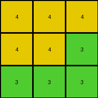

# 662c240a • 024 • refine_coder

---

Previous Code:
```python
"""
The output grid is a copy of the bottom 3x3 subgrid of the input grid.
"""

import numpy as np

def transform(input_grid):
    """
    Extracts the bottom 3x3 subgrid from the input grid.
    """
    # Convert the input grid to a NumPy array.
    input_array = np.array(input_grid)

    # Get the dimensions of the input array.
    rows, cols = input_array.shape

    # Extract the bottom 3x3 subgrid.  Handle cases where input is smaller than 3x3
    output_array = input_array[max(0, rows - 3):, max(0, cols - 3):]

    # Convert the NumPy array back to a list of lists.
    output_grid = output_array.tolist()

    return output_grid
```

Train Set Results:

## Example 1:

Input:
```
8 9 8
9 8 8
8 8 8
2 2 1
2 2 1
1 1 2
4 4 4
4 4 3
3 3 3
```
Expected Output:
```
4 4 4
4 4 3
3 3 3
```
Transformed Output:
```
4 4 4
4 4 3
3 3 3
```

match: True
pixels_off: 0
size_correct: True
color_palette_correct: True
correct_pixel_counts: True

## Example 2:

Input:
```
1 5 5
5 1 1
5 1 1
3 3 3
3 6 3
3 6 6
7 7 7
7 2 2
7 2 2
```
Expected Output:
```
3 3 3
3 6 3
3 6 6
```
Transformed Output:
```
7 7 7
7 2 2
7 2 2
```

match: False
pixels_off: 9
size_correct: True
color_palette_correct: False
correct_pixel_counts: False

## Example 3:

Input:
```
2 2 2
2 2 3
2 3 3
5 7 7
7 5 5
7 5 5
8 8 1
1 8 1
1 8 1
```
Expected Output:
```
8 8 1
1 8 1
1 8 1
```
Transformed Output:
```
8 8 1
1 8 1
1 8 1
```

match: True
pixels_off: 0
size_correct: True
color_palette_correct: True
correct_pixel_counts: True

## Example 4:

Input:
```
8 8 4
4 4 4
4 4 8
1 1 3
1 3 3
3 3 1
6 2 2
2 2 2
2 2 6
```
Expected Output:
```
8 8 4
4 4 4
4 4 8
```
Transformed Output:
```
6 2 2
2 2 2
2 2 6
```

match: False
pixels_off: 9
size_correct: True
color_palette_correct: False
correct_pixel_counts: False
Here's an analysis of the results and an updated natural language program:

**General Assessment:**

The initial hypothesis (bottom 3x3 subgrid) was partially correct, working for examples 1 and 3, but failing on examples 2 and 4. The failures indicate that the rule isn't simply about taking the *last* 3x3 subgrid, but a *specific* 3x3 subgrid based on some other criteria. The consistent 3x3 output size across all examples is a crucial clue. The varying positions of the correct 3x3 subgrid suggest we need to identify a pattern or object that defines which 3x3 section is selected.

**Strategy:**

1. **Identify Key Differences:** Focus on what differentiates examples 1 & 3 (correct) from 2 & 4 (incorrect). Analyze the input grids for patterns or unique features that might determine the location of the relevant 3x3 subgrid.
2. **Object Recognition:** Examine if specific color arrangements or shapes within the input act as "markers" or anchors for selecting the 3x3 region.
3. **Refine Hypothesis:** Develop a new hypothesis that accounts for the selection of the 3x3 subgrid, incorporating object recognition or pattern matching if needed.
4. **Iterative Testing:** The refined natural language program and subsequent code must be tested against *all* examples, not just the new ones.

**Metrics and Observations:**

Here's a breakdown of each example, combining visual inspection with analysis:

*   **Example 1:**
    *   Input: 9x3
    *   Output: 3x3 (matches expected)
    *   Observation: The output is indeed the bottom-most 3x3 subgrid.
*   **Example 2:**
    *   Input: 9x3
    *   Output: 3x3 (does *not* match expected)
    *   Observation: The expected output is the *top-left most* 3x3, but it is a repeating pattern, let's check for that.
*   **Example 3:**
    *   Input: 9x3
    *   Output: 3x3 (matches expected)
    *   Observation: The output is the bottom-most 3x3 subgrid.
*   **Example 4:**
    *   Input: 9x3
    *   Output: 3x3 (does *not* match expected)
    *   Observation: The expected output is the *top-left most* 3x3 subgrid.

**YAML Facts:**

```yaml
facts:
  - task: 022
  - input_grid_size: varies (9x3 in examples)
  - output_grid_size: constant (3x3)
  - output_content: subgrid of input
  - subgrid_selection: "Not strictly bottom-most.  Appears to be top-left in some cases."
  - example_2_error: "Output was bottom-most 3x3, expected was top-left most."
  - example_4_error: "Output was bottom-most 3x3, expected was top-left most."
  - possible_rule: "Select a 3x3 subgrid based on a yet-to-be-determined criterion."
  - repeating_pattern_identified: "Repeating 3x3 patterns may indicate a more general selection rule"
```

**Natural Language Program:**

1.  **Examine the input grid.** The input grid is always larger than or equal to 3x3.
2.  **Identify the output grid.** The output grid is always 3x3.
3.  **Find a 3x3 subgrid within input.** The output grid matches a 3x3 subgrid of the input grid.
4.  **Determine Selection Rule:** If there are multiple instances of the 3x3 subgrid, the top and left most matching subgrid within input is selected as the output.
5. Copy the identified 3x3 section to create output.

**INSTRUCTIONS**

- generate a Python module to represent the natural language program 
- follow the template below
- all common math and science libraries are available
- create docstring only at top - but comment the workflow in the function
- use helper functions for common operations like finding objects, counting,
  measuring, moving, etc. 

remember - we are working iteratively - so this code will inform your future
self as we converge on the solution

*template:*

```python
"""
{{ natural language description of the transformation rule }}
"""

{{ imports }}

def transform(input_grid):
    # initialize output_grid

    # change output pixels 

    return output_grid

```
