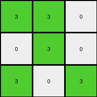
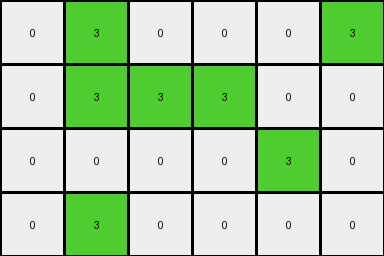
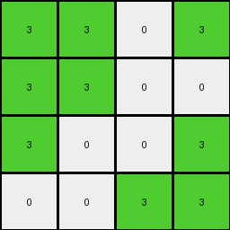

# 67385a82 • 005 • refine_dreamer

---


Previous Code:
```python
"""
Transforms an input grid based on the following rules:

1. Check the entire grid for the presence of green (3) in the bottom row.
2. Iterate through each pixel:
   - If the pixel is not green (3), it remains unchanged.
   - If the pixel is green (3):
     - If the pixel is in the top two rows (row index 0 or 1) AND there are NO green pixels in the bottom row, change it to azure (8).
     - Otherwise (pixel is in the bottom row, OR there ARE green pixels in the bottom row), leave it unchanged.
"""

import numpy as np

def _has_green_in_bottom_row(grid):
    """Checks if the bottom row of a grid contains any green (3) pixels."""
    rows, cols = grid.shape
    return 3 in grid[rows - 1, :]

def transform(input_grid):
    """
    Transforms the input grid according to the specified rules.
    """
    output_grid = np.copy(input_grid)
    rows, cols = output_grid.shape

    # Check for green in the bottom row (global condition).
    bottom_row_green = _has_green_in_bottom_row(output_grid)

    # Iterate through the grid and apply the transformation rules.
    for r in range(rows):
        for c in range(cols):
            if output_grid[r, c] == 3:  # Check if the cell is green.
                if r < 2 and not bottom_row_green:  # Top two rows AND no green in bottom row.
                    output_grid[r, c] = 8  # Change to azure.
                # Else: Leave green pixel unchanged (already in output_grid).
            # Non-green pixels are also implicitly unchanged.

    return output_grid
```

Train Set Results:

## Example 1:

Input:
```
3 3 0
0 3 0
3 0 3
```
Expected Output:
```
8 8 0
0 8 0
3 0 3
```
Transformed Output:
```
3 3 0
0 3 0
3 0 3
```

match: False
pixels_off: 3
size_correct: True
color_palette_correct: True
correct_pixel_counts: False

## Example 2:

Input:
```
0 3 0 0 0 3
0 3 3 3 0 0
0 0 0 0 3 0
0 3 0 0 0 0
```
Expected Output:
```
0 8 0 0 0 3
0 8 8 8 0 0
0 0 0 0 3 0
0 3 0 0 0 0
```
Transformed Output:
```
0 3 0 0 0 3
0 3 3 3 0 0
0 0 0 0 3 0
0 3 0 0 0 0
```

match: False
pixels_off: 4
size_correct: True
color_palette_correct: True
correct_pixel_counts: False

## Example 3:

Input:
```
3 3 0 3
3 3 0 0
3 0 0 3
0 0 3 3
```
Expected Output:
```
8 8 0 3
8 8 0 0
8 0 0 8
0 0 8 8
```
Transformed Output:
```
3 3 0 3
3 3 0 0
3 0 0 3
0 0 3 3
```

match: False
pixels_off: 8
size_correct: True
color_palette_correct: True
correct_pixel_counts: False

## Example 4:

Input:
```
3 3 0 0 0 0
0 3 0 0 3 0
3 0 0 0 0 0
0 3 3 0 0 0
0 3 3 0 0 3
```
Expected Output:
```
8 8 0 0 0 0
0 8 0 0 3 0
3 0 0 0 0 0
0 8 8 0 0 0
0 8 8 0 0 3
```
Transformed Output:
```
3 3 0 0 0 0
0 3 0 0 3 0
3 0 0 0 0 0
0 3 3 0 0 0
0 3 3 0 0 3
```

match: False
pixels_off: 7
size_correct: True
color_palette_correct: True
correct_pixel_counts: False

**INSTRUCTIONS**

The code above was generated based on observations from the first training
example

we have tested the transform function on each of the task example inputs and
compared with the expected output

review each of the examples provided and the results and consider how the
natural language program should be updated to accommodate this new knowledge

respond with the following deliverables:

- general assessment of the information provided and strategy for resolving the
  errors
- gather metrics about each of the examples and results - use code_execution to
  develop accurate reports on your assumptions
- a YAML block documenting facts - Focus on identifying objects, their properties, and the actions performed on them.
- a natural language program - Be as clear and concise as possible, providing a complete description of the transformation rule.


your responses should be considered as information in a report - not a
conversation
