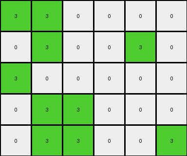

# 67385a82 • 006 • refine_coder

---

Previous Code:
```python
"""
Transforms an input grid based on the following rules:

1. Check the entire grid for the presence of green (3) in the bottom row.
2. Iterate through each pixel:
   - If the pixel is not green (3), it remains unchanged.
   - If the pixel is green (3):
     - If the pixel is in the top two rows (row index 0 or 1) AND there are NO green pixels in the bottom row, change it to azure (8).
     - Otherwise (pixel is in the bottom row, OR there ARE green pixels in the bottom row), leave it unchanged.
"""

import numpy as np

def _has_green_in_bottom_row(grid):
    """Checks if the bottom row of a grid contains any green (3) pixels."""
    rows, cols = grid.shape
    return 3 in grid[rows - 1, :]

def transform(input_grid):
    """
    Transforms the input grid according to the specified rules.
    """
    output_grid = np.copy(input_grid)
    rows, cols = output_grid.shape

    # Check for green in the bottom row (global condition).
    bottom_row_green = _has_green_in_bottom_row(output_grid)

    # Iterate through the grid and apply the transformation rules.
    for r in range(rows):
        for c in range(cols):
            if output_grid[r, c] == 3:  # Check if the cell is green.
                if r < 2 and not bottom_row_green:  # Top two rows AND no green in bottom row.
                    output_grid[r, c] = 8  # Change to azure.
                # Else: Leave green pixel unchanged (already in output_grid).
            # Non-green pixels are also implicitly unchanged.

    return output_grid
```

Train Set Results:

## Example 1:

Input:
```
3 3 0
0 3 0
3 0 3
```
Expected Output:
```
8 8 0
0 8 0
3 0 3
```
Transformed Output:
```
3 3 0
0 3 0
3 0 3
```

match: False
pixels_off: 3
size_correct: True
color_palette_correct: True
correct_pixel_counts: False

## Example 2:

Input:
```
0 3 0 0 0 3
0 3 3 3 0 0
0 0 0 0 3 0
0 3 0 0 0 0
```
Expected Output:
```
0 8 0 0 0 3
0 8 8 8 0 0
0 0 0 0 3 0
0 3 0 0 0 0
```
Transformed Output:
```
0 3 0 0 0 3
0 3 3 3 0 0
0 0 0 0 3 0
0 3 0 0 0 0
```

match: False
pixels_off: 4
size_correct: True
color_palette_correct: True
correct_pixel_counts: False

## Example 3:

Input:
```
3 3 0 3
3 3 0 0
3 0 0 3
0 0 3 3
```
Expected Output:
```
8 8 0 3
8 8 0 0
8 0 0 8
0 0 8 8
```
Transformed Output:
```
3 3 0 3
3 3 0 0
3 0 0 3
0 0 3 3
```

match: False
pixels_off: 8
size_correct: True
color_palette_correct: True
correct_pixel_counts: False

## Example 4:

Input:
```
3 3 0 0 0 0
0 3 0 0 3 0
3 0 0 0 0 0
0 3 3 0 0 0
0 3 3 0 0 3
```
Expected Output:
```
8 8 0 0 0 0
0 8 0 0 3 0
3 0 0 0 0 0
0 8 8 0 0 0
0 8 8 0 0 3
```
Transformed Output:
```
3 3 0 0 0 0
0 3 0 0 3 0
3 0 0 0 0 0
0 3 3 0 0 0
0 3 3 0 0 3
```

match: False
pixels_off: 7
size_correct: True
color_palette_correct: True
correct_pixel_counts: False
Okay, here's a breakdown of the situation, the results, and a plan to improve the natural language program and subsequently the code.

**General Assessment:**

The initial code was based on a flawed interpretation of the transformation rule, focusing too heavily on the presence or absence of green in the bottom row as a global condition.  The results clearly show that the transformation of green to azure is related to the row position of the green pixel, *regardless* of green elsewhere.  The code *incorrectly* assumed that the bottom-row green acted as a "switch" for the entire grid. The examples demonstrate that *all* green pixels in the top two rows are consistently transformed to azure, and green pixels in the lower rows remain green.

The strategy is to shift from a global condition (bottom-row green) to a strictly row-based condition for the transformation of green pixels.

**Metrics and Observations:**

Here's a summary of the results, re-emphasizing the key misunderstanding:

*   **Example 1:** The code failed to change the green pixels in the top two rows to azure.  The bottom-row green check incorrectly prevented this.
*   **Example 2:** Same as Example 1. The top-row greens should have changed, but didn't.
*   **Example 3:** Same issue. All top two row greens should be azure.
*   **Example 4:** Same issue.

**YAML Fact Extraction:**

```yaml
task: 004b5748
examples:
  - id: example_1
    input_objects:
      - object_1: { color: green, positions: [[0, 0], [0, 1], [2, 0], [2, 2]] }
      - object_2: { color: white, positions: [[0, 2], [1, 0], [1, 2], [2, 1]] }
    output_objects:
      - object_1: { color: azure, positions: [[0, 0], [0, 1]]}
      - object_2: { color: white, positions: [[0, 2], [1, 0], [1, 2], [2, 1]] }
      - object_3: { color: green, positions: [[2, 0], [2, 2]]}
    transformation: "Green pixels in rows 0 and 1 change to azure. Other pixels remain the same."

  - id: example_2
    input_objects:
      - object_1: {color: green, positions: [[0, 1], [0, 5], [1, 1], [1, 2], [1, 3], [2, 4], [3, 1]]}
      - object_2: {color: white, positions: [[0, 0], [0, 2], [0, 3], [0, 4], [1, 0], [1, 4], [1, 5], [2, 0], [2, 1], [2, 2], [2, 3], [2, 5], [3, 0], [3, 2], [3, 3], [3, 4], [3, 5]]}
    output_objects:
      - object_1: {color: azure, positions: [[0, 1], [1, 1], [1, 2], [1, 3]]}
      - object_2: {color: white, positions: [[0, 0], [0, 2], [0, 3], [0, 4], [1, 0], [1, 4], [1, 5], [2, 0], [2, 1], [2, 2], [2, 3], [2, 5], [3, 0], [3, 2], [3, 3], [3, 4], [3, 5]]}
      - object_3: {color: green, positions: [[0, 5], [2, 4], [3, 1]]}
    transformation: "Green pixels in rows 0 and 1 change to azure. Other pixels remain the same."

  - id: example_3
    input_objects:
      - object_1: {color: green, positions: [[0, 0], [0, 1], [0, 3], [1, 0], [1, 1], [2, 0], [2, 3], [3, 2], [3, 3]]}
      - object_2: {color: white, positions: [[0, 2], [1, 2], [1, 3], [2, 1], [2, 2], [3, 0], [3, 1]]}
    output_objects:
        - object_1: {color: azure, positions: [[0, 0], [0, 1], [1, 0], [1, 1], [2, 0], [2, 3], [3, 2], [3, 3]]}
        - object_2: {color: white, positions: [[0, 2], [1, 2], [1, 3], [2, 1], [2, 2], [3, 0], [3, 1]]}
    transformation: "Green pixels in rows 0 and 1 change to azure. Other pixels remain the same."

  - id: example_4
    input_objects:
      - object_1: { color: green, positions: [[0, 0], [0, 1], [1, 1], [2, 0], [3, 1], [3, 2], [4, 1], [4, 2], [4, 5]] }
      - object_2: { color: white, positions: [[0, 2], [0, 3], [0, 4], [0, 5], [1, 0], [1, 2], [1, 3], [1, 4], [1, 5], [2, 1], [2, 2], [2, 3], [2, 4], [2, 5], [3, 0], [3, 3], [3, 4], [3, 5], [4, 0], [4, 3], [4, 4]]}
    output_objects:
      - object_1: { color: azure, positions: [[0, 0], [0, 1], [1, 1], [3, 1], [3, 2], [4,1], [4, 2]]}
      - object_2: { color: white, positions: [[0, 2], [0, 3], [0, 4], [0, 5], [1, 0], [1, 2], [1, 3], [1, 4], [1, 5], [2, 1], [2, 2], [2, 3], [2, 4], [2, 5], [3, 0], [3, 3], [3, 4], [3, 5], [4, 0], [4, 3], [4, 4]]}
      - object_3: { color: green, positions: [[2, 0], [4, 5]]}
    transformation: "Green pixels in rows 0 and 1 change to azure. Other pixels remain the same."
```

**Natural Language Program:**

1.  **Iterate** through each pixel of the input grid.
2.  **Check** if the current pixel is green (color value 3).
3.  **If** the pixel is green:
    *   **Check** if the pixel's row index is 0 or 1 (the top two rows).
    *   **If** the pixel is in the top two rows, change its color to azure (color value 8).
    *   **Else**, leave the pixel's color unchanged.
4.  **If** the pixel is not green, leave its color unchanged.

This revised natural language program directly addresses the observed transformation rule, eliminating the incorrect global condition. It focuses on the individual green pixel's location, specifically its row index.

**INSTRUCTIONS**

- generate a Python module to represent the natural language program 
- follow the template below
- all common math and science libraries are available
- create docstring only at top - but comment the workflow in the function
- use helper functions for common operations like finding objects, counting,
  measuring, moving, etc. 

remember - we are working iteratively - so this code will inform your future
self as we converge on the solution

*template:*

```python
"""
{{ natural language description of the transformation rule }}
"""

{{ imports }}

def transform(input_grid):
    # initialize output_grid

    # change output pixels 

    return output_grid

```
