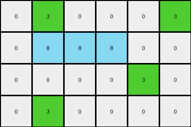

# 67385a82 • 011 • refine_dreamer

---


Previous Code:
```python
"""
Identifies horizontal runs of contiguous green pixels. If a run has length 2 or more,
change all pixels in that run to azure. If a run has length 1, and is adjacent to
any pixel that has already been changed to azure, change to azure.
"""

import numpy as np

def transform(input_grid):
    """
    Transforms the input grid by changing horizontally contiguous green pixels to azure based on run length.
    
    Args:
        input_grid (list of lists): The input grid represented as a list of lists.
    
    Returns:
        list of lists: The transformed grid.
    """
    output_grid = [row[:] for row in input_grid]  # Create a copy to avoid modifying the original
    rows = len(input_grid)
    cols = len(input_grid[0]) if rows > 0 else 0

    # 1. Identify and Measure Horizontal Runs
    runs = []  # List to store (row, start_col, end_col) of each run
    for r in range(rows):
        start_col = -1
        for c in range(cols):
            if input_grid[r][c] == 3:
                if start_col == -1:
                    start_col = c
            elif start_col != -1:
                runs.append((r, start_col, c - 1))
                start_col = -1
        if start_col != -1:  # Handle runs that extend to the end of the row
            runs.append((r, start_col, cols - 1))

    # 2. Change pixels based on run length (>= 2)
    for r, start_c, end_c in runs:
        if end_c - start_c + 1 >= 2:
            for c in range(start_c, end_c + 1):
                output_grid[r][c] = 8

    # 3. Handle single-pixel runs adjacent to changed pixels
    for r, start_c, end_c in runs:
      if end_c - start_c + 1 == 1:
        changed = False
        if start_c > 0 and output_grid[r][start_c - 1] == 8:
          output_grid[r][start_c] = 8
          changed = True
        if end_c < cols - 1 and output_grid[r][end_c+1] == 8 and not changed:
          output_grid[r][end_c] = 8

    return output_grid
```

Train Set Results:

## Example 1:

Input:
```
8 3 0
0 3 0
3 0 3
```
Expected Output:
```
8 8 0
0 8 0
3 0 3
```
Transformed Output:
```
8 8 0
0 3 0
3 0 3
```

match: False
pixels_off: 1
size_correct: True
color_palette_correct: True
correct_pixel_counts: False

## Example 2:

Input:
```
0 3 0 0 0 3
0 8 8 3 0 0
0 0 0 0 3 0
0 3 0 0 0 0
```
Expected Output:
```
0 8 0 0 0 3
0 8 8 8 0 0
0 0 0 0 3 0
0 3 0 0 0 0
```
Transformed Output:
```
0 3 0 0 0 3
0 8 8 8 0 0
0 0 0 0 3 0
0 3 0 0 0 0
```

match: False
pixels_off: 1
size_correct: True
color_palette_correct: True
correct_pixel_counts: False

## Example 3:

Input:
```
8 3 0 3
8 3 0 0
3 0 0 3
0 0 8 3
```
Expected Output:
```
8 8 0 3
8 8 0 0
8 0 0 8
0 0 8 8
```
Transformed Output:
```
8 8 0 3
8 8 0 0
3 0 0 3
0 0 8 8
```

match: False
pixels_off: 2
size_correct: True
color_palette_correct: True
correct_pixel_counts: False

## Example 4:

Input:
```
8 3 0 0 0 0
0 3 0 0 3 0
3 0 0 0 0 0
0 8 3 0 0 0
0 8 3 0 0 3
```
Expected Output:
```
8 8 0 0 0 0
0 8 0 0 3 0
3 0 0 0 0 0
0 8 8 0 0 0
0 8 8 0 0 3
```
Transformed Output:
```
8 8 0 0 0 0
0 3 0 0 3 0
3 0 0 0 0 0
0 8 8 0 0 0
0 8 8 0 0 3
```

match: False
pixels_off: 1
size_correct: True
color_palette_correct: True
correct_pixel_counts: False

**INSTRUCTIONS**

The code above was generated based on observations from the first training
example

we have tested the transform function on each of the task example inputs and
compared with the expected output

review each of the examples provided and the results and consider how the
natural language program should be updated to accommodate this new knowledge

respond with the following deliverables:

- general assessment of the information provided and strategy for resolving the
  errors
- gather metrics about each of the examples and results - use code_execution to
  develop accurate reports on your assumptions
- a YAML block documenting facts - Focus on identifying objects, their properties, and the actions performed on them.
- a natural language program - Be as clear and concise as possible, providing a complete description of the transformation rule.


your responses should be considered as information in a report - not a
conversation
