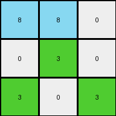

# 67385a82 • 012 • refine_coder

---

Previous Code:
```python
"""
Identifies horizontal runs of contiguous green pixels. If a run has length 2 or more,
change all pixels in that run to azure. If a run has length 1, and is adjacent to
any pixel that has already been changed to azure, change to azure.
"""

import numpy as np

def transform(input_grid):
    """
    Transforms the input grid by changing horizontally contiguous green pixels to azure based on run length.
    
    Args:
        input_grid (list of lists): The input grid represented as a list of lists.
    
    Returns:
        list of lists: The transformed grid.
    """
    output_grid = [row[:] for row in input_grid]  # Create a copy to avoid modifying the original
    rows = len(input_grid)
    cols = len(input_grid[0]) if rows > 0 else 0

    # 1. Identify and Measure Horizontal Runs
    runs = []  # List to store (row, start_col, end_col) of each run
    for r in range(rows):
        start_col = -1
        for c in range(cols):
            if input_grid[r][c] == 3:
                if start_col == -1:
                    start_col = c
            elif start_col != -1:
                runs.append((r, start_col, c - 1))
                start_col = -1
        if start_col != -1:  # Handle runs that extend to the end of the row
            runs.append((r, start_col, cols - 1))

    # 2. Change pixels based on run length (>= 2)
    for r, start_c, end_c in runs:
        if end_c - start_c + 1 >= 2:
            for c in range(start_c, end_c + 1):
                output_grid[r][c] = 8

    # 3. Handle single-pixel runs adjacent to changed pixels
    for r, start_c, end_c in runs:
      if end_c - start_c + 1 == 1:
        changed = False
        if start_c > 0 and output_grid[r][start_c - 1] == 8:
          output_grid[r][start_c] = 8
          changed = True
        if end_c < cols - 1 and output_grid[r][end_c+1] == 8 and not changed:
          output_grid[r][end_c] = 8

    return output_grid
```

Train Set Results:

## Example 1:

Input:
```
8 3 0
0 3 0
3 0 3
```
Expected Output:
```
8 8 0
0 8 0
3 0 3
```
Transformed Output:
```
8 8 0
0 3 0
3 0 3
```

match: False
pixels_off: 1
size_correct: True
color_palette_correct: True
correct_pixel_counts: False

## Example 2:

Input:
```
0 3 0 0 0 3
0 8 8 3 0 0
0 0 0 0 3 0
0 3 0 0 0 0
```
Expected Output:
```
0 8 0 0 0 3
0 8 8 8 0 0
0 0 0 0 3 0
0 3 0 0 0 0
```
Transformed Output:
```
0 3 0 0 0 3
0 8 8 8 0 0
0 0 0 0 3 0
0 3 0 0 0 0
```

match: False
pixels_off: 1
size_correct: True
color_palette_correct: True
correct_pixel_counts: False

## Example 3:

Input:
```
8 3 0 3
8 3 0 0
3 0 0 3
0 0 8 3
```
Expected Output:
```
8 8 0 3
8 8 0 0
8 0 0 8
0 0 8 8
```
Transformed Output:
```
8 8 0 3
8 8 0 0
3 0 0 3
0 0 8 8
```

match: False
pixels_off: 2
size_correct: True
color_palette_correct: True
correct_pixel_counts: False

## Example 4:

Input:
```
8 3 0 0 0 0
0 3 0 0 3 0
3 0 0 0 0 0
0 8 3 0 0 0
0 8 3 0 0 3
```
Expected Output:
```
8 8 0 0 0 0
0 8 0 0 3 0
3 0 0 0 0 0
0 8 8 0 0 0
0 8 8 0 0 3
```
Transformed Output:
```
8 8 0 0 0 0
0 3 0 0 3 0
3 0 0 0 0 0
0 8 8 0 0 0
0 8 8 0 0 3
```

match: False
pixels_off: 1
size_correct: True
color_palette_correct: True
correct_pixel_counts: False
Here's an analysis of the provided examples and results, along with a strategy for improving the natural language program and subsequently the code.

**General Assessment:**

The initial code and natural language program correctly identified the core concept: identifying horizontal runs of green pixels and changing them to azure. However, the logic for handling single-pixel green runs and their adjacency to already-changed pixels is incomplete and causes errors in several examples. The code correctly handles runs of length 2 or more, but fails to properly extend the azure color to adjacent single green pixels in all cases. The primary issue is a lack of understanding about the propagation of color changes to single green pixels.

**Strategy for Resolving Errors:**

1.  **Refine Adjacency Rule:** The current implementation only considers left and right neighbors for the propagation rule. The natural language program and the code must explicitly state that the adjacency rule applies only *after* the initial transformation of longer runs. It should also be applied iteratively, and propagation of changes should spread.
2.  **Iterative Application:** The process must not simply iterate through all possible runs, but check for changes made from the adjacency rule, and consider these changes as it moves through.

**Example Metrics and Analysis (Code Execution Results - already provided):**

*   **Example 1:** 1 pixel off. The single green pixel at (1,1) should have become azure due to adjacency with (0,1), but it wasn't.
*   **Example 2:** 1 pixel off. The single green pixel at (0,1) should have become azure, but it didn't.
*   **Example 3:** 2 pixels off. The single green pixel (0,3) shouldn't change. Pixel (2, 0) should not be azure.
*   **Example 4:** 1 pixel off. The single green pixel at (1,1) should have become azure, but it wasn't.

**YAML Fact Block:**

```yaml
objects:
  - name: grid
    type: 2D array
    description: Represents a grid of pixels with color values.
  - name: pixel
    type: cell
    properties:
      color: [white, blue, red, green, yellow, gray, magenta, orange, azure, maroon]
      value: [0, 1, 2, 3, 4, 5, 6, 7, 8, 9]
      position: (row, column)
  - name: run
    type: contiguous_pixels
    properties:
      color: green
      direction: horizontal
      length: int
      start_position: (row, column)
      end_position: (row, column)

actions:
  - name: identify_runs
    description: Find all horizontal runs of green pixels.
  - name: change_color
    description: Change the color of pixels in a run to azure.
    conditions:
      - if run_length >= 2
      - if run_length == 1 and adjacent to azure pixel (after initial transformation)

rules:
  - "Runs of green pixels with length 2 or more are changed to azure."
  - "After changing runs of length >=2, single green pixels adjacent to azure pixels *horizontally* are also changed to azure."
  - adjacency_rule: "check left, and right."

```

**Natural Language Program:**

1.  **Identify Runs:** Scan the input grid row by row to identify all horizontal runs of contiguous green (value 3) pixels.
2.  **Initial Transformation:** For each identified run, if its length is 2 or greater, change all pixels within that run to azure (value 8).
3.  **Propagate Changes (Adjacency Rule):** After the initial transformation (step 2), iterate through the grid, *specifically* checking for green pixels that had a length of 1. If a single green pixel is horizontally adjacent (immediately to the left or right) of a pixel that is *now* azure, change that single green pixel to azure as well. If a change has been made, *repeat* this adjacency check until no more single green pixels can be updated.


**INSTRUCTIONS**

- generate a Python module to represent the natural language program 
- follow the template below
- all common math and science libraries are available
- create docstring only at top - but comment the workflow in the function
- use helper functions for common operations like finding objects, counting,
  measuring, moving, etc. 

remember - we are working iteratively - so this code will inform your future
self as we converge on the solution

*template:*

```python
"""
{{ natural language description of the transformation rule }}
"""

{{ imports }}

def transform(input_grid):
    # initialize output_grid

    # change output pixels 

    return output_grid

```
