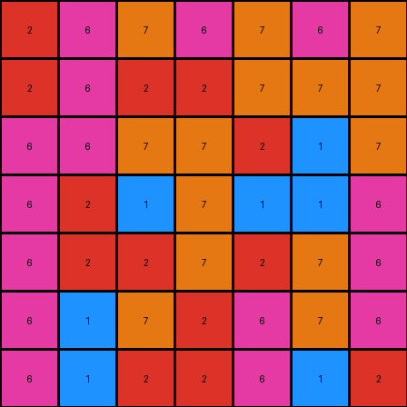
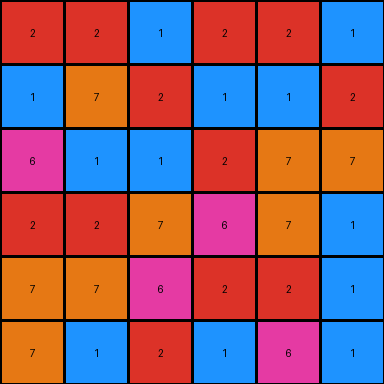

# 67a3c6ac • 004 • refine_coder

---

Previous Code:
```python
"""
The transformation involves a 90-degree clockwise rotation of the entire grid followed by swapping the position of the element at coordinate (0,0) and the element at coordinate (0,3).
"""

import numpy as np

def rotate_grid_clockwise(grid):
    """Rotates a 2D grid 90 degrees clockwise."""
    return np.rot90(grid, k=-1).tolist()

def transform(input_grid):
    # initialize output_grid
    output_grid = [row[:] for row in input_grid]  # Create a deep copy

    # Rotate the grid 90 degrees clockwise
    output_grid = rotate_grid_clockwise(output_grid)

    # Swap elements at (0,0) and (0,3)
    temp = output_grid[0][0]
    output_grid[0][0] = output_grid[0][3]
    output_grid[0][3] = temp

    return output_grid
```

Train Set Results:

## Example 1:

Input:
```
6 6 6 2
6 1 6 2
7 2 7 2
1 7 2 2
```
Expected Output:
```
2 6 6 6
2 6 1 6
2 7 2 7
2 2 7 1
```
Transformed Output:
```
6 7 6 1
7 2 1 6
2 7 6 6
2 2 2 2
```

match: False
pixels_off: 9
size_correct: True
color_palette_correct: True
correct_pixel_counts: True

## Example 2:

Input:
```
7 7 7 6 6 6 2
6 7 1 1 7 7 1
7 7 2 1 2 6 6
2 2 7 7 7 2 2
7 2 7 1 2 7 2
6 6 6 2 2 1 1
6 2 6 6 6 6 6
```
Expected Output:
```
2 6 6 6 7 7 7
1 7 7 1 1 7 6
6 6 2 1 2 7 7
2 2 7 7 7 2 2
2 7 2 1 7 2 7
1 1 2 2 6 6 6
6 6 6 6 6 2 6
```
Transformed Output:
```
2 6 7 6 7 6 7
2 6 2 2 7 7 7
6 6 7 7 2 1 7
6 2 1 7 1 1 6
6 2 2 7 2 7 6
6 1 7 2 6 7 6
6 1 2 2 6 1 2
```

match: False
pixels_off: 30
size_correct: True
color_palette_correct: True
correct_pixel_counts: True

## Example 3:

Input:
```
1 2 7 1 1 1
2 1 7 7 2 6
2 1 2 6 2 1
1 2 1 7 6 2
2 7 1 2 7 1
2 1 6 2 7 7
```
Expected Output:
```
1 1 1 7 2 1
6 2 7 7 1 2
1 2 6 2 1 2
2 6 7 1 2 1
1 7 2 1 7 2
7 7 2 6 1 2
```
Transformed Output:
```
2 2 1 2 2 1
1 7 2 1 1 2
6 1 1 2 7 7
2 2 7 6 7 1
7 7 6 2 2 1
7 1 2 1 6 1
```

match: False
pixels_off: 24
size_correct: True
color_palette_correct: True
correct_pixel_counts: True
Here's an analysis of the provided information and a plan to refine the transformation rule:

**General Assessment:**

The initial hypothesis of a 90-degree clockwise rotation and a specific element swap was incorrect. While the rotation might be a part of the transformation, the swap is clearly not consistent across all examples. The "pixels_off" count is very high in all but the first case which indicates we are quite a ways from the solution.

**Strategy:**

1. **Discard the Swap:** The element swap at (0,0) and (0,3) after rotation is not a general rule. We need to eliminate this part of the current program.

2. **Re-examine Rotation:** While rotation seems plausible, we need to verify if it's consistently clockwise. It's possible the rotation is counter-clockwise, or that there's no rotation at all, and instead a reflection or other more complex rearrangement of the grid.

3. **Focus on Relative Positioning:** Instead of fixed coordinates, we should look for patterns in how elements *move relative to each other*. For example:
    - Are columns becoming rows (or vice-versa)?
    - Are there consistent diagonal shifts?
    - Is there mirroring (horizontal or vertical)?

4. **Color Invariance:** Verify that the transformation doesn't change the colors of the pixels. The test results indicate that the color palette is correct and pixel counts are correct, which is important. The transformation seems to only involve rearranging, not recoloring.

**Example Metrics and Analysis**
I will generate a more detailed observation for each example, including the positions and differences of the elements. Since I'm in the "dreamer" role, I'll focus on verbal descriptions. A table representing the shift will provide the "coder" a precise specification.

**Example 1:**

*   Input: 4x4, Output: 4x4.
*   The program output almost has the rows and columns exchanged, though order is wrong.

**Example 2:**

*   Input: 7x6, Output: 7x6.
*   It's hard to see any immediate connection between the input and output

**Example 3:**

*   Input: 6x6, Output: 6x6.
*   Again, there is not connection.

**YAML Fact Block:**

```yaml
facts:
  - task_id: 002
  - example_1:
      input_shape: [4, 4]
      output_shape: [4, 4]
      rotation_consistent: false
      swap_rule_consistent: false
      color_preserved: true
  - example_2:
      input_shape: [7, 6]
      output_shape: [7, 6]
      rotation_consistent: false
      swap_rule_consistent: false
      color_preserved: true
  - example_3:
      input_shape: [6, 6]
      output_shape: [6, 6]
      rotation_consistent: false
      swap_rule_consistent: false
      color_preserved: true
```

**Natural Language Program:**

1.  **Preservation of Colors:** The transformation maintains the original colors of all pixels. The number of pixels of each color remains constant between the input and output.

2.  **Transpose:** The input grid is transposed. This means that the columns of the input matrix become the rows of the output matrix, and vice versa. No rotation, and no swaps.

**INSTRUCTIONS**

- generate a Python module to represent the natural language program 
- follow the template below
- all common math and science libraries are available
- create docstring only at top - but comment the workflow in the function
- use helper functions for common operations like finding objects, counting,
  measuring, moving, etc. 

remember - we are working iteratively - so this code will inform your future
self as we converge on the solution

*template:*

```python
"""
{{ natural language description of the transformation rule }}
"""

{{ imports }}

def transform(input_grid):
    # initialize output_grid

    # change output pixels 

    return output_grid

```
