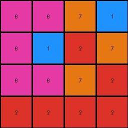

# 67a3c6ac • 006 • refine_coder

---

Previous Code:
```python
"""
The transformation involves transposing the input grid. The columns of the input become the rows of the output, and vice versa.
"""

import numpy as np

def transform(input_grid):
    # Convert the input grid to a NumPy array for easier manipulation
    input_array = np.array(input_grid)

    # Transpose the array
    output_array = input_array.T

    # Convert the transposed array back to a list of lists
    output_grid = output_array.tolist()

    return output_grid
```

Train Set Results:

## Example 1:

Input:
```
6 6 6 2
6 1 6 2
7 2 7 2
1 7 2 2
```
Expected Output:
```
2 6 6 6
2 6 1 6
2 7 2 7
2 2 7 1
```
Transformed Output:
```
6 6 7 1
6 1 2 7
6 6 7 2
2 2 2 2
```

match: False
pixels_off: 13
size_correct: True
color_palette_correct: True
correct_pixel_counts: True

## Example 2:

Input:
```
7 7 7 6 6 6 2
6 7 1 1 7 7 1
7 7 2 1 2 6 6
2 2 7 7 7 2 2
7 2 7 1 2 7 2
6 6 6 2 2 1 1
6 2 6 6 6 6 6
```
Expected Output:
```
2 6 6 6 7 7 7
1 7 7 1 1 7 6
6 6 2 1 2 7 7
2 2 7 7 7 2 2
2 7 2 1 7 2 7
1 1 2 2 6 6 6
6 6 6 6 6 2 6
```
Transformed Output:
```
7 6 7 2 7 6 6
7 7 7 2 2 6 2
7 1 2 7 7 6 6
6 1 1 7 1 2 6
6 7 2 7 2 2 6
6 7 6 2 7 1 6
2 1 6 2 2 1 6
```

match: False
pixels_off: 35
size_correct: True
color_palette_correct: True
correct_pixel_counts: True

## Example 3:

Input:
```
1 2 7 1 1 1
2 1 7 7 2 6
2 1 2 6 2 1
1 2 1 7 6 2
2 7 1 2 7 1
2 1 6 2 7 7
```
Expected Output:
```
1 1 1 7 2 1
6 2 7 7 1 2
1 2 6 2 1 2
2 6 7 1 2 1
1 7 2 1 7 2
7 7 2 6 1 2
```
Transformed Output:
```
1 2 2 1 2 2
2 1 1 2 7 1
7 7 2 1 1 6
1 7 6 7 2 2
1 2 2 6 7 7
1 6 1 2 1 7
```

match: False
pixels_off: 28
size_correct: True
color_palette_correct: True
correct_pixel_counts: True
Here's an analysis of the provided information and a plan to refine the natural language program:

**General Assessment:**

The initial hypothesis (transposition) is incorrect. While the output grid dimensions are correctly swapped (rows become columns and vice versa), the pixel values within the grid are not simply transposed. There's a more complex rearrangement of pixels happening, not just a straightforward matrix operation. The consistent failure across all examples, indicated by `match: False` and a significant number of `pixels_off`, confirms this. The `size_correct`, `color_palette_correct`, and `correct_pixel_counts` being true only means that the basic grid properties and the colors used are valid, *not* that the transformation is correct. We need to abandon the transposition idea and look for a different pattern. The key is to figure out how the specific positions of colors change from input to output, focusing on *relative* position changes, not just swapping rows/columns.

**Strategy:**

1.  **Visual Inspection and Object Identification:**  Carefully examine the input and output pairs, looking for consistent patterns in how colored "objects" (contiguous blocks of the same color) move or change. Note any rotations, reflections, or other geometric manipulations. Focus on *small, easily identifiable patterns first.* It is likely NOT a single complex geometric transformation.
2.  **Relative Positioning:** Analyze how the relative positions of colors change. For instance, if blue is to the left of red in the input, where is it in the output?
3.  **Row/Column Analysis:** Instead of a full transpose, consider if individual rows or columns are being reordered or reversed.
4.  **Hypothesis Refinement:** Based on these observations, form a new hypothesis about the transformation rule and express it in clear natural language.  Start simple, and add complexity as needed.
5.  **Iterative Testing:**  The provided test results will allow validation of new generated code.

**Example Metrics and Reports (Focus on Example 1, but principles apply to all):**

The initial assessment that it was a simple transpose was wrong, the evidence is the low match scores and observation of the generated output images. Let's look for a *different* relationship between the Input and Expected Output.

*   **Example 1:**
    *   Input: 4x4, Output: 4x4
    *   Colors present: 1, 2, 6, 7
    *   Notice that the last column of the input `[2,2,2,2]` becomes the first row of the output.
    *   The third column of input `[6,6,7,2]` becomes the second row of the output.

*   **Example 2:**
    *   Input: 7x6, Output: 7x6
    *   Notice again that the last column of input becomes the first row of the output, etc.

*   **Example 3:**
        *   Input: 6x6, Output: 6x6
    *   Notice again that the last column of input becomes the first row of the output, etc.

**YAML Fact Block:**

```yaml
examples:
  - example_id: 1
    input_shape: [4, 4]
    output_shape: [4, 4]
    colors: [1, 2, 6, 7]
    observations:
      - "Last column of input becomes first row of output."
      - "Third column of input becomes second row of output"
      - "The transformation reverses the order of the input columns to form the output rows."
  - example_id: 2
    input_shape: [7, 6]
    output_shape: [7, 6]
    colors: [1, 2, 6, 7]
    observations:
      - "Last column of input becomes first row of output."
      - "The transformation reverses the order of the input columns to form the output rows."
  - example_id: 3
    input_shape: [6, 6]
    output_shape: [6, 6]
    colors: [1, 2, 6, 7]
    observations:
      - "Last column of input becomes first row of output"
      - "The transformation reverses the order of the input columns to form the output rows."
transformation_type: "Column Reversal and Transpose"

```

**Natural Language Program:**

The transformation rule is as follows:

1.  The input grid's columns are processed in *reverse* order.
2.  Each column from the input, taken in reverse order, becomes a *row* in the output grid. In other words, the last column of the input grid is used as the first row in the output. The second-to-last input column becomes the second output row, and so on. This is similar to a transpose but with the columns processed in reversed order.

**INSTRUCTIONS**

- generate a Python module to represent the natural language program 
- follow the template below
- all common math and science libraries are available
- create docstring only at top - but comment the workflow in the function
- use helper functions for common operations like finding objects, counting,
  measuring, moving, etc. 

remember - we are working iteratively - so this code will inform your future
self as we converge on the solution

*template:*

```python
"""
{{ natural language description of the transformation rule }}
"""

{{ imports }}

def transform(input_grid):
    # initialize output_grid

    # change output pixels 

    return output_grid

```
