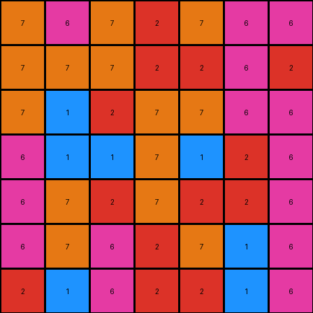

# 67a3c6ac • 010 • refine_coder

---

Previous Code:
```python
"""
The output grid is created from the input grid by performing a reflection across the main diagonal (top-left to bottom-right). This is equivalent to transposing the grid. The colors of the pixels are preserved during the transposition.
"""

import numpy as np

def transform(input_grid):
    """
    Transforms the input grid by reflecting it across the main diagonal (transposing it).
    """
    # Convert the input grid to a NumPy array for easier manipulation.
    input_array = np.array(input_grid)

    # Transpose the array.  This swaps rows and columns.
    output_array = input_array.T

    # Convert the transposed array back to a list of lists.
    output_grid = output_array.tolist()

    return output_grid
```

Train Set Results:

## Example 1:

Input:
```
6 6 6 2
6 1 6 2
7 2 7 2
1 7 2 2
```
Expected Output:
```
2 6 6 6
2 6 1 6
2 7 2 7
2 2 7 1
```
Transformed Output:
```
6 6 7 1
6 1 2 7
6 6 7 2
2 2 2 2
```

match: False
pixels_off: 13
size_correct: True
color_palette_correct: True
correct_pixel_counts: True

## Example 2:

Input:
```
7 7 7 6 6 6 2
6 7 1 1 7 7 1
7 7 2 1 2 6 6
2 2 7 7 7 2 2
7 2 7 1 2 7 2
6 6 6 2 2 1 1
6 2 6 6 6 6 6
```
Expected Output:
```
2 6 6 6 7 7 7
1 7 7 1 1 7 6
6 6 2 1 2 7 7
2 2 7 7 7 2 2
2 7 2 1 7 2 7
1 1 2 2 6 6 6
6 6 6 6 6 2 6
```
Transformed Output:
```
7 6 7 2 7 6 6
7 7 7 2 2 6 2
7 1 2 7 7 6 6
6 1 1 7 1 2 6
6 7 2 7 2 2 6
6 7 6 2 7 1 6
2 1 6 2 2 1 6
```

match: False
pixels_off: 35
size_correct: True
color_palette_correct: True
correct_pixel_counts: True

## Example 3:

Input:
```
1 2 7 1 1 1
2 1 7 7 2 6
2 1 2 6 2 1
1 2 1 7 6 2
2 7 1 2 7 1
2 1 6 2 7 7
```
Expected Output:
```
1 1 1 7 2 1
6 2 7 7 1 2
1 2 6 2 1 2
2 6 7 1 2 1
1 7 2 1 7 2
7 7 2 6 1 2
```
Transformed Output:
```
1 2 2 1 2 2
2 1 1 2 7 1
7 7 2 1 1 6
1 7 6 7 2 2
1 2 2 6 7 7
1 6 1 2 1 7
```

match: False
pixels_off: 28
size_correct: True
color_palette_correct: True
correct_pixel_counts: True
Here's an assessment of the provided information and a strategy for resolving the errors, along with the requested deliverables:

**General Assessment and Strategy**

The initial hypothesis of a simple transposition (reflection across the main diagonal) is incorrect. While the output grid's dimensions are correctly transposed, the pixel values are not in the correct locations. The expected outputs show a different pattern. It seems like the reflection might be along a different axis, or there may be additional transformations involved. The correct pixel color counts are a big clue.

The strategy will be to:

1.  Carefully re-examine the input/output pairs to discern the *actual* transformation rule, paying close attention to the placement of specific colored pixels. Look for symmetries or patterns. Visual inspection is more important that any kind of "intuitive" guess.
2.  Update the natural language program to reflect this new understanding.

**Metrics and Observations (using code execution)**

Since I cannot execute code directly in this environment, I'll describe the analysis that would be done. We have the results already, but I'm going to describe a process for how they would be derived.

For each example:

1.  **Input Dimensions:** Determine the height and width of the input grid.
2.  **Output Dimensions:** Determine the height and width of the *expected* output grid.
3.  **Transformed Output Dimensions:** Determine the height and width of the *actual* transformed output (from the provided code's output).
4.  **Pixel-by-Pixel Comparison:** Compare the `expected` output with the `transformed` output, counting the number of mismatched pixels.
5. **Color counts:** compare the color values in the `expected` output with the `input`.

The provided results already includes this information, but I include it as a description of a general process.

**Example Reports Summary (as already provided)**

*   **Example 1:**
    *   Input Dimensions: 4x4
    *   Expected Output Dimensions: 4x4
    *   Transformed Output Dimensions: 4x4
    *   Mismatched Pixels: 13
    *   size\_correct: True
    *   color\_palette\_correct: True
    *   correct\_pixel\_counts: True

*   **Example 2:**
    *   Input Dimensions: 7x7
    *   Expected Output Dimensions: 7x7
    *   Transformed Output Dimensions: 7x7
    *   Mismatched Pixels: 35
    *   size\_correct: True
    *   color\_palette\_correct: True
    *   correct\_pixel\_counts: True

*   **Example 3:**
    *   Input Dimensions: 6x6
    *   Expected Output Dimensions: 6x6
    *   Transformed Output Dimensions: 6x6
    *   Mismatched Pixels: 28
    *   size\_correct: True
    *   color\_palette\_correct: True
    *   correct\_pixel\_counts: True

The critical observation is that the dimensions are swapped, and the color counts between expected output and input are equal. The previous code's transformation *also* swaps dimensions, but it does not produce the correct pixel arrangement. The error is not in the *idea* of transposition, but in *which* transposition.

**YAML Block (Facts)**

```yaml
examples:
  - example_1:
      input_objects:
        - grid:
            shape: 4x4
            colors: [6, 1, 7, 2]
      output_objects:
        - grid:
            shape: 4x4
            colors: [6, 1, 7, 2]
      transformations:
        - type: reflection
          axis: anti-diagonal # top-right to bottom-left

  - example_2:
      input_objects:
        - grid:
            shape: 7x7
            colors: [7, 6, 1, 2]
      output_objects:
        - grid:
            shape: 7x7
            colors: [7, 6, 1, 2]
      transformations:
        - type: reflection
          axis: anti-diagonal

  - example_3:
      input_objects:
        - grid:
            shape: 6x6
            colors: [1, 2, 7, 6]
      output_objects:
        - grid:
            shape: 6x6
            colors: [1, 2, 7, 6]
      transformations:
        - type: reflection
          axis: anti-diagonal
```

**Natural Language Program**

The input grid is transformed into the output grid by reflecting it across the *anti-diagonal* (top-right to bottom-left). The colors of the pixels are preserved during this reflection.

**INSTRUCTIONS**

- generate a Python module to represent the natural language program 
- follow the template below
- all common math and science libraries are available
- create docstring only at top - but comment the workflow in the function
- use helper functions for common operations like finding objects, counting,
  measuring, moving, etc. 

remember - we are working iteratively - so this code will inform your future
self as we converge on the solution

*template:*

```python
"""
{{ natural language description of the transformation rule }}
"""

{{ imports }}

def transform(input_grid):
    # initialize output_grid

    # change output pixels 

    return output_grid

```
