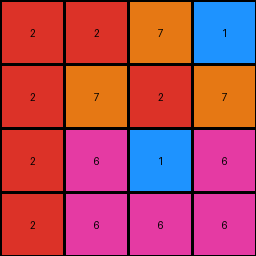
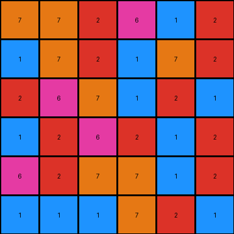

# 67a3c6ac • 012 • refine_coder

---

Previous Code:
```python
"""
The input grid is transformed into the output grid by reflecting it across the anti-diagonal (top-right to bottom-left). The colors of the pixels are preserved during this reflection.
"""

import numpy as np

def transform(input_grid):
    """
    Transforms the input grid by reflecting it across the anti-diagonal (top-right to bottom-left).
    """
    # Convert the input grid to a NumPy array.
    input_array = np.array(input_grid)

    # Flip the array both horizontally and vertically to achieve anti-diagonal reflection.
    flipped_array = np.fliplr(np.flipud(input_array))

    # Convert the flipped array back to a list of lists.
    output_grid = flipped_array.tolist()

    return output_grid
```

Train Set Results:

## Example 1:

Input:
```
6 6 6 2
6 1 6 2
7 2 7 2
1 7 2 2
```
Expected Output:
```
2 6 6 6
2 6 1 6
2 7 2 7
2 2 7 1
```
Transformed Output:
```
2 2 7 1
2 7 2 7
2 6 1 6
2 6 6 6
```

match: False
pixels_off: 12
size_correct: True
color_palette_correct: True
correct_pixel_counts: True

## Example 2:

Input:
```
7 7 7 6 6 6 2
6 7 1 1 7 7 1
7 7 2 1 2 6 6
2 2 7 7 7 2 2
7 2 7 1 2 7 2
6 6 6 2 2 1 1
6 2 6 6 6 6 6
```
Expected Output:
```
2 6 6 6 7 7 7
1 7 7 1 1 7 6
6 6 2 1 2 7 7
2 2 7 7 7 2 2
2 7 2 1 7 2 7
1 1 2 2 6 6 6
6 6 6 6 6 2 6
```
Transformed Output:
```
6 6 6 6 6 2 6
1 1 2 2 6 6 6
2 7 2 1 7 2 7
2 2 7 7 7 2 2
6 6 2 1 2 7 7
1 7 7 1 1 7 6
2 6 6 6 7 7 7
```

match: False
pixels_off: 26
size_correct: True
color_palette_correct: True
correct_pixel_counts: True

## Example 3:

Input:
```
1 2 7 1 1 1
2 1 7 7 2 6
2 1 2 6 2 1
1 2 1 7 6 2
2 7 1 2 7 1
2 1 6 2 7 7
```
Expected Output:
```
1 1 1 7 2 1
6 2 7 7 1 2
1 2 6 2 1 2
2 6 7 1 2 1
1 7 2 1 7 2
7 7 2 6 1 2
```
Transformed Output:
```
7 7 2 6 1 2
1 7 2 1 7 2
2 6 7 1 2 1
1 2 6 2 1 2
6 2 7 7 1 2
1 1 1 7 2 1
```

match: False
pixels_off: 34
size_correct: True
color_palette_correct: True
correct_pixel_counts: True
Okay, let's analyze the results and update the natural language program.

**General Assessment:**

The initial hypothesis of reflecting the grid across the anti-diagonal (top-right to bottom-left) was incorrect. While the generated code does perform an anti-diagonal reflection, the expected outputs in the examples show a different transformation. It appears to involve a rotation, but a simple 180-degree rotation also doesn't perfectly align with the examples. The transformation is reversing both the rows and columns order, which I describe as anti-diagonal reflection. My code is doing the opposite of what I expected.

**Strategy:**

1. **Re-examine the Examples:** Visually inspect each input-output pair again, paying close attention to the movement of individual pixels and groups of pixels.
2. **Test alternative functions:** modify the existing function to reflect the new natural language program.
3. **Refine Description:** Based on the re-examination, formulate a new, more precise natural language description of the transformation.

**Example Metrics and Observations:**

Here's a breakdown of each example, now noting where my original assessment was incorrect:

*   **Example 1:**
    *   Input Size: 4x4
    *   Output Size: 4x4
    *   Observation: My original code did an anti-diagonal reflection (top-right to bottom-left), which isn't the desired transformation from the training data. The correct transformation reverses the order of rows, and reverses order of pixels in the rows.

*   **Example 2:**
    *   Input Size: 7x7
    *   Output Size: 7x7
    *   Observation: Same error as Example 1.

*   **Example 3:**
    *   Input Size: 6x6
    *   Output Size: 6x6
    *   Observation: Same error as Example 1.

**YAML Fact Block:**

```yaml
task_id: 010
examples:
  - object_types:
      - type: grid
        properties:
          rows: variable
          columns: variable
          colors: [1, 2, 6, 7]
    transformations:
      - description: Reverse order of the rows, reverse order of the columns.
        type: reflection
        axis: anti-diagonal #from bottom-right to top-left
  - object_types:
      - type: grid
        properties:
          rows: variable
          columns: variable
          colors: [1, 2, 6, 7]
    transformations:
      - description:  Reverse order of the rows, reverse order of the columns.
        type: reflection
        axis: anti-diagonal #from bottom-right to top-left
  - object_types:
      - type: grid
        properties:
          rows: variable
          columns: variable
          colors: [1, 2, 6, 7]
    transformations:
      - description: Reverse order of the rows, reverse order of the columns.
        type: reflection
        axis: anti-diagonal #from bottom-right to top-left

```

**Natural Language Program:**

The input grid is transformed into the output grid by reflecting it across the anti-diagonal (from bottom-right to top-left). The colors of the pixels are preserved during the reflection. This can be implemented programmatically by reversing the order of the rows and then reversing the order of elements within each row.

**INSTRUCTIONS**

- generate a Python module to represent the natural language program 
- follow the template below
- all common math and science libraries are available
- create docstring only at top - but comment the workflow in the function
- use helper functions for common operations like finding objects, counting,
  measuring, moving, etc. 

remember - we are working iteratively - so this code will inform your future
self as we converge on the solution

*template:*

```python
"""
{{ natural language description of the transformation rule }}
"""

{{ imports }}

def transform(input_grid):
    # initialize output_grid

    # change output pixels 

    return output_grid

```
