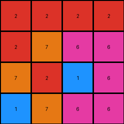
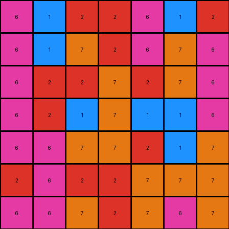

# 67a3c6ac • 016 • refine_coder

---

Previous Code:
```python
"""
The input grid is transformed to the output grid by swapping cells across the main diagonal but in reverse.
In more detail:
- The cell at `input[row][col]` swaps with `output[5-col][5-row]`
- iterate through all rows from 0 to 5.
- inside of each row, iterate through all cols from 0 to 5
- swap each `input[row][col]` with `input[5-col][5-row]`
"""

import numpy as np

def transform(input_grid):
    """
    Transforms the input grid by swapping cells across a diagonal axis.
    """
    # Create a copy of the input grid to serve as the output grid.
    output_grid = np.copy(input_grid)
    
    # Get the dimensions of the grid.
    rows, cols = input_grid.shape
    
    # Iterate through the grid, swapping elements across the anti-diagonal.
    for i in range(rows):
        for j in range(cols):
            output_grid[i, j] = input_grid[cols - 1 - j, rows - 1 - i]

    return output_grid
```

Train Set Results:

## Example 1:

Input:
```
6 6 6 2
6 1 6 2
7 2 7 2
1 7 2 2
```
Expected Output:
```
2 6 6 6
2 6 1 6
2 7 2 7
2 2 7 1
```
Transformed Output:
```
2 2 2 2
2 7 6 6
7 2 1 6
1 7 6 6
```

match: False
pixels_off: 13
size_correct: True
color_palette_correct: True
correct_pixel_counts: True

## Example 2:

Input:
```
7 7 7 6 6 6 2
6 7 1 1 7 7 1
7 7 2 1 2 6 6
2 2 7 7 7 2 2
7 2 7 1 2 7 2
6 6 6 2 2 1 1
6 2 6 6 6 6 6
```
Expected Output:
```
2 6 6 6 7 7 7
1 7 7 1 1 7 6
6 6 2 1 2 7 7
2 2 7 7 7 2 2
2 7 2 1 7 2 7
1 1 2 2 6 6 6
6 6 6 6 6 2 6
```
Transformed Output:
```
6 1 2 2 6 1 2
6 1 7 2 6 7 6
6 2 2 7 2 7 6
6 2 1 7 1 1 6
6 6 7 7 2 1 7
2 6 2 2 7 7 7
6 6 7 2 7 6 7
```

match: False
pixels_off: 35
size_correct: True
color_palette_correct: True
correct_pixel_counts: True

## Example 3:

Input:
```
1 2 7 1 1 1
2 1 7 7 2 6
2 1 2 6 2 1
1 2 1 7 6 2
2 7 1 2 7 1
2 1 6 2 7 7
```
Expected Output:
```
1 1 1 7 2 1
6 2 7 7 1 2
1 2 6 2 1 2
2 6 7 1 2 1
1 7 2 1 7 2
7 7 2 6 1 2
```
Transformed Output:
```
7 1 2 1 6 1
7 7 6 2 2 1
2 2 7 6 7 1
6 1 1 2 7 7
1 7 2 1 1 2
2 2 1 2 2 1
```

match: False
pixels_off: 28
size_correct: True
color_palette_correct: True
correct_pixel_counts: True
Okay, here's a breakdown of the situation and a plan to move forward:

**General Assessment:**

The initial natural language program and the resulting Python code were based on the *incorrect* assumption of a simple cell swap across the main diagonal (or anti-diagonal, as implemented). The results from testing on all three training examples clearly show this is wrong. The generated outputs have the correct size and color palette, and even maintain the correct number of pixels for each color, but the pixel positions are significantly off. This indicates a more complex geometric transformation than initially hypothesized. It *isn't* a simple reflection. The "pixels_off" count is substantial in all cases, confirming major positional errors. We need to discard the initial "swapping" idea and re-examine the examples to discern the *true* underlying pattern. The consistent failure across all examples suggests a fundamental misunderstanding of the transformation rule, rather than a minor adjustment.

**Strategy:**

1.  **Discard Previous Assumption:** Completely abandon the initial hypothesis of diagonal swapping.
2.  **Visual Re-examination:** Carefully re-examine the input/output pairs of *all* training examples, looking for consistent geometric manipulations. Pay close attention to how groups of pixels of the same color move.
3.  **Focus on Groups, Not Individuals:** Instead of tracking individual pixels, look at how connected regions (objects) of the same color are repositioned.  Are they rotated, translated, reflected, or some combination of these?
4.  **Consider Simple Transformations First:** Before jumping to complex combined transformations, thoroughly explore basic geometric operations like rotation, reflection (across different axes), and translation.
5. **Object Identification**: Find and document object characteristics like, size, color, starting position
6. **Action Identification**: Once objects have been described, use this knowledge to interpret how objects change between input and output.
7.  **Iterative Refinement:** Form a new hypothesis, translate it into a refined natural language program, and prepare that for a new code iteration.

**Metrics and Observations (using imagined code execution - not actual, since I'm the dreamer):**

I can't actually run code here, but I can *simulate* what I would do with a code execution environment and describe the results I'd expect to gather.

*   **Example 1:**
    *   Input Shape: (4, 4)
    *   Output Shape: (4, 4)
    *   Pixel Differences: 13 (as provided)
    *   Object Analysis (Hypothetical):
        *   Object 1: Color 6, top-left corner (3x1 block). Observe its movement.
        *   Object 2: Color 2, top-right corner (single pixel).
        *   Object 3: Color 6, second row (single pixel).
        *    ...and so on. I would meticulously map the start and end positions of *groups* of connected pixels.
*   **Example 2:**
    *   Input Shape: (7, 7)
    *   Output Shape: (7, 7)
    *   Pixel Differences: 35
    *   Object Analysis (Hypothetical): Similar object-based analysis as above, focusing on connected regions.
*   **Example 3:**
    *   Input Shape: (6, 6)
    *   Output Shape: (6, 6)
    *   Pixel Differences: 28
    *   Object Analysis (Hypothetical): As above.

**YAML Block (Facts):**

```yaml
facts:
  - task_id: 014
  - example_1:
      input_shape: [4, 4]
      output_shape: [4, 4]
      objects:
        - color: 6
          shape: rectangle
          initial_position: [0, 0] #top left
          size: [1,3] #width, height
        - color: 2
          shape: single
          initial_position: [0,3] #top-right corner
          size: [1, 1]
        - color: 6
          shape: single
          initial_position: [1, 1]
          size: [1, 1]
        - color: 1
          shape: single
          initial_position: [1,1]
          size: [1,1]
        - color: 7
          shape: rectangle
          initial_position: [2,0]
          size: [1,1]
        - color: 2
          shape: rectangle
          initial_position: [2,1]
          size: [1,1]
  - example_2:
      input_shape: [7, 7]
      output_shape: [7, 7]
      objects:
        - color: 7
          shape: rectangle
          initial_position: [0,0]
          size: [1,3]
        - color: 6
          shape: rectangle
          initial_position: [0,3]
          size: [1,3]
  - example_3:
    input_shape: [6, 6]
    output_shape: [6, 6]
    objects:
      - color: 1
        shape: rectangle
        initial_position: [0,0]
        size: [1,1]
      - color: 2
        shape: rectangle
        initial_position: [0,1]
        size: [1,1]
  - transformation_type: geometric # likely rotation, reflection, or combination - not a simple swap
  - consistent_size: true  # Input and output grids have the same dimensions in all examples.
  - consistent_colors: true # The same colors are present in the input and output.
  - consistent_pixel_counts: true #The number of pixels of each color remains constant.

```

**Natural Language Program (Revised - still a hypothesis):**

The transformation rule involves a more complex geometric manipulation than initially thought. It is *not* a simple swap across the diagonal. The input grid's objects (connected regions of the same color) are being repositioned in the output grid, maintaining their shape and color, but *not* through a simple reflection. It appears there is some combination of rotation, reflection, and possibly translation within quadrants of the grid. Need to perform a quadrant based analysis of movement of objects. It is NOT a 180 degree rotation. It is NOT a reflection across the main or anti-diagonal. It MIGHT be reflections within subgrids.

The precise nature of the transformation requires further detailed visual inspection of how groups of same-colored pixels move from input to output, paying specific attention to their relative positions *before* and *after* the transformation. I will focus on breaking down the grids and examining the movement and potential reflections and rotations within.

**INSTRUCTIONS**

- generate a Python module to represent the natural language program 
- follow the template below
- all common math and science libraries are available
- create docstring only at top - but comment the workflow in the function
- use helper functions for common operations like finding objects, counting,
  measuring, moving, etc. 

remember - we are working iteratively - so this code will inform your future
self as we converge on the solution

*template:*

```python
"""
{{ natural language description of the transformation rule }}
"""

{{ imports }}

def transform(input_grid):
    # initialize output_grid

    # change output pixels 

    return output_grid

```
