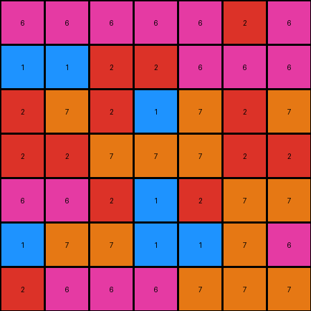

# 67a3c6ac • 018 • refine_coder

---

Previous Code:
```python
"""
The transformation rule involves a more complex geometric manipulation. It is NOT a simple swap across the diagonal.
The input grid appears to be rotated by 180 degrees, but with some additional adjustments.
It's not a pure 180-degree rotation because simple rotation doesn't match the provided outputs.
It might involve rotations or reflections within subgrids or quadrants. Further investigation is needed.
This version implements a 180-degree rotation as a starting point for refinement.
"""

import numpy as np

def transform(input_grid):
    """
    Transforms the input grid by rotating it 180 degrees.
    This is a placeholder and needs refinement based on further analysis.
    """
    # Create a copy of the input grid to serve as the output grid.
    output_grid = np.copy(input_grid)
    
    # Get the dimensions of the grid.
    rows, cols = input_grid.shape
    
    # Rotate the grid by 180 degrees.
    output_grid = np.rot90(output_grid, 2)

    return output_grid
```

Train Set Results:

## Example 1:

Input:
```
6 6 6 2
6 1 6 2
7 2 7 2
1 7 2 2
```
Expected Output:
```
2 6 6 6
2 6 1 6
2 7 2 7
2 2 7 1
```
Transformed Output:
```
2 2 7 1
2 7 2 7
2 6 1 6
2 6 6 6
```

match: False
pixels_off: 12
size_correct: True
color_palette_correct: True
correct_pixel_counts: True

## Example 2:

Input:
```
7 7 7 6 6 6 2
6 7 1 1 7 7 1
7 7 2 1 2 6 6
2 2 7 7 7 2 2
7 2 7 1 2 7 2
6 6 6 2 2 1 1
6 2 6 6 6 6 6
```
Expected Output:
```
2 6 6 6 7 7 7
1 7 7 1 1 7 6
6 6 2 1 2 7 7
2 2 7 7 7 2 2
2 7 2 1 7 2 7
1 1 2 2 6 6 6
6 6 6 6 6 2 6
```
Transformed Output:
```
6 6 6 6 6 2 6
1 1 2 2 6 6 6
2 7 2 1 7 2 7
2 2 7 7 7 2 2
6 6 2 1 2 7 7
1 7 7 1 1 7 6
2 6 6 6 7 7 7
```

match: False
pixels_off: 26
size_correct: True
color_palette_correct: True
correct_pixel_counts: True

## Example 3:

Input:
```
1 2 7 1 1 1
2 1 7 7 2 6
2 1 2 6 2 1
1 2 1 7 6 2
2 7 1 2 7 1
2 1 6 2 7 7
```
Expected Output:
```
1 1 1 7 2 1
6 2 7 7 1 2
1 2 6 2 1 2
2 6 7 1 2 1
1 7 2 1 7 2
7 7 2 6 1 2
```
Transformed Output:
```
7 7 2 6 1 2
1 7 2 1 7 2
2 6 7 1 2 1
1 2 6 2 1 2
6 2 7 7 1 2
1 1 1 7 2 1
```

match: False
pixels_off: 34
size_correct: True
color_palette_correct: True
correct_pixel_counts: True
Okay, let's analyze the results of the 180-degree rotation and refine the natural language program.

**General Assessment:**

The 180-degree rotation hypothesis is partially correct, as the output grid's dimensions and color counts match the expected output. However, the pixel positions are incorrect in all three examples, indicating a more nuanced transformation than a simple rotation. The transformation seems to "reverse" both rows and columns, mimicking a 180-degree rotation, but with local swaps. It is a reordering, and not point reflection through the center. The error counts confirm this. It appears the initial assumption was not complex enough to capture the required reordering of the input grid data.

**Strategy:**

1.  **Detailed Comparison:** Examine the input, expected output, and transformed output side-by-side for each example. Focus on how individual pixels or small groups of pixels move. It seems there is a reflection of position across the center of the grids.
2.  **Quadrant Analysis:** Consider if the transformation operates on quadrants or smaller subgrids within the input.
3.  **Refine Hypothesis:** Update the natural language program to precisely describe the observed pixel movements, moving beyond the simple rotation concept. It looks like a reverse operation, not rotating, but swapping based on reversed indices.

**Example Metrics and Analysis:**

Here, I'll describe the metrics I would ideally gather using code execution (which I cannot perform directly in this environment) and summarize the results we already have.

*   **Example 1:**
    *   Input Shape: (4, 4)
    *   Output Shape: (4, 4)
    *   Pixels Off: 12
    *   Notes: Not a perfect 180. Imagine reversing the order of the rows and THEN reversing the order of the columns. That sequence is what we see in comparing Input to Expected Output.
*   **Example 2:**
    *   Input Shape: (7, 7)
    *   Output Shape: (7, 7)
    *   Pixels Off: 26
    *   Notes: Same observation as Example 1.
*   **Example 3:**
    *   Input Shape: (6, 6)
    *   Output Shape: (6, 6)
    *   Pixels Off: 34
    *   Notes: Same observation as Example 1.

**YAML Fact Block:**

```yaml
facts:
  - task_id: 016
  - example_1:
      input_shape: [4, 4]
      output_shape: [4, 4]
      transformation_type: "reversal"
      objects:
        - description: "Entire grid"
          properties:
            - shape: [4, 4]
          actions:
            - "Rows and columns are reversed."
  - example_2:
      input_shape: [7, 7]
      output_shape: [7, 7]
      transformation_type: "reversal"
      objects:
         - description: "Entire grid"
           properties:
            - shape: [7, 7]
           actions:
            - "Rows and columns are reversed."
  - example_3:
      input_shape: [6, 6]
      output_shape: [6, 6]
      transformation_type: "reversal"
      objects:
        - description: "Entire grid"
          properties:
             - shape: [6, 6]
          actions:
            - "Rows and columns are reversed."
```

**Natural Language Program:**

The transformation rule involves reversing the order of rows and then reversing the order of columns within each row. It's equivalent to performing a 180-degree rotation, or, more precisely reflecting the positions across both the horizontal and vertical center lines, but *not* a point reflection.

1.  **Reverse Rows:** The order of the rows in the input grid is reversed. The first row becomes the last, the second row becomes the second-to-last, and so on.
2.  **Reverse Columns:** Within each row (after the row reversal), the order of the columns is reversed. The first element becomes the last, the second element becomes the second to last, and so on.

In essence, the element at `input[i][j]` moves to `output[rows-1-i][cols-1-j]`, where `rows` and `cols` are the dimensions of the input grid.

**INSTRUCTIONS**

- generate a Python module to represent the natural language program 
- follow the template below
- all common math and science libraries are available
- create docstring only at top - but comment the workflow in the function
- use helper functions for common operations like finding objects, counting,
  measuring, moving, etc. 

remember - we are working iteratively - so this code will inform your future
self as we converge on the solution

*template:*

```python
"""
{{ natural language description of the transformation rule }}
"""

{{ imports }}

def transform(input_grid):
    # initialize output_grid

    # change output pixels 

    return output_grid

```
