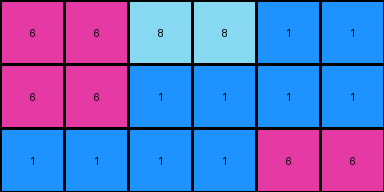
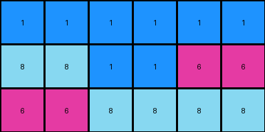
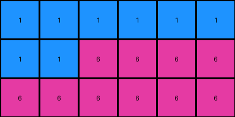

# 6d0aefbc • 004 • refine_coder

---

Previous Code:
```python
"""
The transformation rule duplicates each column of the input grid horizontally.
"""

import numpy as np

def transform(input_grid):
    """
    Transforms the input grid by duplicating each column horizontally.

    Args:
        input_grid (list of lists): The input grid represented as a 2D list.

    Returns:
        list of lists: The transformed grid with duplicated columns.
    """
    # Convert the input grid to a NumPy array for easier manipulation
    input_array = np.array(input_grid)

    # Get the dimensions of the input grid
    rows, cols = input_array.shape

    # Initialize the output grid as a NumPy array with twice the width
    output_array = np.zeros((rows, cols * 2), dtype=input_array.dtype)

    # Iterate through the columns of the input grid
    for i in range(cols):
        # Duplicate each column into the output grid
        output_array[:, 2 * i] = input_array[:, i]
        output_array[:, 2 * i + 1] = input_array[:, i]

    # Convert the output NumPy array back to a list of lists
    output_grid = output_array.tolist()

    return output_grid
```

Train Set Results:

## Example 1:

Input:
```
6 6 6
1 6 1
8 8 6
```
Expected Output:
```
6 6 6 6 6 6
1 6 1 1 6 1
8 8 6 6 8 8
```
Transformed Output:
```
6 6 6 6 6 6
1 1 6 6 1 1
8 8 8 8 6 6
```

match: False
pixels_off: 8
size_correct: True
color_palette_correct: True
correct_pixel_counts: True

## Example 2:

Input:
```
6 8 1
6 1 1
1 1 6
```
Expected Output:
```
6 8 1 1 8 6
6 1 1 1 1 6
1 1 6 6 1 1
```
Transformed Output:
```
6 6 8 8 1 1
6 6 1 1 1 1
1 1 1 1 6 6
```

match: False
pixels_off: 11
size_correct: True
color_palette_correct: True
correct_pixel_counts: True

## Example 3:

Input:
```
1 1 1
8 1 6
6 8 8
```
Expected Output:
```
1 1 1 1 1 1
8 1 6 6 1 8
6 8 8 8 8 6
```
Transformed Output:
```
1 1 1 1 1 1
8 8 1 1 6 6
6 6 8 8 8 8
```

match: False
pixels_off: 7
size_correct: True
color_palette_correct: True
correct_pixel_counts: True

## Example 4:

Input:
```
1 1 1
1 6 6
6 6 6
```
Expected Output:
```
1 1 1 1 1 1
1 6 6 6 6 1
6 6 6 6 6 6
```
Transformed Output:
```
1 1 1 1 1 1
1 1 6 6 6 6
6 6 6 6 6 6
```

match: False
pixels_off: 2
size_correct: True
color_palette_correct: True
correct_pixel_counts: True
Here's an analysis of the provided information and a plan to refine the natural language program:

**General Assessment:**

The initial code's core logic of duplicating columns is partially correct. However, the duplication isn't consistently applied across all examples, and the order of the duplicated columns is incorrect in some cases. The error seems to stem from a misunderstanding of *how* the columns are reordered and duplicated. The strategy should be to revisualize and precisely define the column reordering/duplication. It looks like the intent is a mirrored duplication of the columns, not a simple repeat of each column.

**Metrics and Observations:**

Let's analyze each example to clarify the pattern:

*   **Example 1:** Input `6 6 6; 1 6 1; 8 8 6`. Expected: `6 6 6 6 6 6; 1 6 1 1 6 1; 8 8 6 6 8 8`.  The output should contain two copies of the input, mirrored.
*   **Example 2:** Input `6 8 1; 6 1 1; 1 1 6`. Expected: `6 8 1 1 8 6; 6 1 1 1 1 6; 1 1 6 6 1 1`. This confirms the mirroring. The last column becomes next to last, second to last becomes second, etc.
*   **Example 3:** Input `1 1 1; 8 1 6; 6 8 8`. Expected: `1 1 1 1 1 1; 8 1 6 6 1 8; 6 8 8 8 8 6`. Mirrored again.
*   **Example 4:** Input `1 1 1; 1 6 6; 6 6 6`. Expected: `1 1 1 1 1 1; 1 6 6 6 6 1; 6 6 6 6 6 6`. Mirrored.

**YAML Fact Documentation:**

```yaml
task: 002
objects:
  - id: input_grid
    type: grid
    properties:
      colors: [1, 6, 8] # Example-specific, update for each
      dimensions: [rows, cols] # Variable dimensions
  - id: output_grid
    type: grid
    properties:
      colors: [1, 6, 8] # Example-specific
      dimensions: [rows, cols * 2]
actions:
  - type: mirror_duplicate_columns
    input: input_grid
    output: output_grid
    description: Each column in the input grid is duplicated and mirrored to create the output grid. The order of columns is reversed during the duplication.
```

**Natural Language Program:**

1.  **Input:** Take the input grid.
2.  **Mirror Columns:** Create a mirrored copy of the input columns. This means reversing the order of the columns and then appending this reversed sequence to the original sequence of columns.
3.  **Output:**  The output grid consists of the original columns followed by the reversed columns.

Another, perhaps clearer way to put it:

1. Take the input grid
2. Reverse the order of the columns
3. Append the reversed columns to the original columns.
4. Return the combined grid.

**INSTRUCTIONS**

- generate a Python module to represent the natural language program 
- follow the template below
- all common math and science libraries are available
- create docstring only at top - but comment the workflow in the function
- use helper functions for common operations like finding objects, counting,
  measuring, moving, etc. 

remember - we are working iteratively - so this code will inform your future
self as we converge on the solution

*template:*

```python
"""
{{ natural language description of the transformation rule }}
"""

{{ imports }}

def transform(input_grid):
    # initialize output_grid

    # change output pixels 

    return output_grid

```
