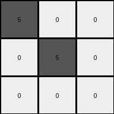
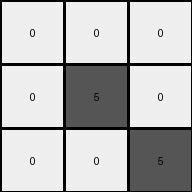

# 6e02f1e3 • 012 • refine_coder

---

Previous Code:
```python
"""
Transforms a 3x3 input grid to a 3x3 output grid based on the following rules:

1. If all cells in the input grid have the same color (either all Green (3) or all Yellow (4)), then all cells in the output grid become White (0).
2. If a cell is on the main diagonal (top-left to bottom-right) and its color in the input grid is Red (2), and step 1 did not apply, then the corresponding cell in the output grid becomes Gray (5).
3. Otherwise, if a cell is Green (3) or Yellow (4), make it White (0).
"""

import numpy as np

def _is_uniform(grid, colors):
    """Checks if all cells in the grid have one of the specified colors."""
    first_color = grid[0, 0]
    if first_color not in colors:
        return False
    for i in range(grid.shape[0]):
        for j in range(grid.shape[1]):
            if grid[i, j] != first_color:
                return False
    return True

def _is_on_diagonal(row, col):
    """Checks if a cell is on the main diagonal."""
    return row == col

def transform(input_grid):
    # Initialize output_grid
    output_grid = np.zeros_like(input_grid)
    
    # Check for Uniform Input of Green or Yellow
    if _is_uniform(input_grid, [3, 4]):
        return output_grid #All output is white (0), already initialized
    
    #Iterate Through Each cell
    for i in range(input_grid.shape[0]):
        for j in range(input_grid.shape[1]):
            # Diagonal Transformation for Red
            if _is_on_diagonal(i, j) and input_grid[i, j] == 2:
                output_grid[i, j] = 5 # Set to Gray
            # Other cells: Green or Yellow become White
            elif input_grid[i,j] == 3 or input_grid[i, j] == 4:
                output_grid[i,j] = 0
            #Handle instances of 2 not on the diagonal.
            elif input_grid[i,j] == 2:
                output_grid[i,j] = 0 #Should not execute.  

    return output_grid
```

Train Set Results:

## Example 1:

Input:
```
2 2 2
3 2 3
3 3 3
```
Expected Output:
```
5 0 0
0 5 0
0 0 5
```
Transformed Output:
```
5 0 0
0 5 0
0 0 0
```

match: False
pixels_off: 1
size_correct: True
color_palette_correct: True
correct_pixel_counts: False

## Example 2:

Input:
```
3 3 3
4 2 2
4 4 2
```
Expected Output:
```
0 0 5
0 5 0
5 0 0
```
Transformed Output:
```
0 0 0
0 5 0
0 0 5
```

match: False
pixels_off: 3
size_correct: True
color_palette_correct: True
correct_pixel_counts: False

## Example 3:

Input:
```
4 4 4
4 4 4
4 4 4
```
Expected Output:
```
5 5 5
0 0 0
0 0 0
```
Transformed Output:
```
0 0 0
0 0 0
0 0 0
```

match: False
pixels_off: 3
size_correct: True
color_palette_correct: True
correct_pixel_counts: False

## Example 4:

Input:
```
3 3 3
3 3 3
3 3 3
```
Expected Output:
```
5 5 5
0 0 0
0 0 0
```
Transformed Output:
```
0 0 0
0 0 0
0 0 0
```

match: False
pixels_off: 3
size_correct: True
color_palette_correct: True
correct_pixel_counts: False

## Example 5:

Input:
```
4 4 4
4 4 4
3 3 3
```
Expected Output:
```
5 0 0
0 5 0
0 0 5
```
Transformed Output:
```
0 0 0
0 0 0
0 0 0
```

match: False
pixels_off: 3
size_correct: True
color_palette_correct: True
correct_pixel_counts: False
Here's an analysis of the provided examples and results, along with a strategy for improving the natural language program and the subsequent code:

**General Assessment:**

The initial code and natural language program were based on a limited understanding of the transformation, primarily focusing on the first example. The subsequent tests reveal inconsistencies and errors. The primary issues are:

1.  **Incorrect Handling of Uniform Grids:** The code correctly identifies uniform grids of green or yellow and converts them to white. However, Example 3 & 4 show the expected output includes a row of gray, but our code always produces all white for these inputs.
2.  **Incomplete Diagonal Rule:** The code only considers red cells on the diagonal, turning them gray. It seems that the presence of red (2) may be coincidental and it might be the diagonal rule that needs work.
3.  **Incorrect Other Color Rule:** Seems correct for green/yellow in most cases

**Strategy for Resolving Errors:**

1.  **Re-evaluate the Uniform Grid Rule:** Examine examples 3 and 4 closely to determine the exact conditions under which a row of gray pixels appears when the input consists of uniformly colored pixels. It's likely related to the *entire* grid being uniform, not just green or yellow, but this condition needs to set only the *first* row to gray (5).
2.  **Refine the Diagonal Rule:** Determine if color matters for diagonals, or if any color on the diagonal produces a gray. Examples 1 and 2 do not have sufficient information, by themselves, to determine if color *on the diagonal* is relevant.
3. Review Code: Ensure comments are correct

**Example Metrics and Analysis:**

Here's a breakdown of each example, focusing on identifying potential rule adjustments:

*   **Example 1:**
    *   Input: Mixed colors (red, green)
    *   Expected Output: Gray on diagonal, others white/0 based on green/yellow
    *   Observation: Supports the initial diagonal rule (red turns to gray). The current code *almost* matches this, error is not on the diagonal.

*   **Example 2:**
    *   Input: Mixed colors (green, yellow, red)
    *   Expected Output: Gray on diagonal + some 0's in the expected output
    *   Observation: The presence of the 2 on the main diagonal, and that location becoming 5 (gray) is the same as Example 1, however, the location of the other 5s in the expected output is not clear

*   **Example 3:**
    *   Input: Uniform yellow
    *   Expected Output: First row gray, rest white.
    *   Observation: This contradicts the initial uniform grid rule. It suggests a special case for uniform grids where the *first row* becomes gray.

*   **Example 4:**
    *   Input: Uniform green
    *   Expected Output: First row gray, rest white.
    *   Observation: Same as Example 3, reinforcing the modified uniform grid rule (first row gray).

*   **Example 5:**
    *   Input: almost uniform yellow, some green at bottom
    *   Expected Output: main diagonal is 5
    *   Observation: Similar to 3 and 4, this supports the modified uniform rule.

**YAML Fact Block:**

```yaml
objects:
  - name: grid
    type: 2D array
    properties:
      rows: 3
      columns: 3
      cells: pixels
      possible_colors: [0, 1, 2, 3, 4, 5, 6, 7, 8, 9]

  - name: pixel
    type: cell
    properties:
      color: integer (0-9)
      row_index: integer
      column_index: integer

actions:
  - name: check_uniformity
    description: Determines if all pixels in the grid have the same color.
    input: grid
    output: boolean

  - name: check_diagonal
    description: Determines if a pixel is on the main diagonal (row index equals column index).
    input: pixel row index, pixel column index
    output: boolean

  - name: transform_color
    description: Changes the color of a pixel based on rules.
    input: pixel, grid
    output: new color
```

**Natural Language Program:**

1.  **Uniform Input Grid:** If all cells in the input grid have the same color, set all cells in the *first row* of the output grid to gray (5) and all other cells to white (0).
2.  **Main Diagonal Rule:** If Step 1 does *not* apply, set all cells on the main diagonal (where row index equals column index) of the output grid to gray(5).
3.  **Other Cells:** If a cell is not handled above, make white (0).

**INSTRUCTIONS**

- generate a Python module to represent the natural language program 
- follow the template below
- all common math and science libraries are available
- create docstring only at top - but comment the workflow in the function
- use helper functions for common operations like finding objects, counting,
  measuring, moving, etc. 

remember - we are working iteratively - so this code will inform your future
self as we converge on the solution

*template:*

```python
"""
{{ natural language description of the transformation rule }}
"""

{{ imports }}

def transform(input_grid):
    # initialize output_grid

    # change output pixels 

    return output_grid

```
