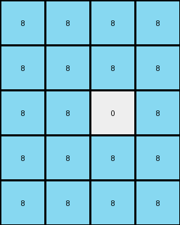
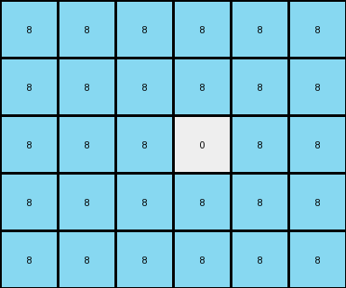

# 6f8cd79b • 003 • refine_dreamer

---


Previous Code:
```python
"""
Identify the center pixel of a 3x3 grid. Keep its value as 0. Change the value of all other pixels to 8.
"""

import numpy as np

def transform(input_grid):
    """
    Transforms a 3x3 grid by keeping the center pixel value as 0 and changing all other pixels to 8.
    
    Args:
        input_grid: A 3x3 numpy array representing the input grid.
        
    Returns:
        A 3x3 numpy array representing the transformed grid.
    """
    # Initialize the output grid as a copy of the input grid.
    output_grid = np.copy(input_grid)

    # Get the dimensions of the grid
    rows, cols = output_grid.shape

    # Iterate through each cell of the grid
    for i in range(rows):
        for j in range(cols):
            # Check if the current cell is the center pixel
            if i == rows // 2 and j == cols // 2:
                # Keep the center pixel as 0
                continue  # Skip to the next iteration
            else:
                # Change all other pixels to 8
                output_grid[i, j] = 8

    return output_grid
```

Train Set Results:

## Example 1:

Input:
```
0 0 0
0 0 0
0 0 0
```
Expected Output:
```
8 8 8
8 0 8
8 8 8
```
Transformed Output:
```
8 8 8
8 0 8
8 8 8
```

match: True
pixels_off: 0
size_correct: True
color_palette_correct: True
correct_pixel_counts: True

## Example 2:

Input:
```
0 0 0
0 0 0
0 0 0
0 0 0
```
Expected Output:
```
8 8 8
8 0 8
8 0 8
8 8 8
```
Transformed Output:
```
8 8 8
8 8 8
8 0 8
8 8 8
```

match: False
pixels_off: 1
size_correct: True
color_palette_correct: True
correct_pixel_counts: False

## Example 3:

Input:
```
0 0 0 0
0 0 0 0
0 0 0 0
0 0 0 0
0 0 0 0
```
Expected Output:
```
8 8 8 8
8 0 0 8
8 0 0 8
8 0 0 8
8 8 8 8
```
Transformed Output:
```
8 8 8 8
8 8 8 8
8 8 0 8
8 8 8 8
8 8 8 8
```

match: False
pixels_off: 5
size_correct: True
color_palette_correct: True
correct_pixel_counts: False

## Example 4:

Input:
```
0 0 0 0 0 0
0 0 0 0 0 0
0 0 0 0 0 0
0 0 0 0 0 0
0 0 0 0 0 0
```
Expected Output:
```
8 8 8 8 8 8
8 0 0 0 0 8
8 0 0 0 0 8
8 0 0 0 0 8
8 8 8 8 8 8
```
Transformed Output:
```
8 8 8 8 8 8
8 8 8 8 8 8
8 8 8 0 8 8
8 8 8 8 8 8
8 8 8 8 8 8
```

match: False
pixels_off: 11
size_correct: True
color_palette_correct: True
correct_pixel_counts: False

**INSTRUCTIONS**

The code above was generated based on observations from the first training
example

we have tested the transform function on each of the task example inputs and
compared with the expected output

review each of the examples provided and the results and consider how the
natural language program should be updated to accommodate this new knowledge

respond with the following deliverables:

- general assessment of the information provided and strategy for resolving the
  errors
- gather metrics about each of the examples and results - use code_execution to
  develop accurate reports on your assumptions
- a YAML block documenting facts - Focus on identifying objects, their properties, and the actions performed on them.
- a natural language program - Be as clear and concise as possible, providing a complete description of the transformation rule.


your responses should be considered as information in a report - not a
conversation
