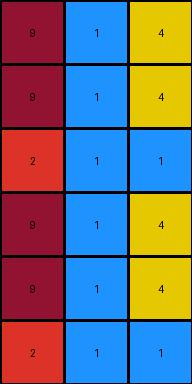
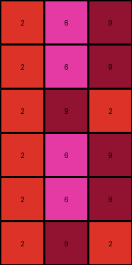

# 6fa7a44f • 004 • refine_coder

---

Previous Code:
```python
"""
The transformation rule is to repeat the input grid once vertically. The output is the input grid with itself appended below.
"""

import numpy as np

def transform(input_grid):
    # initialize output_grid
    output_grid = np.copy(input_grid)

    # change output pixels 
    output_grid = np.concatenate((output_grid, input_grid), axis=0)

    return output_grid
```

Train Set Results:

## Example 1:

Input:
```
9 1 4
9 1 4
2 1 1
```
Expected Output:
```
9 1 4
9 1 4
2 1 1
2 1 1
9 1 4
9 1 4
```
Transformed Output:
```
9 1 4
9 1 4
2 1 1
9 1 4
9 1 4
2 1 1
```

match: False
pixels_off: 4
size_correct: True
color_palette_correct: True
correct_pixel_counts: True

## Example 2:

Input:
```
4 8 4
7 6 7
8 7 8
```
Expected Output:
```
4 8 4
7 6 7
8 7 8
8 7 8
7 6 7
4 8 4
```
Transformed Output:
```
4 8 4
7 6 7
8 7 8
4 8 4
7 6 7
8 7 8
```

match: False
pixels_off: 6
size_correct: True
color_palette_correct: True
correct_pixel_counts: True

## Example 3:

Input:
```
7 7 7
9 5 5
5 1 7
```
Expected Output:
```
7 7 7
9 5 5
5 1 7
5 1 7
9 5 5
7 7 7
```
Transformed Output:
```
7 7 7
9 5 5
5 1 7
7 7 7
9 5 5
5 1 7
```

match: False
pixels_off: 4
size_correct: True
color_palette_correct: True
correct_pixel_counts: True

## Example 4:

Input:
```
2 6 9
2 6 9
2 9 2
```
Expected Output:
```
2 6 9
2 6 9
2 9 2
2 9 2
2 6 9
2 6 9
```
Transformed Output:
```
2 6 9
2 6 9
2 9 2
2 6 9
2 6 9
2 9 2
```

match: False
pixels_off: 4
size_correct: True
color_palette_correct: True
correct_pixel_counts: True
Okay, here's an analysis of the provided information and a plan to refine the natural language program:

**General Assessment:**

The initial natural language program was close but slightly off. It correctly identified the repetition but incorrectly described the order. Instead of appending the input grid to itself, it seems the output grid is constructed by reversing the order of rows in the input and concatenating it to a copy of input. The tests show a consistent pattern of mismatch, where the rows are reordered.

**Strategy:**

1.  **Detailed Example Analysis:** I need to meticulously examine each input/output/transformed output trio, paying extremely close attention to the row order and the exact positioning of repeated elements.
2.  **Refine Natural Language Program:** Based on the detailed analysis, I will rewrite the natural language program to accurately describe the transformation, focusing on the specific row manipulations.
3. Consider the possibility of using helper operations to simplify the code.

**Example Metrics and Observations:**

I'll use a structured approach, analyzing each example. I will create a YAML structure later.

*   **Example 1:**
    *   Input Shape: (3, 3)
    *   Output Shape: (6, 3)
    *   Observation: Rows are repeated, but in reverse order. Row 3 becomes Row 4, Row 2 becomes Row 5, Row 1 becomes Row 6.

*   **Example 2:**
    *   Input Shape: (3, 3)
    *   Output Shape: (6, 3)
    *   Observation: Same pattern. Rows are repeated, in reverse order. Row 3 becomes Row 4, Row 2 becomes Row 5, Row 1 becomes Row 6.

*   **Example 3:**
    *   Input Shape: (3, 3)
    *   Output Shape: (6, 3)
    *   Observation: Same Pattern. Rows are repeated, in reverse order. Row 3 becomes Row 4, Row 2 becomes Row 5, Row 1 becomes Row 6.

*    **Example 4:**
    *   Input Shape: (3, 3)
    *   Output Shape: (6, 3)
    *   Observation: Same Pattern. Rows are repeated, in reverse order. Row 3 becomes Row 4, Row 2 becomes Row 5, Row 1 becomes Row 6.

**YAML Facts:**

```yaml
examples:
  - id: 1
    input_shape: [3, 3]
    output_shape: [6, 3]
    transformation:
      type: row_repetition
      order: reversed
  - id: 2
    input_shape: [3, 3]
    output_shape: [6, 3]
    transformation:
      type: row_repetition
      order: reversed
  - id: 3
    input_shape: [3, 3]
    output_shape: [6, 3]
    transformation:
      type: row_repetition
      order: reversed
  - id: 4
    input_shape: [3, 3]
    output_shape: [6, 3]
    transformation:
      type: row_repetition
      order: reversed
```

**Natural Language Program:**

The transformation rule is to take the input grid and create a new output grid that is double the height. The first half of the output is an exact copy of input. The next half of the grid will contain the rows of the input, but attached in reverse order.

**INSTRUCTIONS**

- generate a Python module to represent the natural language program 
- follow the template below
- all common math and science libraries are available
- create docstring only at top - but comment the workflow in the function
- use helper functions for common operations like finding objects, counting,
  measuring, moving, etc. 

remember - we are working iteratively - so this code will inform your future
self as we converge on the solution

*template:*

```python
"""
{{ natural language description of the transformation rule }}
"""

{{ imports }}

def transform(input_grid):
    # initialize output_grid

    # change output pixels 

    return output_grid

```
