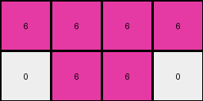

# 72ca375d • 003 • refine_dreamer

---

Previous Code:
```python
"""
1. Identify the Target Color: The program focuses on a single color within the input grid, in this instance magenta (represented by the digit 6).
2. Locate the Bounding Box: Determine the smallest rectangular area that encloses all pixels of the target color (magenta) in the input grid. Note the row and column of the upper-left and lower right pixels.
3. Extract the area: Create the ouput grid that represents a cropped view of the input grid, using the coordinates of the bounding box identified in step 2, filled with the pixels of the target color.
"""

import numpy as np

def find_bounding_box(grid, target_color):
    """
    Finds the bounding box of a target color in a grid.
    Returns (min_row, min_col, max_row, max_col)
    """
    rows, cols = np.where(grid == target_color)
    if len(rows) == 0:
        return None  # Target color not found
    min_row, min_col = np.min(rows), np.min(cols)
    max_row, max_col = np.max(rows), np.max(cols)
    return min_row, min_col, max_row, max_col

def transform(input_grid):
    """
    Extracts a rectangular region of a specific color from the input grid.
    """
    input_grid = np.array(input_grid)  # Ensure input is a NumPy array.
    target_color = 6

    # Find the bounding box of the target color.
    bounding_box = find_bounding_box(input_grid, target_color)
    if bounding_box is None:
        return [[]] # Return empty grid.

    min_row, min_col, max_row, max_col = bounding_box

    # Extract the region.
    output_grid = input_grid[min_row:max_row+1, min_col:max_col+1]

    return output_grid.tolist()
```

Train Set Results:

## Example 1:

Input:
```
0 0 0 0 0 0 0 0 0 0
0 2 2 0 0 0 0 0 0 0
0 0 2 2 2 0 0 7 7 0
0 0 0 0 0 0 7 0 7 0
0 0 0 0 0 0 0 0 0 0
0 0 0 0 0 0 0 0 0 0
0 0 0 6 6 6 6 0 0 0
0 0 0 0 6 6 0 0 0 0
0 0 0 0 0 0 0 0 0 0
0 0 0 0 0 0 0 0 0 0
```
Expected Output:
```
6 6 6 6
0 6 6 0
```
Transformed Output:
```
6 6 6 6
0 6 6 0
```

match: True
pixels_off: 0
size_correct: True
color_palette_correct: True
correct_pixel_counts: True

## Example 2:

Input:
```
0 0 0 0 0 0 0 0 0 0
0 0 4 4 0 0 0 0 0 0
0 0 4 4 0 0 8 8 8 0
0 0 0 0 0 0 8 0 8 8
0 0 0 0 0 0 0 0 0 0
0 0 0 0 0 0 0 0 0 0
0 0 0 0 0 0 0 0 0 0
0 0 2 2 2 2 0 0 0 0
0 2 2 2 0 0 0 0 0 0
0 0 0 0 0 0 0 0 0 0
```
Expected Output:
```
4 4
4 4
```
Transformed Output:
```

```

match: False
pixels_off: None
size_correct: False
color_palette_correct: True
correct_pixel_counts: False

## Example 3:

Input:
```
0 0 0 0 0 0 0 0 0 0
0 3 3 0 0 0 0 0 0 0
0 0 3 0 0 5 0 0 5 0
0 0 3 0 0 5 5 5 5 0
0 0 0 0 0 0 0 0 0 0
0 0 0 0 0 0 0 0 0 0
0 0 0 0 0 0 0 0 0 0
0 0 0 8 8 8 0 0 0 0
8 8 8 8 0 8 8 0 0 0
0 0 0 0 0 0 0 0 0 0
```
Expected Output:
```
5 0 0 5
5 5 5 5
```
Transformed Output:
```

```

match: False
pixels_off: None
size_correct: False
color_palette_correct: True
correct_pixel_counts: False
**INSTRUCTIONS**

The code above was generated based on observations from the first training
example

we have tested the transform function on each of the task example inputs and
compared with the expected output

review each of the examples provided and the results and consider how the
natural language program should be updated to accommodate this new knowledge

respond with the following deliverables:

- general assessment of the information provided and strategy for resolving the
  errors
- gather metrics about each of the examples and results - use code_execution to
  develop accurate reports on your assumptions
- a YAML block documenting facts - Focus on identifying objects, their properties, and the actions performed on them.
- a natural language program - Be as clear and concise as possible, providing a complete description of the transformation rule.


your responses should be considered as information in a report - not a
conversation
