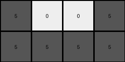

# 72ca375d • 015 • refine_dreamer

---


Previous Code:
```python
"""
1.  **Identify Target Color:** The target color for extraction is gray (5).

2.  **Locate Target Objects:** Scan the input grid to find all connected components (objects) of the target color (gray).

3. **Select largest target object:** From the set of object, choose the one that has the most pixels.

4.  **Extract Bounding Box:** Determine the smallest rectangular region (bounding box) that fully encompasses the largest target object.

5.  **Create Output:** Create the output grid using on the selected object bounding box, using value '5' when the pixel exists, or value '0' if it does not exist in the source grid.
"""

import numpy as np

def find_objects(grid, target_color):
    # Find all connected components of the target color in the grid.
    visited = np.zeros_like(grid, dtype=bool)
    objects = []

    def dfs(row, col, current_object):
        if (
            row < 0
            or row >= grid.shape[0]
            or col < 0
            or col >= grid.shape[1]
            or visited[row, col]
            or grid[row, col] != target_color
        ):
            return
        visited[row, col] = True
        current_object.append((row, col))
        dfs(row + 1, col, current_object)
        dfs(row - 1, col, current_object)
        dfs(row, col + 1, current_object)
        dfs(row, col - 1, current_object)

    for row in range(grid.shape[0]):
        for col in range(grid.shape[1]):
            if grid[row, col] == target_color and not visited[row, col]:
                current_object = []
                dfs(row, col, current_object)
                objects.append(current_object)
    return objects

def bounding_box(object_pixels):
    # Calculate the bounding box of a set of pixels.
    if not object_pixels:
        return (0, 0, 0, 0)
    min_row = min(pixel[0] for pixel in object_pixels)
    max_row = max(pixel[0] for pixel in object_pixels)
    min_col = min(pixel[1] for pixel in object_pixels)
    max_col = max(pixel[1] for pixel in object_pixels)
    return (min_row, max_row, min_col, max_col)

def largest_object(objects):
    # return largest object by pixel count
    largest = []
    count = 0
    for obj in objects:
        if len(obj) > count:
            largest = obj
            count = len(obj)
    
    return largest
    

def transform(input_grid):
    # 1. Identify Target Color:
    target_color = 5

    # 2. Locate Target Objects:
    objects = find_objects(np.array(input_grid), target_color)
    
    # 3. Select largest target object:
    obj = largest_object(objects)

    # 4. Extract Bounding Box:
    min_row, max_row, min_col, max_col = bounding_box(obj)
    
    # init output grid
    output_grid = np.zeros((max_row - min_row + 1, max_col - min_col + 1), dtype=int)

    # 5. Create output grid
    for r, c in obj:
        output_grid[r - min_row, c - min_col] = target_color

    return output_grid.tolist()
```

Train Set Results:

## Example 1:

Input:
```
0 0 0 0 0 0 0 0 0 0
0 2 2 0 0 0 0 0 0 0
0 0 2 2 2 0 0 7 7 0
0 0 0 0 0 0 7 0 7 0
0 0 0 0 0 0 0 0 0 0
0 0 0 0 0 0 0 0 0 0
0 0 0 6 6 6 6 0 0 0
0 0 0 0 6 6 0 0 0 0
0 0 0 0 0 0 0 0 0 0
0 0 0 0 0 0 0 0 0 0
```
Expected Output:
```
6 6 6 6
0 6 6 0
```
Transformed Output:
```
0
```

match: False
pixels_off: None
size_correct: False
color_palette_correct: True
correct_pixel_counts: False

## Example 2:

Input:
```
0 0 0 0 0 0 0 0 0 0
0 0 4 4 0 0 0 0 0 0
0 0 4 4 0 0 8 8 8 0
0 0 0 0 0 0 8 0 8 8
0 0 0 0 0 0 0 0 0 0
0 0 0 0 0 0 0 0 0 0
0 0 0 0 0 0 0 0 0 0
0 0 2 2 2 2 0 0 0 0
0 2 2 2 0 0 0 0 0 0
0 0 0 0 0 0 0 0 0 0
```
Expected Output:
```
4 4
4 4
```
Transformed Output:
```
0
```

match: False
pixels_off: None
size_correct: False
color_palette_correct: False
correct_pixel_counts: False

## Example 3:

Input:
```
0 0 0 0 0 0 0 0 0 0
0 3 3 0 0 0 0 0 0 0
0 0 3 0 0 5 0 0 5 0
0 0 3 0 0 5 5 5 5 0
0 0 0 0 0 0 0 0 0 0
0 0 0 0 0 0 0 0 0 0
0 0 0 0 0 0 0 0 0 0
0 0 0 8 8 8 0 0 0 0
8 8 8 8 0 8 8 0 0 0
0 0 0 0 0 0 0 0 0 0
```
Expected Output:
```
5 0 0 5
5 5 5 5
```
Transformed Output:
```
5 0 0 5
5 5 5 5
```

match: True
pixels_off: 0
size_correct: True
color_palette_correct: True
correct_pixel_counts: True

**INSTRUCTIONS**

The code above was generated based on observations from the first training
example

we have tested the transform function on each of the task example inputs and
compared with the expected output

review each of the examples provided and the results and consider how the
natural language program should be updated to accommodate this new knowledge

respond with the following deliverables:

- general assessment of the information provided and strategy for resolving the
  errors
- gather metrics about each of the examples and results - use code_execution to
  develop accurate reports on your assumptions
- a YAML block documenting facts - Focus on identifying objects, their properties, and the actions performed on them.
- a natural language program - Be as clear and concise as possible, providing a complete description of the transformation rule.


your responses should be considered as information in a report - not a
conversation
