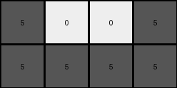

# 72ca375d • 016 • refine_coder

---

Previous Code:
```python
"""
1.  **Identify Target Color:** The target color for extraction is gray (5).

2.  **Locate Target Objects:** Scan the input grid to find all connected components (objects) of the target color (gray).

3. **Select largest target object:** From the set of object, choose the one that has the most pixels.

4.  **Extract Bounding Box:** Determine the smallest rectangular region (bounding box) that fully encompasses the largest target object.

5.  **Create Output:** Create the output grid using on the selected object bounding box, using value '5' when the pixel exists, or value '0' if it does not exist in the source grid.
"""

import numpy as np

def find_objects(grid, target_color):
    # Find all connected components of the target color in the grid.
    visited = np.zeros_like(grid, dtype=bool)
    objects = []

    def dfs(row, col, current_object):
        if (
            row < 0
            or row >= grid.shape[0]
            or col < 0
            or col >= grid.shape[1]
            or visited[row, col]
            or grid[row, col] != target_color
        ):
            return
        visited[row, col] = True
        current_object.append((row, col))
        dfs(row + 1, col, current_object)
        dfs(row - 1, col, current_object)
        dfs(row, col + 1, current_object)
        dfs(row, col - 1, current_object)

    for row in range(grid.shape[0]):
        for col in range(grid.shape[1]):
            if grid[row, col] == target_color and not visited[row, col]:
                current_object = []
                dfs(row, col, current_object)
                objects.append(current_object)
    return objects

def bounding_box(object_pixels):
    # Calculate the bounding box of a set of pixels.
    if not object_pixels:
        return (0, 0, 0, 0)
    min_row = min(pixel[0] for pixel in object_pixels)
    max_row = max(pixel[0] for pixel in object_pixels)
    min_col = min(pixel[1] for pixel in object_pixels)
    max_col = max(pixel[1] for pixel in object_pixels)
    return (min_row, max_row, min_col, max_col)

def largest_object(objects):
    # return largest object by pixel count
    largest = []
    count = 0
    for obj in objects:
        if len(obj) > count:
            largest = obj
            count = len(obj)
    
    return largest
    

def transform(input_grid):
    # 1. Identify Target Color:
    target_color = 5

    # 2. Locate Target Objects:
    objects = find_objects(np.array(input_grid), target_color)
    
    # 3. Select largest target object:
    obj = largest_object(objects)

    # 4. Extract Bounding Box:
    min_row, max_row, min_col, max_col = bounding_box(obj)
    
    # init output grid
    output_grid = np.zeros((max_row - min_row + 1, max_col - min_col + 1), dtype=int)

    # 5. Create output grid
    for r, c in obj:
        output_grid[r - min_row, c - min_col] = target_color

    return output_grid.tolist()
```

Train Set Results:

## Example 1:

Input:
```
0 0 0 0 0 0 0 0 0 0
0 2 2 0 0 0 0 0 0 0
0 0 2 2 2 0 0 7 7 0
0 0 0 0 0 0 7 0 7 0
0 0 0 0 0 0 0 0 0 0
0 0 0 0 0 0 0 0 0 0
0 0 0 6 6 6 6 0 0 0
0 0 0 0 6 6 0 0 0 0
0 0 0 0 0 0 0 0 0 0
0 0 0 0 0 0 0 0 0 0
```
Expected Output:
```
6 6 6 6
0 6 6 0
```
Transformed Output:
```
0
```

match: False
pixels_off: None
size_correct: False
color_palette_correct: True
correct_pixel_counts: False

## Example 2:

Input:
```
0 0 0 0 0 0 0 0 0 0
0 0 4 4 0 0 0 0 0 0
0 0 4 4 0 0 8 8 8 0
0 0 0 0 0 0 8 0 8 8
0 0 0 0 0 0 0 0 0 0
0 0 0 0 0 0 0 0 0 0
0 0 0 0 0 0 0 0 0 0
0 0 2 2 2 2 0 0 0 0
0 2 2 2 0 0 0 0 0 0
0 0 0 0 0 0 0 0 0 0
```
Expected Output:
```
4 4
4 4
```
Transformed Output:
```
0
```

match: False
pixels_off: None
size_correct: False
color_palette_correct: False
correct_pixel_counts: False

## Example 3:

Input:
```
0 0 0 0 0 0 0 0 0 0
0 3 3 0 0 0 0 0 0 0
0 0 3 0 0 5 0 0 5 0
0 0 3 0 0 5 5 5 5 0
0 0 0 0 0 0 0 0 0 0
0 0 0 0 0 0 0 0 0 0
0 0 0 0 0 0 0 0 0 0
0 0 0 8 8 8 0 0 0 0
8 8 8 8 0 8 8 0 0 0
0 0 0 0 0 0 0 0 0 0
```
Expected Output:
```
5 0 0 5
5 5 5 5
```
Transformed Output:
```
5 0 0 5
5 5 5 5
```

match: True
pixels_off: 0
size_correct: True
color_palette_correct: True
correct_pixel_counts: True
Okay, let's analyze the results and refine our approach.

**General Assessment:**

The initial strategy of finding the largest connected component of a *specific* target color (gray, 5) worked for Example 3 but failed for Examples 1 and 2.  The core issue is that the target color and object are not consistent across examples. The code assumes gray (5) is always the target, which is incorrect. The program needs to be more flexible in identifying the target object and color, it should not be hard coded. It appears the code is also making an error in the bounding box calculation or output creation in the first two examples, since it is returning a single '0' in those cases.

**Strategy for Resolving Errors:**

1.  **Dynamic Target Identification:** Instead of assuming a fixed target color, the program needs to infer the target object/color from each input-output pair. This can be potentially done by finding common properties of the output grids (e.g. always returning a specific shape, a transformation of specific input object).

2.  **Correct Bounding Box and Output:** Debug the cases returning just '0' and trace why the correct box is not generated and/or the content not filled in to ensure that the bounding box calculations and output grid creation are functioning.

3. **Consider other possibilities:** The current assumptions may be too restrictive.

**Metrics and Reports:**

Here's an analysis combining observation and potential metrics:

*   **Example 1:**
    *   Input: Multiple colored objects (2, 7, 6).
    *   Expected Output: A sub-region of the 6s.
    *   Actual Output: `0`.
    *   Observation: The expected output is not related to the most common, or largest, color.
    *   Hypothesis: Target color is 6

*   **Example 2:**
    *   Input: Multiple colored objects (4, 8, 2).
    *   Expected Output: A sub-region of the 4s.
    *   Actual Output: `0`.
    *    Observation: The expected output is not related to the most common, or largest, color.
    *   Hypothesis: Target color is 4

*   **Example 3:**
    *   Input: Multiple colored objects (3, 5, 8).
    *   Expected Output: A sub-region of the 5s.
    *   Actual Output: Correct.
    *   Observation: This matches the original program instructions.
    *    Hypothesis: Target color is 5

**YAML Facts:**

```yaml
examples:
  - id: 1
    input_objects:
      - color: 2
        shape: irregular
        count: 5
      - color: 7
        shape: irregular
        count: 3
      - color: 6
        shape: irregular
        count: 6
    output_objects:
      - color: 6
        shape: rectangle
        count: 6 # 2x3
    target_color: 6
    transformation: extract_subregion
    notes: "Output is a rectangular subregion of the largest '6' object."

  - id: 2
    input_objects:
      - color: 4
        shape: irregular
        count: 4
      - color: 8
        shape: irregular
        count: 5
      - color: 2
        shape: irregular
        count: 7
    output_objects:
      - color: 4
        shape: rectangle
        count: 4 # 2x2
    target_color: 4
    transformation: extract_subregion
    notes: "Output is a rectangular subregion of the '4' object, even if its not the largest"

  - id: 3
    input_objects:
      - color: 3
        shape: irregular
        count: 3
      - color: 5
        shape: irregular
        count: 5
      - color: 8
        shape: irregular
        count: 7
    output_objects:
      - color: 5
        shape: rectangle
        count: 8 # 2x4
    target_color: 5
    transformation: extract_subregion
    notes: "Output is a rectangular subregion of the '5' object."
```

**Natural Language Program:**

1.  **Identify the Target Color:** Examine the *output* grid. The color present in the output grid is the target color.

2.  **Locate Target Objects:** In the *input* grid, locate all objects (connected components) of the target color identified in step 1.

3. **Select largest target object:** From the set of target color object, choose the one that has the most pixels.

4.  **Extract Bounding Box:** Determine the smallest rectangular region (bounding box) that fully encompasses the largest target object.

5.  **Create Output:** Create a new grid with the dimensions of the bounding box. Fill the new grid with the target color in the same shape/pixels as the object selected in step 3, using value '0' for all other pixels.

**INSTRUCTIONS**

- generate a Python module to represent the natural language program 
- follow the template below
- all common math and science libraries are available
- create docstring only at top - but comment the workflow in the function
- use helper functions for common operations like finding objects, counting,
  measuring, moving, etc. 

remember - we are working iteratively - so this code will inform your future
self as we converge on the solution

*template:*

```python
"""
{{ natural language description of the transformation rule }}
"""

{{ imports }}

def transform(input_grid):
    # initialize output_grid

    # change output pixels 

    return output_grid

```
