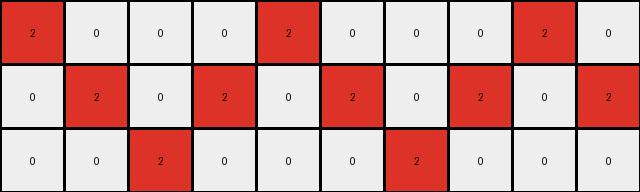
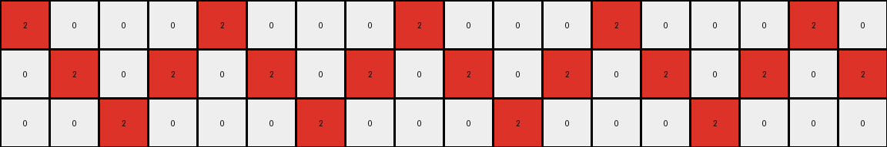

# 7447852a • 005 • refine_dreamer

---

Previous Code:
```python
"""
Transforms an input grid, changing some red pixels (2) to yellow (4) based on adjacency. A red pixel changes to yellow if it has at least one orthogonally adjacent white pixel (0) and at least one orthogonally adjacent red pixel (2).
"""

import numpy as np

def transform(input_grid):
    """
    Transforms the input grid according to the adjacency rules.
    """
    rows, cols = input_grid.shape
    output_grid = np.copy(input_grid)  # Initialize output grid

    def is_valid(r, c):
        """Checks if the given row and column are within grid bounds."""
        return 0 <= r < rows and 0 <= c < cols

    def get_adjacent_colors(r, c):
        """Gets the colors of orthogonally adjacent cells."""
        adjacent_colors = []
        for dr, dc in [(0, 1), (0, -1), (1, 0), (-1, 0)]:  # Right, Left, Down, Up
            nr, nc = r + dr, c + dc
            if is_valid(nr, nc):
                adjacent_colors.append(input_grid[nr, nc])
        return adjacent_colors

    # Iterate through each cell of the input grid
    for r in range(rows):
        for c in range(cols):
            if input_grid[r, c] == 2:  # Check if the cell is red
                adjacent_colors = get_adjacent_colors(r, c)
                has_white_neighbor = 0 in adjacent_colors
                has_red_neighbor = 2 in adjacent_colors

                if has_white_neighbor and has_red_neighbor:
                    output_grid[r, c] = 4  # Change to yellow

    return output_grid
```

Train Set Results:

## Example 1:

Input:
```
2 0 0 0 2 0 0 0 2 0
0 2 0 2 0 2 0 2 0 2
0 0 2 0 0 0 2 0 0 0
```
Expected Output:
```
2 0 0 0 2 4 4 4 2 0
4 2 0 2 0 2 4 2 0 2
4 4 2 0 0 0 2 0 0 0
```
Transformed Output:
```
2 0 0 0 2 0 0 0 2 0
0 2 0 2 0 2 0 2 0 2
0 0 2 0 0 0 2 0 0 0
```

match: False
pixels_off: 7
size_correct: True
color_palette_correct: True
correct_pixel_counts: False

## Example 2:

Input:
```
2 0 0 0 2 0 0 0 2 0 0 0 2 0 0
0 2 0 2 0 2 0 2 0 2 0 2 0 2 0
0 0 2 0 0 0 2 0 0 0 2 0 0 0 2
```
Expected Output:
```
2 0 0 0 2 4 4 4 2 0 0 0 2 0 0
4 2 0 2 0 2 4 2 0 2 0 2 4 2 0
4 4 2 0 0 0 2 0 0 0 2 4 4 4 2
```
Transformed Output:
```
2 0 0 0 2 0 0 0 2 0 0 0 2 0 0
0 2 0 2 0 2 0 2 0 2 0 2 0 2 0
0 0 2 0 0 0 2 0 0 0 2 0 0 0 2
```

match: False
pixels_off: 11
size_correct: True
color_palette_correct: True
correct_pixel_counts: False

## Example 3:

Input:
```
2 0 0 0 2 0 0 0 2 0 0 0 2 0 0 0 2 0
0 2 0 2 0 2 0 2 0 2 0 2 0 2 0 2 0 2
0 0 2 0 0 0 2 0 0 0 2 0 0 0 2 0 0 0
```
Expected Output:
```
2 0 0 0 2 4 4 4 2 0 0 0 2 0 0 0 2 4
4 2 0 2 0 2 4 2 0 2 0 2 4 2 0 2 0 2
4 4 2 0 0 0 2 0 0 0 2 4 4 4 2 0 0 0
```
Transformed Output:
```
2 0 0 0 2 0 0 0 2 0 0 0 2 0 0 0 2 0
0 2 0 2 0 2 0 2 0 2 0 2 0 2 0 2 0 2
0 0 2 0 0 0 2 0 0 0 2 0 0 0 2 0 0 0
```

match: False
pixels_off: 12
size_correct: True
color_palette_correct: True
correct_pixel_counts: False
**INSTRUCTIONS**

The code above was generated based on observations from the first training
example

we have tested the transform function on each of the task example inputs and
compared with the expected output

review each of the examples provided and the results and consider how the
natural language program should be updated to accommodate this new knowledge

respond with the following deliverables:

- general assessment of the information provided and strategy for resolving the
  errors
- gather metrics about each of the examples and results - use code_execution to
  develop accurate reports on your assumptions
- a YAML block documenting facts - Focus on identifying objects, their properties, and the actions performed on them.
- a natural language program - Be as clear and concise as possible, providing a complete description of the transformation rule.


your responses should be considered as information in a report - not a
conversation
