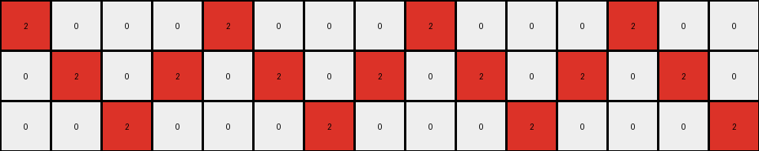
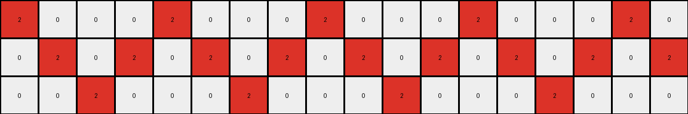

# 7447852a • 006 • refine_coder

---

Previous Code:
```python
"""
Transforms an input grid, changing some red pixels (2) to yellow (4) based on adjacency. A red pixel changes to yellow if it has at least one orthogonally adjacent white pixel (0) and at least one orthogonally adjacent red pixel (2).
"""

import numpy as np

def transform(input_grid):
    """
    Transforms the input grid according to the adjacency rules.
    """
    rows, cols = input_grid.shape
    output_grid = np.copy(input_grid)  # Initialize output grid

    def is_valid(r, c):
        """Checks if the given row and column are within grid bounds."""
        return 0 <= r < rows and 0 <= c < cols

    def get_adjacent_colors(r, c):
        """Gets the colors of orthogonally adjacent cells."""
        adjacent_colors = []
        for dr, dc in [(0, 1), (0, -1), (1, 0), (-1, 0)]:  # Right, Left, Down, Up
            nr, nc = r + dr, c + dc
            if is_valid(nr, nc):
                adjacent_colors.append(input_grid[nr, nc])
        return adjacent_colors

    # Iterate through each cell of the input grid
    for r in range(rows):
        for c in range(cols):
            if input_grid[r, c] == 2:  # Check if the cell is red
                adjacent_colors = get_adjacent_colors(r, c)
                has_white_neighbor = 0 in adjacent_colors
                has_red_neighbor = 2 in adjacent_colors

                if has_white_neighbor and has_red_neighbor:
                    output_grid[r, c] = 4  # Change to yellow

    return output_grid
```

Train Set Results:

## Example 1:

Input:
```
2 0 0 0 2 0 0 0 2 0
0 2 0 2 0 2 0 2 0 2
0 0 2 0 0 0 2 0 0 0
```
Expected Output:
```
2 0 0 0 2 4 4 4 2 0
4 2 0 2 0 2 4 2 0 2
4 4 2 0 0 0 2 0 0 0
```
Transformed Output:
```
2 0 0 0 2 0 0 0 2 0
0 2 0 2 0 2 0 2 0 2
0 0 2 0 0 0 2 0 0 0
```

match: False
pixels_off: 7
size_correct: True
color_palette_correct: True
correct_pixel_counts: False

## Example 2:

Input:
```
2 0 0 0 2 0 0 0 2 0 0 0 2 0 0
0 2 0 2 0 2 0 2 0 2 0 2 0 2 0
0 0 2 0 0 0 2 0 0 0 2 0 0 0 2
```
Expected Output:
```
2 0 0 0 2 4 4 4 2 0 0 0 2 0 0
4 2 0 2 0 2 4 2 0 2 0 2 4 2 0
4 4 2 0 0 0 2 0 0 0 2 4 4 4 2
```
Transformed Output:
```
2 0 0 0 2 0 0 0 2 0 0 0 2 0 0
0 2 0 2 0 2 0 2 0 2 0 2 0 2 0
0 0 2 0 0 0 2 0 0 0 2 0 0 0 2
```

match: False
pixels_off: 11
size_correct: True
color_palette_correct: True
correct_pixel_counts: False

## Example 3:

Input:
```
2 0 0 0 2 0 0 0 2 0 0 0 2 0 0 0 2 0
0 2 0 2 0 2 0 2 0 2 0 2 0 2 0 2 0 2
0 0 2 0 0 0 2 0 0 0 2 0 0 0 2 0 0 0
```
Expected Output:
```
2 0 0 0 2 4 4 4 2 0 0 0 2 0 0 0 2 4
4 2 0 2 0 2 4 2 0 2 0 2 4 2 0 2 0 2
4 4 2 0 0 0 2 0 0 0 2 4 4 4 2 0 0 0
```
Transformed Output:
```
2 0 0 0 2 0 0 0 2 0 0 0 2 0 0 0 2 0
0 2 0 2 0 2 0 2 0 2 0 2 0 2 0 2 0 2
0 0 2 0 0 0 2 0 0 0 2 0 0 0 2 0 0 0
```

match: False
pixels_off: 12
size_correct: True
color_palette_correct: True
correct_pixel_counts: False
Here's an assessment of the provided information and a strategy for resolving the errors, along with the requested deliverables:

**General Assessment:**

The initial code correctly identifies the core concept: changing red pixels to yellow based on orthogonal adjacency to white and other red pixels. However, it fails to capture the "chain reaction" or "propagation" effect. The provided examples demonstrate that a red pixel turning yellow can *then* cause *other* red pixels to turn yellow in the *same* transformation step. The current code only considers the *initial* state of the grid when making changes, not the updated state.

**Strategy for Resolving Errors:**

The key to fixing the code is to implement the transformation iteratively. Instead of a single pass through the grid, we need to repeatedly apply the transformation rule until no more changes occur. This will allow the "chain reaction" of color changes to propagate correctly. A `while` loop, checking for changes in each iteration, is the appropriate approach.

**Metrics and Observations:**

Here's a breakdown of each example, highlighting key observations:

*   **Example 1:**
    *   **Input:** Three rows, alternating red and white pixels, with red pixels at the start and in the middle.
    *   **Expected Output:**  The red pixels adjacent to both white and other red pixels change to yellow. Notice how a newly yellow pixel enables more changes.
    *   **Transformed Output (Incorrect):**  Only initial candidates for transformation are changed. No propagation.
    *   **Key Observation:** The transformation must propagate. Changing one pixel can affect others.

*   **Example 2:**
    *   **Input:**  Similar to Example 1, but with an additional two columns of red and white pixels.
    *   **Expected Output:** Same logic as Example 1, with propagation across a wider area.
    *   **Transformed Output (Incorrect):** Same error as Example 1, no propagation.
    *   **Key Observation:**  Reinforces the need for iterative application of the rule.

*   **Example 3:**
    *   **Input:** Similar to Examples 1 and 2, but wider.
    *   **Expected Output:**  Same logic. Propagation continues.
    *   **Transformed Output (Incorrect):** Same error. No propagation.
    *   **Key Observation:**  Confirms the consistent propagation requirement.

**YAML Facts:**

```yaml
objects:
  - name: grid
    type: 2D array
    properties:
      rows: variable
      columns: variable
      cells: pixels
  - name: pixel
    type: cell
    properties:
      color: integer (0-9)
      neighbors: list of adjacent pixels

actions:
  - name: change_color
    precondition:
      - pixel is red (2)
      - pixel has at least one white (0) orthogonally adjacent neighbor
      - pixel has at least one red (2) orthogonally adjacent neighbor
    postcondition:
      - pixel color changes to yellow (4)
    propagation: yes
```

**Natural Language Program:**

1.  **Initialize:** Start with the input grid.
2.  **Iterate:** Repeat the following steps until no more changes occur in a single iteration:
    *   **Scan:** Examine each pixel in the grid.
    *   **Check Conditions:** For each pixel, if it meets *all* of the following conditions:
        *   The pixel is currently red (color 2).
        *   At least one orthogonally adjacent pixel is white (color 0).
        *   At least one orthogonally adjacent pixel is red (color 2).
    *   **Transform:** If all conditions are met, change the pixel's color to yellow (color 4).
3.  **Output:** Once no more changes occur (a full iteration without any transformations), the resulting grid is the output.

The crucial addition here is the "Iterate" step, which explicitly describes the iterative process needed for the propagation of the color change. This iterative approach ensures all consequential changes are applied, unlike the single-pass approach of the initial code.

**INSTRUCTIONS**

- generate a Python module to represent the natural language program 
- follow the template below
- all common math and science libraries are available
- create docstring only at top - but comment the workflow in the function
- use helper functions for common operations like finding objects, counting,
  measuring, moving, etc. 

remember - we are working iteratively - so this code will inform your future
self as we converge on the solution

*template:*

```python
"""
{{ natural language description of the transformation rule }}
"""

{{ imports }}

def transform(input_grid):
    # initialize output_grid

    # change output pixels 

    return output_grid

```
