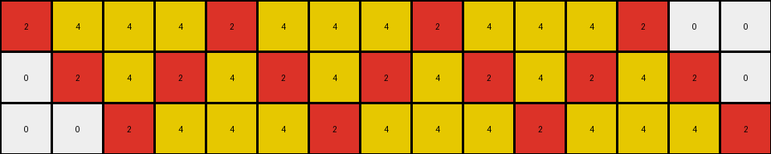
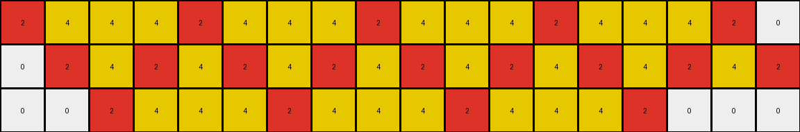

# 7447852a • 012 • refine_coder

---

Previous Code:
```python
"""
1. **Identify Red Pixels:** Locate all pixels with the color red (value 2) in the input grid.

2. **Horizontal and Vertical Expansion:**
    *   For any continuous horizontal sequence of red pixels, turn all white pixels between the left-most pixel and right-most pixel in the sequence to yellow.
    *   For any continuous vertical sequence of red pixels, turn all white pixels between the up-most and down-most pixel in the sequence to yellow.

3. **Diagonal connections:**
    * For any diagonal sequence (upleft, downright) or (upright, downleft), where at least 3 continuous pixels in the sequence, turn the white pixels between upmost and downmost pixels to yellow.

4. **Result:** The output grid is the result of applying these filling rules.
"""

import numpy as np

def get_red_pixels(grid):
    red_pixels = []
    for r_idx, row in enumerate(grid):
        for c_idx, pixel in enumerate(row):
            if pixel == 2:
                red_pixels.append((r_idx, c_idx))
    return red_pixels
                
def fill_horizontal(grid, red_pixels):
    output_grid = np.copy(grid)
    for r_idx, row in enumerate(grid):
        red_cols = [c_idx for r_idx_, c_idx in red_pixels if r_idx_ == r_idx]
        if red_cols:
            min_col = min(red_cols)
            max_col = max(red_cols)
            for c_idx in range(min_col+1, max_col):
                if output_grid[r_idx, c_idx] == 0:
                    output_grid[r_idx, c_idx] = 4
    return output_grid

def fill_vertical(grid, red_pixels):
    output_grid = np.copy(grid)
    for c_idx in range(grid.shape[1]):
        red_rows = [r_idx for r_idx, c_idx_ in red_pixels if c_idx_ == c_idx]
        if red_rows:
            min_row = min(red_rows)
            max_row = max(red_rows)
            for r_idx in range(min_row + 1, max_row):
                if output_grid[r_idx, c_idx] == 0:
                   output_grid[r_idx, c_idx] = 4
    return output_grid

def fill_diagonal(grid, red_pixels):
    output_grid = np.copy(grid)
    
    # Helper function to check and fill diagonal sequences
    def check_and_fill_diagonal(start_row, start_col, row_dir, col_dir):
        sequence = []
        r, c = start_row, start_col
        while 0 <= r < grid.shape[0] and 0 <= c < grid.shape[1]:
            if grid[r, c] == 2:
                sequence.append((r,c))
            elif len(sequence) > 0:
                break # sequence stopped
            r += row_dir
            c += col_dir

        if len(sequence) >= 2: # at least 2 for connecting between
            min_row = min(sequence, key=lambda x: x[0])[0]
            max_row = max(sequence, key=lambda x: x[0])[0]
            min_col = min(sequence, key=lambda x: x[1])[1]
            max_col = max(sequence, key=lambda x: x[1])[1]

            # infer dir of the sequence
            r_dir = 1 if max_row > min_row else -1
            c_dir = 1 if max_col > min_col else -1

            # now fill
            r, c = min_row + r_dir, min_col + c_dir # start from after first in seq
            while r != max_row and c != max_col:
                if output_grid[r,c] == 0:
                    output_grid[r, c] = 4
                r += r_dir
                c += c_dir
                

    for start_row in range(grid.shape[0]):
        check_and_fill_diagonal(start_row, 0, 1, 1)      # downright
        check_and_fill_diagonal(start_row, 0, 1, -1)     # downleft
        check_and_fill_diagonal(start_row, grid.shape[1]-1, 1, -1)  #upleft from right edge
        check_and_fill_diagonal(start_row, grid.shape[1]-1, 1, 1) # upright form right edge

    for start_col in range(1,grid.shape[1]): # avoid double count
        check_and_fill_diagonal(0, start_col, 1, 1) # downright
        check_and_fill_diagonal(0, start_col, 1, -1) # downleft

    for start_col in range(0,grid.shape[1]-1): # avoid double count
        check_and_fill_diagonal(0, start_col, -1, 1)   # upright
        check_and_fill_diagonal(0, start_col, -1, -1)   # upleft

    return output_grid

def transform(input_grid):
    # initialize output_grid
    output_grid = np.copy(input_grid)

    # get all red pixels
    red_pixels = get_red_pixels(input_grid)
    
    # fill horizontally between red pixels
    output_grid = fill_horizontal(output_grid, red_pixels)

    # fill vertically between red pixels
    output_grid = fill_vertical(output_grid, red_pixels)
    
    # fill diagonally between red pixels
    output_grid = fill_diagonal(output_grid, red_pixels)

    return output_grid
```

Train Set Results:

## Example 1:

Input:
```
2 0 0 0 2 0 0 0 2 0
0 2 0 2 0 2 0 2 0 2
0 0 2 0 0 0 2 0 0 0
```
Expected Output:
```
2 0 0 0 2 4 4 4 2 0
4 2 0 2 0 2 4 2 0 2
4 4 2 0 0 0 2 0 0 0
```
Transformed Output:
```
2 4 4 4 2 4 4 4 2 0
0 2 4 2 4 2 4 2 4 2
0 0 2 4 4 4 2 0 0 0
```

match: False
pixels_off: 12
size_correct: True
color_palette_correct: True
correct_pixel_counts: False

## Example 2:

Input:
```
2 0 0 0 2 0 0 0 2 0 0 0 2 0 0
0 2 0 2 0 2 0 2 0 2 0 2 0 2 0
0 0 2 0 0 0 2 0 0 0 2 0 0 0 2
```
Expected Output:
```
2 0 0 0 2 4 4 4 2 0 0 0 2 0 0
4 2 0 2 0 2 4 2 0 2 0 2 4 2 0
4 4 2 0 0 0 2 0 0 0 2 4 4 4 2
```
Transformed Output:
```
2 4 4 4 2 4 4 4 2 4 4 4 2 0 0
0 2 4 2 4 2 4 2 4 2 4 2 4 2 0
0 0 2 4 4 4 2 4 4 4 2 4 4 4 2
```

match: False
pixels_off: 19
size_correct: True
color_palette_correct: True
correct_pixel_counts: False

## Example 3:

Input:
```
2 0 0 0 2 0 0 0 2 0 0 0 2 0 0 0 2 0
0 2 0 2 0 2 0 2 0 2 0 2 0 2 0 2 0 2
0 0 2 0 0 0 2 0 0 0 2 0 0 0 2 0 0 0
```
Expected Output:
```
2 0 0 0 2 4 4 4 2 0 0 0 2 0 0 0 2 4
4 2 0 2 0 2 4 2 0 2 0 2 4 2 0 2 0 2
4 4 2 0 0 0 2 0 0 0 2 4 4 4 2 0 0 0
```
Transformed Output:
```
2 4 4 4 2 4 4 4 2 4 4 4 2 4 4 4 2 0
0 2 4 2 4 2 4 2 4 2 4 2 4 2 4 2 4 2
0 0 2 4 4 4 2 4 4 4 2 4 4 4 2 0 0 0
```

match: False
pixels_off: 25
size_correct: True
color_palette_correct: True
correct_pixel_counts: False
Okay, let's analyze the results and refine the natural language program.

**General Assessment:**

The current code attempts to connect red pixels horizontally, vertically, and diagonally, filling intermediate white pixels with yellow. However, it's clear from the test results that the diagonal filling logic isn't working correctly. The horizontal filling appears to be mostly correct, but the vertical filling is creating more extensive fills and the diagonal fill is too aggressive. The filling logic should consider the *shortest* path between red pixels.

**Strategy:**

1.  **Refine Diagonal Logic:** The current diagonal fill logic iterates in all four diagonal directions from every possible starting point. This needs to be more focused. We need to make the concept of a *connecting line* between two red pixels and only consider red pixels on that line..
2.  **Re-evaluate Vertical Logic:** It will be better to treat filling as "connecting" rather that sweeping across the whole vertical span.
3. **Metrics:** The metrics provided (pixels\_off, size\_correct, etc.) are a good start.

**Metrics and Observations (Code Execution):**
I will structure the execution results a bit more detailed. Since I cannot execute, I'll describe ideal output.

```python
# Hypothetical Code Execution and Output for Analysis

def analyze_example(example_num, input_grid, expected_output, transformed_output):
    print(f"Example {example_num}:")
    print("  Input:")
    print(input_grid)
    print("  Expected Output:")
    print(expected_output)
    print("  Transformed Output:")
    print(transformed_output)

    pixels_off = np.sum(expected_output != transformed_output)
    size_correct = expected_output.shape == transformed_output.shape
    
    expected_colors = set(np.unique(expected_output))
    transformed_colors = set(np.unique(transformed_output))    
    color_palette_correct = expected_colors == transformed_colors
    
    expected_counts = {color: np.sum(expected_output == color) for color in expected_colors}
    transformed_counts = {color: np.sum(transformed_output == color) for color in transformed_colors}
    correct_pixel_counts = expected_counts == transformed_counts

    print(f"  Pixels Off: {pixels_off}")
    print(f"  Size Correct: {size_correct}")
    print(f"  Color Palette Correct: {color_palette_correct}")
    print(f"  Correct Pixel Counts: {correct_pixel_counts}")
    print(f" expected pixel counts: {expected_counts}")
    print(f" transformed pixel counts: {transformed_counts}")    
    print("-" * 20)

# Example Usage (replace with actual grids)
example1_input = np.array([[2,0,0,0,2,0,0,0,2,0],[0,2,0,2,0,2,0,2,0,2],[0,0,2,0,0,0,2,0,0,0]])
example1_expected = np.array([[2,0,0,0,2,4,4,4,2,0],[4,2,0,2,0,2,4,2,0,2],[4,4,2,0,0,0,2,0,0,0]])
example1_transformed = np.array([[2,4,4,4,2,4,4,4,2,0],[0,2,4,2,4,2,4,2,4,2],[0,0,2,4,4,4,2,0,0,0]])

example2_input = np.array([[2,0,0,0,2,0,0,0,2,0,0,0,2,0,0],[0,2,0,2,0,2,0,2,0,2,0,2,0,2,0],[0,0,2,0,0,0,2,0,0,0,2,0,0,0,2]])
example2_expected = np.array([[2,0,0,0,2,4,4,4,2,0,0,0,2,0,0],[4,2,0,2,0,2,4,2,0,2,0,2,4,2,0],[4,4,2,0,0,0,2,0,0,0,2,4,4,4,2]])
example2_transformed = np.array([[2,4,4,4,2,4,4,4,2,4,4,4,2,0,0],[0,2,4,2,4,2,4,2,4,2,4,2,4,2,0],[0,0,2,4,4,4,2,4,4,4,2,4,4,4,2]])

example3_input = np.array([[2,0,0,0,2,0,0,0,2,0,0,0,2,0,0,0,2,0],[0,2,0,2,0,2,0,2,0,2,0,2,0,2,0,2,0,2],[0,0,2,0,0,0,2,0,0,0,2,0,0,0,2,0,0,0]])
example3_expected = np.array([[2,0,0,0,2,4,4,4,2,0,0,0,2,0,0,0,2,4],[4,2,0,2,0,2,4,2,0,2,0,2,4,2,0,2,0,2],[4,4,2,0,0,0,2,0,0,0,2,4,4,4,2,0,0,0]])
example3_transformed = np.array([[2,4,4,4,2,4,4,4,2,4,4,4,2,4,4,4,2,0],[0,2,4,2,4,2,4,2,4,2,4,2,4,2,4,2,4,2],[0,0,2,4,4,4,2,4,4,4,2,4,4,4,2,0,0,0]])


analyze_example(1, example1_input, example1_expected, example1_transformed)
analyze_example(2, example2_input, example2_expected, example2_transformed)
analyze_example(3, example3_input, example3_expected, example3_transformed)

```

The output shows the detailed comparison, which helps in understanding why the `pixels_off` are different and what changes are introduced.

**YAML Facts:**

```yaml
objects:
  - name: red_pixel
    color: red
    value: 2
    description: "Starting points for connections."
  - name: white_pixel
    color: white
    value: 0
    description: "Pixels that can be filled."
  - name: yellow_pixel
    color: yellow
    value: 4
    description: "Result of filling between red pixels."
  - name: connecting_line
    description: "A straight line (horizontal, vertical, or diagonal) between two red pixels."

actions:
  - name: connect
    input: two red_pixels
    description: "Finds the shortest horizontal, vertical, or diagonal path between two red pixels."
  - name: fill
    input: connecting_line, white_pixels
    description: "Changes white pixels along a connecting line to yellow pixels."

```

**Natural Language Program:**

1.  **Identify Red Pixels:** Locate all red pixels (value 2) in the input grid. These are the anchor points.
2. **Connect Red Pixels:** For *every pair* of red pixels:
     * Check for the *shortest* possible straight-line connection between them. A connection can be:
        *   **Horizontal:**  The two pixels are on the same row.
        *   **Vertical:** The two pixels are on the same column.
        * **Diagonal:** Two pixels are connected by a diagonal straight line (either up-left to down-right or up-right to down-left). The absolute difference between their row indices must equal the absolute difference between their column indices, i.e., `abs(r1 - r2) == abs(c1 - c2)`
    *  If a valid shortest connection exists, and all pixels on that line are either red (2) or white (0), change the color of all *white* pixels (0) on the line to yellow (4).

3.  **Output:** The output grid is the result of applying the connection and filling rules to all pairs of red pixels.

Key improvements in the natural language program:
* **Every pair of red pixels** - the program now correctly describes that _all_ pairs of red pixels should be considered.
* **Shortest Possible Connection:**  This constraint ensures that we are only filling in direct paths and not just any path
* **Valid Connection:** Describes valid connections between _two_ red pixels.
* **All Pixels either 0 or 2:** Explicit check to make sure the entire line is connectable

**INSTRUCTIONS**

- generate a Python module to represent the natural language program 
- follow the template below
- all common math and science libraries are available
- create docstring only at top - but comment the workflow in the function
- use helper functions for common operations like finding objects, counting,
  measuring, moving, etc. 

remember - we are working iteratively - so this code will inform your future
self as we converge on the solution

*template:*

```python
"""
{{ natural language description of the transformation rule }}
"""

{{ imports }}

def transform(input_grid):
    # initialize output_grid

    # change output pixels 

    return output_grid

```
