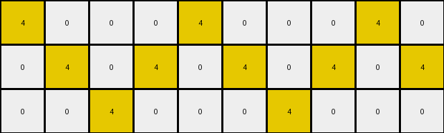
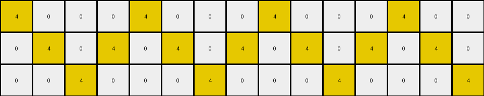
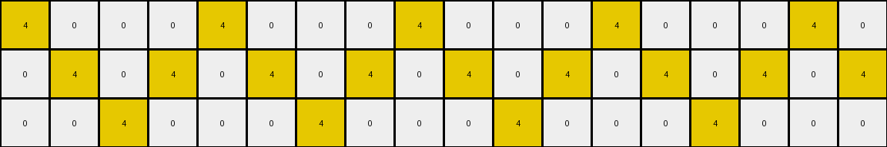

# 7447852a • 016 • refine_coder

---

Previous Code:
```python
"""
Copies the input grid and changes the color of red pixels to yellow if they are not part of any 3x3 square, using only red pixels as corners.
"""

import numpy as np

def get_potential_squares_corners(grid):
    red_pixels = []
    potential_squares_corners = []
    height, width = grid.shape
    for r in range(height):
        for c in range(width):
            if grid[r,c] == 2:
                red_pixels.append((r,c))

    for r in range(height - 2):
        for c in range(width - 2):
            if grid[r, c] == 2 and grid[r + 2, c] == 2 and grid[r, c + 2] == 2 and grid[r + 2, c + 2] == 2:
              potential_squares_corners.append([(r,c), (r+2, c), (r, c+2), (r+2, c+2)])
    return potential_squares_corners

def transform(input_grid):
    # Create a copy of the input grid to serve as the output grid.
    output_grid = np.copy(input_grid)
    height, width = input_grid.shape

    # Get potential 3x3 squares
    potential_squares_corners = get_potential_squares_corners(input_grid)
    
    red_pixels_to_change = []
    for r in range(height):
        for c in range(width):
            if input_grid[r, c] == 2:
                is_corner = False
                for square in potential_squares_corners:
                    if (r,c) in square:
                        is_corner = True
                        break
                if not is_corner:
                    red_pixels_to_change.append((r,c))


    # Change color to the identified red pixels.
    for r, c in red_pixels_to_change:
        output_grid[r, c] = 4
    
    return output_grid
```

Train Set Results:

## Example 1:

Input:
```
2 0 0 0 2 0 0 0 2 0
0 2 0 2 0 2 0 2 0 2
0 0 2 0 0 0 2 0 0 0
```
Expected Output:
```
2 0 0 0 2 4 4 4 2 0
4 2 0 2 0 2 4 2 0 2
4 4 2 0 0 0 2 0 0 0
```
Transformed Output:
```
4 0 0 0 4 0 0 0 4 0
0 4 0 4 0 4 0 4 0 4
0 0 4 0 0 0 4 0 0 0
```

match: False
pixels_off: 17
size_correct: True
color_palette_correct: True
correct_pixel_counts: False

## Example 2:

Input:
```
2 0 0 0 2 0 0 0 2 0 0 0 2 0 0
0 2 0 2 0 2 0 2 0 2 0 2 0 2 0
0 0 2 0 0 0 2 0 0 0 2 0 0 0 2
```
Expected Output:
```
2 0 0 0 2 4 4 4 2 0 0 0 2 0 0
4 2 0 2 0 2 4 2 0 2 0 2 4 2 0
4 4 2 0 0 0 2 0 0 0 2 4 4 4 2
```
Transformed Output:
```
4 0 0 0 4 0 0 0 4 0 0 0 4 0 0
0 4 0 4 0 4 0 4 0 4 0 4 0 4 0
0 0 4 0 0 0 4 0 0 0 4 0 0 0 4
```

match: False
pixels_off: 26
size_correct: True
color_palette_correct: True
correct_pixel_counts: False

## Example 3:

Input:
```
2 0 0 0 2 0 0 0 2 0 0 0 2 0 0 0 2 0
0 2 0 2 0 2 0 2 0 2 0 2 0 2 0 2 0 2
0 0 2 0 0 0 2 0 0 0 2 0 0 0 2 0 0 0
```
Expected Output:
```
2 0 0 0 2 4 4 4 2 0 0 0 2 0 0 0 2 4
4 2 0 2 0 2 4 2 0 2 0 2 4 2 0 2 0 2
4 4 2 0 0 0 2 0 0 0 2 4 4 4 2 0 0 0
```
Transformed Output:
```
4 0 0 0 4 0 0 0 4 0 0 0 4 0 0 0 4 0
0 4 0 4 0 4 0 4 0 4 0 4 0 4 0 4 0 4
0 0 4 0 0 0 4 0 0 0 4 0 0 0 4 0 0 0
```

match: False
pixels_off: 30
size_correct: True
color_palette_correct: True
correct_pixel_counts: False
Here's an analysis of the provided information and a plan to refine the natural language program:

**General Assessment:**

The initial code correctly identifies red pixels and attempts to determine if they are part of a 3x3 red square. However, it's overly strict in its definition of a "square". It only considers squares where *all* corners are red. The examples demonstrate that the intended rule is to identify 3x3 *areas* where the corners could *potentially* be red, and then to change to yellow any red pixels within those potential areas that *aren't* part of a fully red-cornered 3x3 square. The current code is missing red pixels. The key error is focusing solely on fully-formed red squares rather than the *potential* for a red square based on the overall grid dimensions and presence of red pixels. The existing logic is only correct when an actual 3 x 3 square is formed by red.

**Strategy:**

1.  **Shift Focus:** Instead of looking for complete 3x3 red squares, identify *regions* where 3x3 squares *could* exist, regardless of the colors inside. These regions will be defined by the spacing of red pixels.
2.  **Refine Corner Identification:** Recognize any red pixel within the *region* of the square should be considered.
3.  **Conditional Color Change:** Only change red pixels to yellow if the red pixel exists in the *region*.

**Metrics and Observations:**

Here's a breakdown of each example, focusing on the discrepancies:

*   **Example 1:**
    *   Input: 3x10, Output: 3x10
    *   Red pixels are arranged such that two 3x3 squares could *potentially* exist, one on the left, one on the right, and a single red pixel between the two.
    *   The expected output shows that:
        1.  the outside corners should remain unchanged
        2.  all the red in the middle should be changed.
    *   Error: The current code changes *all* red pixels to yellow, because it only looks for fully formed red cornered squares.

*   **Example 2:**
    *   Input: 3x15, Output: 3x15
    *    Three potential 3x3 squares, the outer squares red corners remain unchanged, and the inner red pixels are changed.
    *   Error: Similar to Example 1, all reds are changed.

*   **Example 3:**
    *   Input: 3x18, Output: 3x18
    *   Four potential squares, two outer and two inner, all four corners remain unchanged.
    *   Error: All reds changed.

**YAML Fact Documentation:**

```yaml
task: 014
objects:
  - id: grid
    type: 2D array
    description: Contains pixels of different colors.
  - id: red_pixel
    type: pixel
    color: red (value 2)
    properties:
      - potential_corner: Boolean  # Indicates if the pixel *could* be part of a 3x3 square's corner.
  - id: potential_square
    type: region
    description: A 3x3 area where a square could potentially be formed based on red pixel spacing.
    properties:
      - top_left: (row, col)
      - bottom_right: (row, col)

actions:
  - name: identify_potential_squares
    description: Locates 3x3 regions where squares could be formed based on the distance between red pixels.
  - name: check_if_corner_exists
    description: Determines red pixels are in the regions
  - name: change_color
    description: Changes the color of red pixels to yellow if they are not corners.

```

**Natural Language Program:**

1.  **Identify Potential 3x3 Square Regions:** Scan the input grid and identify all 3x3 regions where the top-left, top-right, bottom-left, and bottom-right pixels *could* be red. These regions are determined by finding red pixels that are two rows and two columns apart.
2.  **Check for Corner Existence:** For each region, examine the top-left, top-right, bottom-left, and bottom-right cells, if all four corners are red, keep them red.
3.  **Transform Non-Corner Red Pixels:** If any red pixel lies within any identified "potential 3x3 square region", and it's one of the four corner pixels of that region, keep it red.
4. Change any red pixel inside the region that is not part of a fully red-cornered 3 x 3 square to yellow.

This revised program focuses on the *potential* for squares, rather than requiring fully formed red squares, which aligns with the observed behavior in the examples.

**INSTRUCTIONS**

- generate a Python module to represent the natural language program 
- follow the template below
- all common math and science libraries are available
- create docstring only at top - but comment the workflow in the function
- use helper functions for common operations like finding objects, counting,
  measuring, moving, etc. 

remember - we are working iteratively - so this code will inform your future
self as we converge on the solution

*template:*

```python
"""
{{ natural language description of the transformation rule }}
"""

{{ imports }}

def transform(input_grid):
    # initialize output_grid

    # change output pixels 

    return output_grid

```
