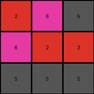
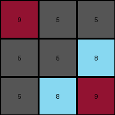

# 74dd1130 • 009 • refine_dreamer

---


Previous Code:
```python
"""
The transformation rule for this task is to transpose (swap) the values of the cells located at positions (0, 1) and (1, 0) of the input 3x3 grid, while keeping all other cells unchanged.
"""

import numpy as np

def transform(input_grid):
    """
    Transposes elements at (0, 1) and (1, 0) in a 3x3 grid.

    Args:
        input_grid (list of lists): A 3x3 grid represented as a list of lists.

    Returns:
        list of lists: A new 3x3 grid with the specified elements transposed.
    """
    # Initialize the output grid as a copy of the input grid.
    output_grid = [row[:] for row in input_grid]

    # Transpose elements at (0, 1) and (1, 0).
    output_grid[0][1] = input_grid[1][0]
    output_grid[1][0] = input_grid[0][1]
    
    return output_grid
```

Train Set Results:

## Example 1:

Input:
```
2 2 1
1 5 1
5 2 2
```
Expected Output:
```
2 1 5
2 5 2
1 1 2
```
Transformed Output:
```
2 1 1
1 5 1
5 2 2
```

match: False
pixels_off: 5
size_correct: True
color_palette_correct: True
correct_pixel_counts: False

## Example 2:

Input:
```
2 2 5
6 2 2
5 5 5
```
Expected Output:
```
2 6 5
2 2 5
5 2 5
```
Transformed Output:
```
2 6 5
6 2 2
5 5 5
```

match: False
pixels_off: 3
size_correct: True
color_palette_correct: True
correct_pixel_counts: False

## Example 3:

Input:
```
9 9 5
5 5 8
5 8 9
```
Expected Output:
```
9 5 5
9 5 8
5 8 9
```
Transformed Output:
```
9 5 5
5 5 8
5 8 9
```

match: False
pixels_off: 1
size_correct: True
color_palette_correct: True
correct_pixel_counts: False

## Example 4:

Input:
```
2 6 6
2 1 1
2 6 2
```
Expected Output:
```
2 2 2
6 1 6
6 1 2
```
Transformed Output:
```
2 2 6
2 1 1
2 6 2
```

match: False
pixels_off: 5
size_correct: True
color_palette_correct: True
correct_pixel_counts: False

**INSTRUCTIONS**

The code above was generated based on observations from the first training
example

we have tested the transform function on each of the task example inputs and
compared with the expected output

review each of the examples provided and the results and consider how the
natural language program should be updated to accommodate this new knowledge

respond with the following deliverables:

- general assessment of the information provided and strategy for resolving the
  errors
- gather metrics about each of the examples and results - use code_execution to
  develop accurate reports on your assumptions
- a YAML block documenting facts - Focus on identifying objects, their properties, and the actions performed on them.
- a natural language program - Be as clear and concise as possible, providing a complete description of the transformation rule.


your responses should be considered as information in a report - not a
conversation
