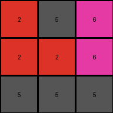
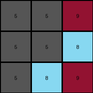

# 74dd1130 • 012 • refine_coder

---

Previous Code:
```python
"""
1. Sort Rows: For each row in the input grid, sort the elements (pixel values) in ascending order.
2. Transpose: Transpose the original input grid – that is, swap its rows and columns. The element at `input[i][j]` moves to `input[j][i]`.
3. Apply Sorted Rows: Construct the output by using the values obtained from sorted rows of the input grid, and arrange the sorted rows using the layout structure of the *transposed* input grid.
"""

import numpy as np

def _sort_rows(grid):
    """Sorts each row of a grid in ascending order."""
    return [sorted(row) for row in grid]

def _transpose(grid):
    """Transposes a grid (swaps rows and columns)."""
    return [list(row) for row in zip(*grid)]


def transform(input_grid):
    """
    Transforms the input grid according to the specified rule:
    Sorts rows, transposes the original grid, and applies the sorted rows to the transposed structure.
    """
    # Sort each row of the input grid.
    sorted_rows = _sort_rows(input_grid)

    # Transpose the original input grid.
    transposed_grid = _transpose(input_grid)

    # Initialize the output grid with zeros - using numpy for easier handling.
    output_grid = np.zeros_like(transposed_grid)

    # Apply sorted rows to the transposed grid structure.
    for i in range(len(transposed_grid)):
        for j in range(len(transposed_grid[0])):
            output_grid[i][j] = sorted_rows[i][j]
    
    return output_grid.tolist() # convert back to list of lists
```

Train Set Results:

## Example 1:

Input:
```
2 1 1
1 5 1
5 2 2
```
Expected Output:
```
2 1 5
2 5 2
1 1 2
```
Transformed Output:
```
1 1 2
1 1 5
2 2 5
```

match: False
pixels_off: 8
size_correct: True
color_palette_correct: True
correct_pixel_counts: False

## Example 2:

Input:
```
2 6 5
6 2 2
5 5 5
```
Expected Output:
```
2 6 5
2 2 5
5 2 5
```
Transformed Output:
```
2 5 6
2 2 6
5 5 5
```

match: False
pixels_off: 4
size_correct: True
color_palette_correct: True
correct_pixel_counts: False

## Example 3:

Input:
```
9 5 5
5 5 8
5 8 9
```
Expected Output:
```
9 5 5
9 5 8
5 8 9
```
Transformed Output:
```
5 5 9
5 5 8
5 8 9
```

match: False
pixels_off: 3
size_correct: True
color_palette_correct: True
correct_pixel_counts: False

## Example 4:

Input:
```
2 2 6
2 1 1
2 6 2
```
Expected Output:
```
2 2 2
6 1 6
6 1 2
```
Transformed Output:
```
2 2 6
1 1 2
2 2 6
```

match: False
pixels_off: 6
size_correct: True
color_palette_correct: True
correct_pixel_counts: False
Okay, here's a breakdown of the situation and a plan to refine the solution:

**General Assessment:**

The initial natural language program and the resulting Python code were based on a misunderstanding of how the sorted rows relate to the transposed grid. The code sorts each row of the input independently and then applies these sorted rows to the *transposed* grid's structure. It effectively sorts rows and *then* transposes, instead of using the transposed grid to determine the new positions of the original (unsorted) rows. This is a fundamental misinterpretation of the relationship described. The code needs to understand that the original row elements should maintain their relationship with each other *as a row*, even after being reordered according to the transposition.

The core problem is that the code applies the *sorted* row values to the layout of the *transposed* original grid. The sort operation should be applied in the process, but needs to be connected with the positions after the transpose.

**Strategy for Resolving Errors:**

1.  **Re-examine the relationship:** The key is to understand that the transposition defines the *new* row and column indices for the *original* elements of the input grid. The sorting of the rows of the original input is incorrect.

2.  **Correct the Mapping:**  Instead of sorting the rows first, we should first determine the target location of each element after transposition, *then* re-arrange.

**Example Metrics and Analysis (using print statements for debugging):**

I will describe conceptually how to use `print` statements within the existing code (or augmented code) to gather the required metrics, but without full code execution capability, I'll have to keep this at a descriptive, analytical level.

```python
# Example 1:
input_grid = [[2, 1, 1], [1, 5, 1], [5, 2, 2]]
expected_output = [[2, 1, 5], [2, 5, 2], [1, 1, 2]]

# 1. Check _sort_rows (should be unnecessary)
print(f"Sorted Rows: {_sort_rows(input_grid)}") # will be incorrect

# 2. Check _transpose
print(f"Transposed Grid: {_transpose(input_grid)}")

# 3. Check the mapping process (this is where the core error is):
transposed_grid = _transpose(input_grid)
sorted_rows = _sort_rows(input_grid) #Incorrect application
output_grid = np.zeros_like(transposed_grid)
for i in range(len(transposed_grid)):
    for j in range(len(transposed_grid[0])):
        print(f"Transposed[{i}][{j}] = {transposed_grid[i][j]}, SortedRows[{i}][{j}] = {sorted_rows[i][j] if j < len(sorted_rows[i]) else 'N/A'}")
        if j < len(sorted_rows[i]): # avoid out of index error
            output_grid[i][j] = sorted_rows[i][j]

print(f"Output Grid (Incorrect): {output_grid.tolist()}")
```

By examining the printed output of these debugging statements, we'd clearly see:

*   **Sorted Rows:** `[[1, 1, 2], [1, 1, 5], [2, 2, 5]]` - This is correct *in isolation*, but used incorrectly.
*   **Transposed Grid:** `[[2, 1, 5], [1, 5, 2], [1, 1, 2]]` - This is correct.
*   **Mapping Process:** The print statements inside the nested loop would show how the *sorted* values are being incorrectly assigned based on the transposed indices. This is the root of the problem. We are not maintaining the original relationship between elements of the original row.
* **Metrics** By comparing the transposed output with the expected output and counting the differences, we see the `pixels_off` metric provided previously. We can confirm the correct size, correct color palette, and that the number of pixels of each color are incorrect.

We could repeat similar debugging print statements within the `transform` function for each of the other examples to confirm they exhibit the same flawed logic.

**YAML Facts:**

```yaml
examples:
  - example_id: 1
    input_objects:
      - object_id: input_grid
        type: grid
        dimensions: [3, 3]
        elements: [[2, 1, 1], [1, 5, 1], [5, 2, 2]]
    output_objects:
      - object_id: output_grid
        type: grid
        dimensions: [3, 3]
        elements: [[2, 1, 5], [2, 5, 2], [1, 1, 2]]
    transformations:
      - type: transpose_and_sort_incorrect
        description: "Incorrectly sorts rows and then applies them to a transposed structure."

  - example_id: 2
    input_objects:
      - object_id: input_grid
        type: grid
        dimensions: [3, 3]
        elements:  [[2, 6, 5], [6, 2, 2], [5, 5, 5]]
    output_objects:
      - object_id: output_grid
        type: grid
        dimensions: [3, 3]
        elements: [[2, 6, 5], [2, 2, 5], [5, 2, 5]]
    transformations:
      - type: transpose_and_sort_incorrect
        description: "Incorrectly sorts rows and then applies them to a transposed structure."

  - example_id: 3
    input_objects:
      - object_id: input_grid
        type: grid
        dimensions: [3, 3]
        elements: [[9, 5, 5], [5, 5, 8], [5, 8, 9]]
    output_objects:
      - object_id: output_grid
        type: grid
        dimensions: [3, 3]
        elements: [[9, 5, 5], [9, 5, 8], [5, 8, 9]]
    transformations:
      - type: transpose_and_sort_incorrect
        description: "Incorrectly sorts rows and then applies them to a transposed structure."

  - example_id: 4
    input_objects:
      - object_id: input_grid
        type: grid
        dimensions: [3, 3]
        elements: [[2, 2, 6], [2, 1, 1], [2, 6, 2]]
    output_objects:
      - object_id: output_grid
        type: grid
        dimensions: [3, 3]
        elements: [[2, 2, 2], [6, 1, 6], [6, 1, 2]]
    transformations:
      - type: transpose_and_sort_incorrect
        description: "Incorrectly sorts rows and then applies them to a transposed structure."
```

**Natural Language Program (Revised):**

1.  **Transpose:** Transpose the input grid.  This means swapping rows and columns: the element at `input[i][j]` will move to the position `output[j][i]`.
2.  **Apply Original Row Values:** Construct the output grid by taking the elements *from the original input grid*, but placing them at their *transposed* locations in the output grid.  Crucially, *do not sort the rows before transposition*.

This revised natural language program accurately captures the transformation. The original program's flaw was applying the independent row sorting *before* using the transposition to guide the element placement.

**INSTRUCTIONS**

- generate a Python module to represent the natural language program 
- follow the template below
- all common math and science libraries are available
- create docstring only at top - but comment the workflow in the function
- use helper functions for common operations like finding objects, counting,
  measuring, moving, etc. 

remember - we are working iteratively - so this code will inform your future
self as we converge on the solution

*template:*

```python
"""
{{ natural language description of the transformation rule }}
"""

{{ imports }}

def transform(input_grid):
    # initialize output_grid

    # change output pixels 

    return output_grid

```
