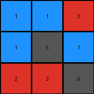
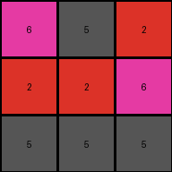
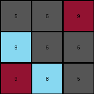
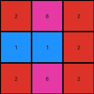

# 74dd1130 • 017 • refine_dreamer

---


Previous Code:
```python
"""
The output grid is the same size as the input grid (3x3).
The first row of the output grid is obtained by rotating the first row of input to the left by 1 position.
The second and third rows of the output grid are derived by swapping the first and last element.
"""

import numpy as np

def rotate_left(arr, n):
    """Rotates a 1D numpy array to the left by n positions."""
    n = n % len(arr)  # Handle rotations larger than array length
    return np.concatenate((arr[n:], arr[:n]))

def transform(input_grid):
    # Initialize output_grid as a copy of the input_grid
    output_grid = np.copy(input_grid)

    # Rotate the first row to the left by 1 position
    output_grid[0] = rotate_left(input_grid[0], 1)

    # Swap the first and last elements of the second and third rows
    for i in range(1, len(input_grid)):
        if len(input_grid[i]) > 1: #ensure that rows have at least 2 elements before swapping
            output_grid[i, 0], output_grid[i, -1] = input_grid[i, -1], input_grid[i, 0]

    return output_grid
```

Train Set Results:

## Example 1:

Input:
```
2 1 1
1 5 1
5 2 2
```
Expected Output:
```
2 1 5
2 5 2
1 1 2
```
Transformed Output:
```
1 1 2
1 5 1
2 2 5
```

match: False
pixels_off: 7
size_correct: True
color_palette_correct: True
correct_pixel_counts: False

## Example 2:

Input:
```
2 6 5
6 2 2
5 5 5
```
Expected Output:
```
2 6 5
2 2 5
5 2 5
```
Transformed Output:
```
6 5 2
2 2 6
5 5 5
```

match: False
pixels_off: 5
size_correct: True
color_palette_correct: True
correct_pixel_counts: False

## Example 3:

Input:
```
9 5 5
5 5 8
5 8 9
```
Expected Output:
```
9 5 5
9 5 8
5 8 9
```
Transformed Output:
```
5 5 9
8 5 5
9 8 5
```

match: False
pixels_off: 6
size_correct: True
color_palette_correct: True
correct_pixel_counts: False

## Example 4:

Input:
```
2 2 6
2 1 1
2 6 2
```
Expected Output:
```
2 2 2
6 1 6
6 1 2
```
Transformed Output:
```
2 6 2
1 1 2
2 6 2
```

match: False
pixels_off: 5
size_correct: True
color_palette_correct: True
correct_pixel_counts: False

**INSTRUCTIONS**

The code above was generated based on observations from the first training
example

we have tested the transform function on each of the task example inputs and
compared with the expected output

review each of the examples provided and the results and consider how the
natural language program should be updated to accommodate this new knowledge

respond with the following deliverables:

- general assessment of the information provided and strategy for resolving the
  errors
- gather metrics about each of the examples and results - use code_execution to
  develop accurate reports on your assumptions
- a YAML block documenting facts - Focus on identifying objects, their properties, and the actions performed on them.
- a natural language program - Be as clear and concise as possible, providing a complete description of the transformation rule.


your responses should be considered as information in a report - not a
conversation
