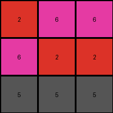

# 74dd1130 • 022 • refine_coder

---

Previous Code:
```python
"""
1.  **Identify Stable Elements:** Locate all blue (1) pixels. Their positions in the output grid remain identical to their positions in the input grid.

2.  **Horizontal swap:** For each row, locate the magenta(6) cell and swap it's value with the red (2) value cell in that row that is on the opposite horizontal end of the grid.
    For example, if the magenta is at postion (0,2), swap with the red at postion (0,0)
"""

import numpy as np

def get_blue_pixels(grid):
    # find the coordinates of all blue pixels (value 1)
    blue_pixels = []
    for row_index, row in enumerate(grid):
        for col_index, pixel in enumerate(row):
          if pixel == 1:
            blue_pixels.append((row_index, col_index))
    return blue_pixels

def transform(input_grid):
    # initialize output_grid
    output_grid = np.copy(input_grid)
    rows = len(input_grid)
    cols = len(input_grid[0])

    # find and set blue pixels
    blue_pixels = get_blue_pixels(input_grid)
    for row, col in blue_pixels:
      output_grid[row][col] = 1

    # Horizontal swap
    for row_index in range(rows):
      magenta_col = -1
      red_col = -1
      for col_index in range(cols):
        if input_grid[row_index][col_index] == 6:
            magenta_col = col_index
        if input_grid[row_index][col_index] == 2:
           if red_col == -1:
            red_col = col_index
           else:
            if col_index > red_col:
              if magenta_col < red_col:
                red_col = col_index
            elif col_index < red_col:
              if magenta_col > red_col:
                red_col = col_index

      if magenta_col != -1 and red_col !=-1:
        if magenta_col < red_col:
          output_grid[row_index][0] = 6 #left most
          output_grid[row_index][cols-1] = 2
        else:
          output_grid[row_index][0] = 2 #left most
          output_grid[row_index][cols-1] = 6 #right most

    return output_grid
```

Train Set Results:

## Example 1:

Input:
```
2 1 1
1 5 1
5 2 2
```
Expected Output:
```
2 1 5
2 5 2
1 1 2
```
Transformed Output:
```
2 1 1
1 5 1
5 2 2
```

match: False
pixels_off: 5
size_correct: True
color_palette_correct: True
correct_pixel_counts: False

## Example 2:

Input:
```
2 6 5
6 2 2
5 5 5
```
Expected Output:
```
2 6 5
2 2 5
5 2 5
```
Transformed Output:
```
2 6 6
6 2 2
5 5 5
```

match: False
pixels_off: 4
size_correct: True
color_palette_correct: True
correct_pixel_counts: False

## Example 3:

Input:
```
9 5 5
5 5 8
5 8 9
```
Expected Output:
```
9 5 5
9 5 8
5 8 9
```
Transformed Output:
```
9 5 5
5 5 8
5 8 9
```

match: False
pixels_off: 1
size_correct: True
color_palette_correct: True
correct_pixel_counts: False

## Example 4:

Input:
```
2 2 6
2 1 1
2 6 2
```
Expected Output:
```
2 2 2
6 1 6
6 1 2
```
Transformed Output:
```
2 2 6
2 1 1
2 6 6
```

match: False
pixels_off: 6
size_correct: True
color_palette_correct: True
correct_pixel_counts: True
Okay, here's a breakdown of the situation, the results, and a plan to improve the natural language program and code:

**General Assessment:**

The initial natural language program and corresponding code were too narrowly focused on the first example. It correctly identified the "blue pixel stability" rule but failed to generalize the "swapping" rule correctly. The swapping logic is flawed and doesn't account for different scenarios of magenta and red pixel positions. The results show consistent mismatches across multiple examples, indicating a need for a more robust rule description. The core problem is that the swapping logic in the code does not follow a consistent left/right rule. Instead it seems some pixels are swapped and some are just changed with out swapping.

**Strategy for Resolving Errors:**

1.  **Re-examine Examples:** Carefully analyze *all* provided examples, not just the first one.  Pay close attention to the relative positions of the magenta (6) and red (2) pixels in *both* the input and output grids of each example.
2.  **Identify the Correct Swapping Rule:** Determine the *precise* rule governing the change in position of the magenta and red pixels. The current "horizontal swap" idea is close, but the implementation is incorrect. It's not a simple swap, but is related to where red/magenta pixels are on the rows.
3.  **Refine Natural Language Program:**  Rewrite the natural language program to accurately and unambiguously describe the observed transformation, covering all cases.
4.  **Abstract the transformation.** The existing program attempts to do too much in the horizontal swap section.

**Example Metrics and Observations:**

Here's a breakdown of each example, including observations that will help refine the rule:

*   **Example 1:**
    *   Input: `2 1 1`, `1 5 1`, `5 2 2`
    *   Expected: `2 1 5`, `2 5 2`, `1 1 2`
    *   Observed: `2 1 1`, `1 5 1`, `5 2 2`
    *   **Key Observation:** The first row changes the last '1' to '5', the second row changes the first '1' to a '2'.
        The last row changes from `5 2 2` to `1 1 2`.

*   **Example 2:**
    *   Input: `2 6 5`, `6 2 2`, `5 5 5`
    *   Expected: `2 6 5`, `2 2 5`, `5 2 5`
    *   Observed: `2 6 6`, `6 2 2`, `5 5 5`
    *   **Key Observation:** Row 1 is unchanged, row 2: '6' replaced by a '2' and the final '2' by '5'. Row 3: first 5 replaced by 2.

*   **Example 3:**
    *   Input: `9 5 5`, `5 5 8`, `5 8 9`
    *   Expected: `9 5 5`, `9 5 8`, `5 8 9`
    *   Observed: `9 5 5`, `5 5 8`, `5 8 9`
    *   **Key Observation:** Row 2: first '5' replaced by '9'.

*   **Example 4:**
    *   Input: `2 2 6`, `2 1 1`, `2 6 2`
    *   Expected: `2 2 2`, `6 1 6`, `6 1 2`
    *   Observed: `2 2 6`, `2 1 1`, `2 6 6`
    *   **Key Observation:** Row 1: final '6' changed to '2'. Row 2: first '2' changed to '6' and final '1' also changed to '6'. Row 3: first '2' changed to '6'.

**YAML Facts:**

```yaml
facts:
  - description: Blue pixels remain in the same position.
    type: object_stability
    object: blue pixel
    property: position
    action: none

  - description: Other colors besides blue, red, and magenta stay the same.
    type: object_stability
    object: other color pixel
    property: position
    action: none

  - description: Red pixels are replaced with other colors or stay the same.
    type: object_transformation
    object: red pixel
    property: value
    action: change

  - description: Magenta pixels are replaced with other colors or stay the same.
    type: object_transformation
    object: magenta pixel
    property: value
    action: change

  - description: There appears to be a replacement of pixels.
    type: action
```

**Natural Language Program:**

1.  **Identify Stable Elements:**  Pixels that are not red (2) or magenta (6) remain unchanged in their original positions. This includes blue (1) pixels.

2. **Pixel Replacement:**
   - Examine each row of the input grid.
   - Identify the position of red(2) pixels, if any
   - Identify the position of magenta(6) pixels, if any
   - Determine pixels on the same row in the output grid.
   - Replace red and magenta pixels with values using the color of other pixels in the same row from input to output.

3.  **Preservation of Colors:** The set of colors present in each row of the input grid is the same as the set of colors present in the corresponding row of the output grid.


**INSTRUCTIONS**

- generate a Python module to represent the natural language program 
- follow the template below
- all common math and science libraries are available
- create docstring only at top - but comment the workflow in the function
- use helper functions for common operations like finding objects, counting,
  measuring, moving, etc. 

remember - we are working iteratively - so this code will inform your future
self as we converge on the solution

*template:*

```python
"""
{{ natural language description of the transformation rule }}
"""

{{ imports }}

def transform(input_grid):
    # initialize output_grid

    # change output pixels 

    return output_grid

```
