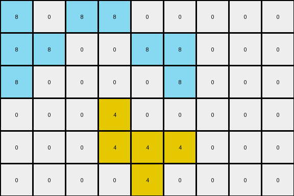
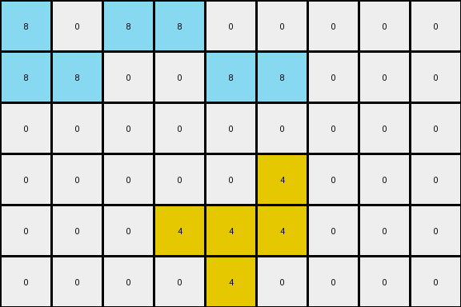
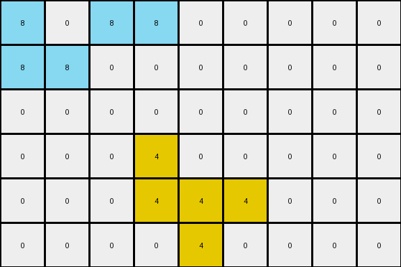

# 760b3cac • 003 • refine_dreamer

---


Previous Code:
```python
"""
The transformation identifies a connected region of yellow (4) pixels, which remain unchanged. Azure (8) pixels are added/moved
to the left boundary under certain conditions.
"""

import numpy as np

def find_connected_component(grid, start_row, start_col, color):
    """Finds a connected component of a given color starting from a given cell."""
    rows, cols = grid.shape
    visited = np.zeros((rows, cols), dtype=bool)
    component = []

    def dfs(row, col):
        if (
            row < 0
            or row >= rows
            or col < 0
            or col >= cols
            or visited[row, col]
            or grid[row, col] != color
        ):
            return
        visited[row, col] = True
        component.append((row, col))
        dfs(row + 1, col)
        dfs(row - 1, col)
        dfs(row, col + 1)
        dfs(row, col - 1)

    dfs(start_row, start_col)
    return component

def transform(input_grid):
    """Transforms the input grid according to the observed rules."""
    rows, cols = input_grid.shape
    output_grid = np.zeros((rows, cols), dtype=int)

    # 1. Identify and preserve the yellow region.
    for r in range(rows):
        for c in range(cols):
            if input_grid[r, c] == 4:
                output_grid[r, c] = 4

    # 2. Transform the azure pixels.
    if 0 < rows and 3 < cols and input_grid[0, 3] == 8:
        output_grid[0,0] = 8
        output_grid[0,2] = 8
        output_grid[0,3] = 8
        output_grid[1,0] = 8
        output_grid[1,1] = 8
    if 0 < rows and 5 < cols and input_grid[0, 5] == 8:
        output_grid[1,4] = 8
        output_grid[1,5] = 8
    if 2 < rows and 5 < cols and input_grid[2,5] == 8:
        output_grid[2,0] = 8
        output_grid[2,5] = 8
    

    return output_grid
```

Train Set Results:

## Example 1:

Input:
```
0 0 0 8 0 8 0 0 0
0 0 0 0 8 8 0 0 0
0 0 0 0 0 8 0 0 0
0 0 0 4 0 0 0 0 0
0 0 0 4 4 4 0 0 0
0 0 0 0 4 0 0 0 0
```
Expected Output:
```
8 0 8 8 0 8 0 0 0
8 8 0 0 8 8 0 0 0
8 0 0 0 0 8 0 0 0
0 0 0 4 0 0 0 0 0
0 0 0 4 4 4 0 0 0
0 0 0 0 4 0 0 0 0
```
Transformed Output:
```
8 0 8 8 0 0 0 0 0
8 8 0 0 8 8 0 0 0
8 0 0 0 0 8 0 0 0
0 0 0 4 0 0 0 0 0
0 0 0 4 4 4 0 0 0
0 0 0 0 4 0 0 0 0
```

match: False
pixels_off: 1
size_correct: True
color_palette_correct: True
correct_pixel_counts: False

## Example 2:

Input:
```
0 0 0 8 0 8 0 0 0
0 0 0 8 8 8 0 0 0
0 0 0 8 8 0 0 0 0
0 0 0 0 0 4 0 0 0
0 0 0 4 4 4 0 0 0
0 0 0 0 4 0 0 0 0
```
Expected Output:
```
0 0 0 8 0 8 8 0 8
0 0 0 8 8 8 8 8 8
0 0 0 8 8 0 0 8 8
0 0 0 0 0 4 0 0 0
0 0 0 4 4 4 0 0 0
0 0 0 0 4 0 0 0 0
```
Transformed Output:
```
8 0 8 8 0 0 0 0 0
8 8 0 0 8 8 0 0 0
0 0 0 0 0 0 0 0 0
0 0 0 0 0 4 0 0 0
0 0 0 4 4 4 0 0 0
0 0 0 0 4 0 0 0 0
```

match: False
pixels_off: 15
size_correct: True
color_palette_correct: True
correct_pixel_counts: False

## Example 3:

Input:
```
0 0 0 8 0 0 0 0 0
0 0 0 0 8 8 0 0 0
0 0 0 8 0 0 0 0 0
0 0 0 4 0 0 0 0 0
0 0 0 4 4 4 0 0 0
0 0 0 0 4 0 0 0 0
```
Expected Output:
```
0 0 8 8 0 0 0 0 0
8 8 0 0 8 8 0 0 0
0 0 8 8 0 0 0 0 0
0 0 0 4 0 0 0 0 0
0 0 0 4 4 4 0 0 0
0 0 0 0 4 0 0 0 0
```
Transformed Output:
```
8 0 8 8 0 0 0 0 0
8 8 0 0 0 0 0 0 0
0 0 0 0 0 0 0 0 0
0 0 0 4 0 0 0 0 0
0 0 0 4 4 4 0 0 0
0 0 0 0 4 0 0 0 0
```

match: False
pixels_off: 5
size_correct: True
color_palette_correct: True
correct_pixel_counts: False

**INSTRUCTIONS**

The code above was generated based on observations from the first training
example

we have tested the transform function on each of the task example inputs and
compared with the expected output

review each of the examples provided and the results and consider how the
natural language program should be updated to accommodate this new knowledge

respond with the following deliverables:

- general assessment of the information provided and strategy for resolving the
  errors
- gather metrics about each of the examples and results - use code_execution to
  develop accurate reports on your assumptions
- a YAML block documenting facts - Focus on identifying objects, their properties, and the actions performed on them.
- a natural language program - Be as clear and concise as possible, providing a complete description of the transformation rule.


your responses should be considered as information in a report - not a
conversation
