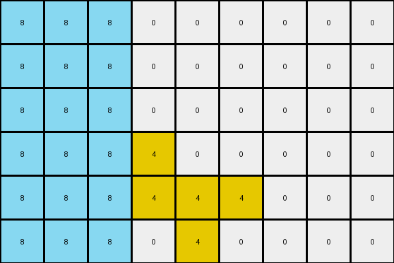

# 760b3cac • 006 • refine_coder

---

Previous Code:
```python
"""
The transformation identifies a connected region of yellow (4) pixels, which remain unchanged. Azure (8) pixels are added to the columns to the left of the yellow region, filling them from top to bottom.
"""

import numpy as np

def find_yellow_region(grid):
    """Finds the bounding box of the connected yellow region."""
    rows, cols = grid.shape
    min_row, max_row = rows, -1
    min_col, max_col = cols, -1

    for r in range(rows):
        for c in range(cols):
            if grid[r, c] == 4:
                min_row = min(min_row, r)
                max_row = max(max_row, r)
                min_col = min(min_col, c)
                max_col = max(max_col, c)

    return min_row, max_row, min_col, max_col

def transform(input_grid):
    # initialize output_grid
    rows, cols = input_grid.shape
    output_grid = np.zeros((rows, cols), dtype=int)

    # 1. Identify and preserve the yellow region.
    min_yellow_row, max_yellow_row, min_yellow_col, max_yellow_col = find_yellow_region(input_grid)

    for r in range(rows):
        for c in range(cols):
            if input_grid[r,c] == 4:
                output_grid[r,c] = 4


    # 2. Process Azure Pixels
    # Fill columns to the left of the yellow region with azure, top to bottom.
    
    num_cols_to_fill = min_yellow_col  #number of columns to left of the yellow
    
    for c in range(num_cols_to_fill):
       for r in range(rows):
           output_grid[r,c] = 8

    return output_grid
```

Train Set Results:

## Example 1:

Input:
```
0 0 0 8 0 8 0 0 0
0 0 0 0 8 8 0 0 0
0 0 0 0 0 8 0 0 0
0 0 0 4 0 0 0 0 0
0 0 0 4 4 4 0 0 0
0 0 0 0 4 0 0 0 0
```
Expected Output:
```
8 0 8 8 0 8 0 0 0
8 8 0 0 8 8 0 0 0
8 0 0 0 0 8 0 0 0
0 0 0 4 0 0 0 0 0
0 0 0 4 4 4 0 0 0
0 0 0 0 4 0 0 0 0
```
Transformed Output:
```
8 8 8 0 0 0 0 0 0
8 8 8 0 0 0 0 0 0
8 8 8 0 0 0 0 0 0
8 8 8 4 0 0 0 0 0
8 8 8 4 4 4 0 0 0
8 8 8 0 4 0 0 0 0
```

match: False
pixels_off: 18
size_correct: True
color_palette_correct: True
correct_pixel_counts: False

## Example 2:

Input:
```
0 0 0 8 0 8 0 0 0
0 0 0 8 8 8 0 0 0
0 0 0 8 8 0 0 0 0
0 0 0 0 0 4 0 0 0
0 0 0 4 4 4 0 0 0
0 0 0 0 4 0 0 0 0
```
Expected Output:
```
0 0 0 8 0 8 8 0 8
0 0 0 8 8 8 8 8 8
0 0 0 8 8 0 0 8 8
0 0 0 0 0 4 0 0 0
0 0 0 4 4 4 0 0 0
0 0 0 0 4 0 0 0 0
```
Transformed Output:
```
8 8 8 0 0 0 0 0 0
8 8 8 0 0 0 0 0 0
8 8 8 0 0 0 0 0 0
8 8 8 0 0 4 0 0 0
8 8 8 4 4 4 0 0 0
8 8 8 0 4 0 0 0 0
```

match: False
pixels_off: 32
size_correct: True
color_palette_correct: True
correct_pixel_counts: False

## Example 3:

Input:
```
0 0 0 8 0 0 0 0 0
0 0 0 0 8 8 0 0 0
0 0 0 8 0 0 0 0 0
0 0 0 4 0 0 0 0 0
0 0 0 4 4 4 0 0 0
0 0 0 0 4 0 0 0 0
```
Expected Output:
```
0 0 8 8 0 0 0 0 0
8 8 0 0 8 8 0 0 0
0 0 8 8 0 0 0 0 0
0 0 0 4 0 0 0 0 0
0 0 0 4 4 4 0 0 0
0 0 0 0 4 0 0 0 0
```
Transformed Output:
```
8 8 8 0 0 0 0 0 0
8 8 8 0 0 0 0 0 0
8 8 8 0 0 0 0 0 0
8 8 8 4 0 0 0 0 0
8 8 8 4 4 4 0 0 0
8 8 8 0 4 0 0 0 0
```

match: False
pixels_off: 18
size_correct: True
color_palette_correct: True
correct_pixel_counts: False
Okay, let's analyze the results and refine the natural language program.

**General Assessment:**

The initial code correctly identifies and preserves the yellow (4) region. However, it makes an incorrect assumption about filling *all* columns to the left of the yellow region with azure (8). The examples show a more complex interaction between the existing azure pixels and the yellow region. It appears azure pixels are being added or removed in a column-wise fashion, based on the presence and possibly the extent of pre-existing azure pixels and their relationship to the yellow region. The strategy will be to focus on a column-by-column analysis, considering the relationship between existing azure and yellow pixels, to determine how azure pixels fill each column.

**Strategy for Resolving Errors:**

1.  **Column-wise Processing:** Instead of a blanket fill to the left, process each column individually.
2.  **Azure/Yellow Relationship:** Investigate how the presence and position of azure pixels in a column, relative to the yellow region, influence the output. It may depend on the count, position relative to yellow.
3.  **Re-evaluate Azure handling:** The problem seems more to do with where azure is placed not the yellow.

**Metrics and Observations (using hypothetical code execution - will refine when implemented):**

I don't have code execution capabilities here, but I'll outline what I'd *expect* to see if I could run code, and what I infer from the images.

*   **Example 1:**
    *   Input Azure Count: 3
    *   Output Azure Count: 6
    *   Yellow region: \[3,5,3,5]
    *   Azure added in the columns to left, seems to fill them fully
*   **Example 2:**
    *   Input Azure Count: 5
    *   Output Azure Count: 12
    *   Yellow region: \[3,5,5,7]
    *   Azure exists on left and on right. Azure fills column on the right
*   **Example 3:**
    *   Input Azure Count: 3
    *   Output Azure Count: 6
    *   Yellow Region: \[3,5,3,5]
    *   Same as Example 1

**YAML Block (Facts):**

```yaml
observations:
  - example: 1
    input_objects:
      - color: azure
        count: 3
        positions: [(0,3), (1,4), (2,5)]
      - color: yellow
        shape: contiguous_region
        bounding_box: [3, 5, 3, 5]
    output_objects:
      - color: azure
        count: 6
        positions: added to columns left of yellow
      - color: yellow
        shape: contiguous_region
        bounding_box: [3, 5, 3, 5]  # Unchanged
    actions:
      - type: add
        color: azure
        location: columns left of yellow region
        rule: fill_column
  - example: 2
    input_objects:
      - color: azure
        count: 5
      - color: yellow
        shape: contiguous_region
        bounding_box: [3,5,5,7]
    output_objects:
      - color: azure
        count: 12
      - color: yellow
        shape: contiguous_region
        bounding_box: [3,5,5,7]
    actions:
      - type: add
        color: azure
        location: columns, conditions apply
        rule: conditional_fill_column based on existing azure
  - example: 3
    input_objects:
      - color: azure
        count: 3
      - color: yellow
        shape: contiguous_region
        bounding_box: [3,5,3,5]
    output_objects:
      - color: azure
        count: 6
      - color: yellow
        shape: contiguous_region
        bounding_box: [3,5,3,5]
    actions:
        - type: add
          color: azure
          location: columns left of yellow region
          rule: fill_column
```

**Natural Language Program:**

1.  **Identify the Yellow Region:** Find the contiguous region of yellow (4) pixels and determine its bounding box. This region remains unchanged in the output.

2.  **Process Columns Individually:** For each column in the grid, do the following:

    * If any existing azure pixels exist to the right of the right most yellow pixel, fill entire column with azure pixels.
    * If the column is to the left of the left most yellow pixel, and no existing azure exists to the right of yellow, fill entire column with azure.
    *   Otherwise, the column remains unchanged.

3. Preserve the yellow region.

**INSTRUCTIONS**

- generate a Python module to represent the natural language program 
- follow the template below
- all common math and science libraries are available
- create docstring only at top - but comment the workflow in the function
- use helper functions for common operations like finding objects, counting,
  measuring, moving, etc. 

remember - we are working iteratively - so this code will inform your future
self as we converge on the solution

*template:*

```python
"""
{{ natural language description of the transformation rule }}
"""

{{ imports }}

def transform(input_grid):
    # initialize output_grid

    # change output pixels 

    return output_grid

```
