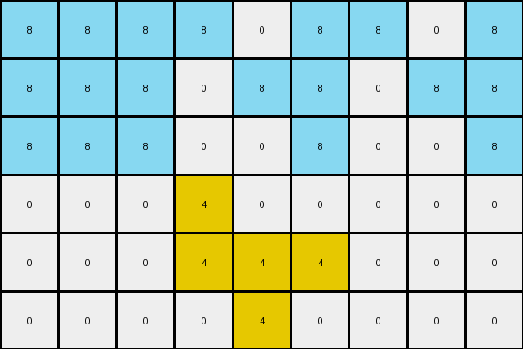
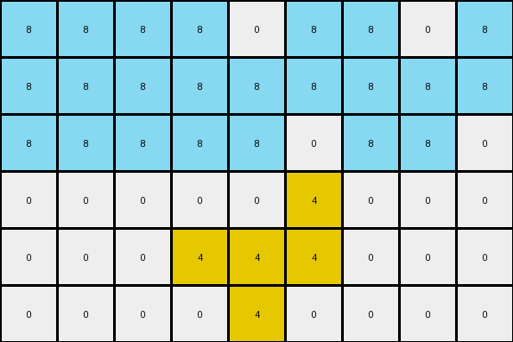
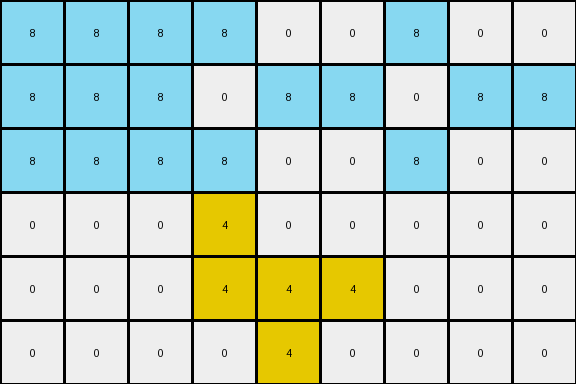

# 760b3cac • 017 • refine_dreamer

---

Previous Code:
```python
"""
1.  **Identify Objects:** Find all pixels that are azure (8) and group them as a single object. Find all pixels that are yellow (4) and group them as a single object.
2.  **Yellow Object:** The yellow object remains unchanged in its original position and shape.
3.  **Azure Object:**
    *   Find the minimum and maximum row and column of the bounding box around the azure object.
    *   Copy the Azure object.
    *   If the minimum column of the Azure object is > 0, expand the Azure object to fill the area from column 0 to one less than the original minimum column.
    *   If the maximum column of the Azure object is < input_grid.shape[1] - 1, copy and paste each column from the bounding box starting at the first column after the bounding box until it is filled.
"""

import numpy as np

def find_object(grid, color):
    coords = np.argwhere(grid == color)
    if len(coords) == 0:
        return []
    return coords.tolist()

def get_bounding_box(coords):
    if not coords:
        return None
    min_row = min(coords, key=lambda p: p[0])[0]
    max_row = max(coords, key=lambda p: p[0])[0]
    min_col = min(coords, key=lambda p: p[1])[1]
    max_col = max(coords, key=lambda p: p[1])[1]
    return min_row, max_row, min_col, max_col

def transform(input_grid):
    # initialize output_grid
    output_grid = np.copy(input_grid)

    # Identify Objects
    azure_object = find_object(input_grid, 8)
    yellow_object = find_object(input_grid, 4)

    # Yellow Object (remains unchanged)
    #   for pixel in yellow_object:
    #     output_grid[pixel[0], pixel[1]] = 4

    # Azure Object Transformation
    if azure_object:
        min_row, max_row, min_col, max_col = get_bounding_box(azure_object)

        # Expand left
        if min_col > 0:
            for r in range(min_row, max_row + 1):
                for c in range(0, min_col):
                    output_grid[r, c] = 8

        # Expand Right
        if max_col < input_grid.shape[1] - 1:
            width = max_col - min_col + 1
            offset = 0
            for col in range(max_col + 1, input_grid.shape[1]):
              for row in range(min_row, max_row+1):
                original_col = min_col + (offset % width)
                output_grid[row, col] = input_grid[row, original_col]
              offset+=1

    return output_grid
```

Train Set Results:

## Example 1:

Input:
```
0 0 0 8 0 8 0 0 0
0 0 0 0 8 8 0 0 0
0 0 0 0 0 8 0 0 0
0 0 0 4 0 0 0 0 0
0 0 0 4 4 4 0 0 0
0 0 0 0 4 0 0 0 0
```
Expected Output:
```
8 0 8 8 0 8 0 0 0
8 8 0 0 8 8 0 0 0
8 0 0 0 0 8 0 0 0
0 0 0 4 0 0 0 0 0
0 0 0 4 4 4 0 0 0
0 0 0 0 4 0 0 0 0
```
Transformed Output:
```
8 8 8 8 0 8 8 0 8
8 8 8 0 8 8 0 8 8
8 8 8 0 0 8 0 0 8
0 0 0 4 0 0 0 0 0
0 0 0 4 4 4 0 0 0
0 0 0 0 4 0 0 0 0
```

match: False
pixels_off: 9
size_correct: True
color_palette_correct: True
correct_pixel_counts: False

## Example 2:

Input:
```
0 0 0 8 0 8 0 0 0
0 0 0 8 8 8 0 0 0
0 0 0 8 8 0 0 0 0
0 0 0 0 0 4 0 0 0
0 0 0 4 4 4 0 0 0
0 0 0 0 4 0 0 0 0
```
Expected Output:
```
0 0 0 8 0 8 8 0 8
0 0 0 8 8 8 8 8 8
0 0 0 8 8 0 0 8 8
0 0 0 0 0 4 0 0 0
0 0 0 4 4 4 0 0 0
0 0 0 0 4 0 0 0 0
```
Transformed Output:
```
8 8 8 8 0 8 8 0 8
8 8 8 8 8 8 8 8 8
8 8 8 8 8 0 8 8 0
0 0 0 0 0 4 0 0 0
0 0 0 4 4 4 0 0 0
0 0 0 0 4 0 0 0 0
```

match: False
pixels_off: 11
size_correct: True
color_palette_correct: True
correct_pixel_counts: False

## Example 3:

Input:
```
0 0 0 8 0 0 0 0 0
0 0 0 0 8 8 0 0 0
0 0 0 8 0 0 0 0 0
0 0 0 4 0 0 0 0 0
0 0 0 4 4 4 0 0 0
0 0 0 0 4 0 0 0 0
```
Expected Output:
```
0 0 8 8 0 0 0 0 0
8 8 0 0 8 8 0 0 0
0 0 8 8 0 0 0 0 0
0 0 0 4 0 0 0 0 0
0 0 0 4 4 4 0 0 0
0 0 0 0 4 0 0 0 0
```
Transformed Output:
```
8 8 8 8 0 0 8 0 0
8 8 8 0 8 8 0 8 8
8 8 8 8 0 0 8 0 0
0 0 0 4 0 0 0 0 0
0 0 0 4 4 4 0 0 0
0 0 0 0 4 0 0 0 0
```

match: False
pixels_off: 9
size_correct: True
color_palette_correct: True
correct_pixel_counts: False
**INSTRUCTIONS**

The code above was generated based on observations from the first training
example

we have tested the transform function on each of the task example inputs and
compared with the expected output

review each of the examples provided and the results and consider how the
natural language program should be updated to accommodate this new knowledge

respond with the following deliverables:

- general assessment of the information provided and strategy for resolving the
  errors
- gather metrics about each of the examples and results - use code_execution to
  develop accurate reports on your assumptions
- a YAML block documenting facts - Focus on identifying objects, their properties, and the actions performed on them.
- a natural language program - Be as clear and concise as possible, providing a complete description of the transformation rule.


your responses should be considered as information in a report - not a
conversation
