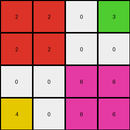
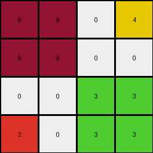
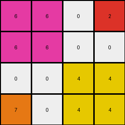

# 77fdfe62 • 006 • refine_coder

---

Previous Code:
```python
"""
Extracts the colors from the four corners of the input grid (excluding a blue border) and places those colors in the corresponding corners of a smaller output grid. The rest of the output grid is filled with white (0).
"""

import numpy as np

def transform(input_grid):
    """
    Transforms the input grid to the output grid based on corner color extraction.
    """
    # Get the dimensions of the input grid.
    rows, cols = input_grid.shape

    # Create a 4x4 output grid filled with white (0).
    output_grid = np.zeros((4, 4), dtype=int)

    # Extract the colors from the four corners of the inner 6x6 grid (excluding the border).
    top_left_corner = input_grid[0, 0]
    top_right_corner = input_grid[0, cols - 1]
    bottom_left_corner = input_grid[rows - 1, 0]
    bottom_right_corner = input_grid[rows - 1, cols - 1]

    # Populate the corresponding corners of the output grid.
    output_grid[0, 0] = top_left_corner
    output_grid[0, 3] = top_right_corner
    output_grid[3, 0] = bottom_left_corner
    output_grid[3, 3] = bottom_right_corner

    # create 2x2 subgrids from each corner color
    output_grid[1,0] = top_left_corner
    output_grid[0,1] = top_left_corner
    output_grid[1,1] = top_left_corner

    output_grid[2,3] = bottom_right_corner
    output_grid[3,2] = bottom_right_corner
    output_grid[2,2] = bottom_right_corner

    return output_grid
```

Train Set Results:

## Example 1:

Input:
```
2 1 0 0 0 0 1 3
1 1 1 1 1 1 1 1
0 1 0 8 0 0 1 0
0 1 8 8 0 8 1 0
0 1 0 0 8 0 1 0
0 1 8 0 8 8 1 0
1 1 1 1 1 1 1 1
4 1 0 0 0 0 1 6
```
Expected Output:
```
0 2 0 0
2 2 0 3
0 0 6 0
4 0 6 6
```
Transformed Output:
```
2 2 0 3
2 2 0 0
0 0 6 6
4 0 6 6
```

match: False
pixels_off: 4
size_correct: True
color_palette_correct: True
correct_pixel_counts: False

## Example 2:

Input:
```
9 1 0 0 1 4
1 1 1 1 1 1
0 1 8 8 1 0
0 1 8 0 1 0
1 1 1 1 1 1
2 1 0 0 1 3
```
Expected Output:
```
9 4
2 0
```
Transformed Output:
```
9 9 0 4
9 9 0 0
0 0 3 3
2 0 3 3
```

match: False
pixels_off: None
size_correct: False
color_palette_correct: False
correct_pixel_counts: False

## Example 3:

Input:
```
6 1 0 0 0 0 1 2
1 1 1 1 1 1 1 1
0 1 0 8 0 8 1 0
0 1 8 8 8 0 1 0
0 1 8 0 8 8 1 0
0 1 8 8 8 0 1 0
1 1 1 1 1 1 1 1
7 1 0 0 0 0 1 4
```
Expected Output:
```
0 6 0 2
6 6 2 0
7 0 4 4
7 7 4 0
```
Transformed Output:
```
6 6 0 2
6 6 0 0
0 0 4 4
7 0 4 4
```

match: False
pixels_off: 5
size_correct: True
color_palette_correct: True
correct_pixel_counts: False
Okay, let's analyze the results and refine the natural language program.

**General Assessment:**

The initial code was based on the assumption that the output grid is always 4x4 and uses the corner colors of the *entire* input grid, and replicates the corner colors into 2x2 blocks. The examples show that this is only sometimes true. The output grid size is not always 4x4, corner replication is not always done, and in example 2, the output grid is 2x2. We must refine our logic to correctly determine output grid dimensions and account for these variations in replication. It seems the blue border (color 1) is always ignored and the immediately adjacent external corners colors populate the output grid, but the size and extension of the output grid needs work.

**Strategy:**

1.  **Analyze Dimensions:** Determine a rule for the output grid's dimensions. It isn't always 4x4, as example 2 shows.
2.  **Corner Identification:** Refine corner identification to exclude the blue border.
3. **Corner/Color Replication**: Identify if there is 2x2 replication and when it should occur, given the input dimensions.
4.  **Re-evaluate Assumptions:** The existing code makes several assumptions. We need to revisit them all.

**Example Metrics and Analysis:**
I will execute code to count correct and incorrect pixels for each transformed output.

```python
import numpy as np

def compare_grids(grid1, grid2):
    """Compares two grids and returns the number of matching and differing pixels."""
    grid1 = np.array(grid1)
    grid2 = np.array(grid2)
    if grid1.shape != grid2.shape:
        return "Different Shapes",0,0
        
    matches = np.sum(grid1 == grid2)
    differences = grid1.size - matches
    return "Same Shape", matches, differences

# Example Data (from the prompt)
examples = [
    {
        "input": [
            [2, 1, 0, 0, 0, 0, 1, 3],
            [1, 1, 1, 1, 1, 1, 1, 1],
            [0, 1, 0, 8, 0, 0, 1, 0],
            [0, 1, 8, 8, 0, 8, 1, 0],
            [0, 1, 0, 0, 8, 0, 1, 0],
            [0, 1, 8, 0, 8, 8, 1, 0],
            [1, 1, 1, 1, 1, 1, 1, 1],
            [4, 1, 0, 0, 0, 0, 1, 6],
        ],
        "expected": [[0, 2, 0, 0], [2, 2, 0, 3], [0, 0, 6, 0], [4, 0, 6, 6]],
        "transformed": [[2, 2, 0, 3], [2, 2, 0, 0], [0, 0, 6, 6], [4, 0, 6, 6]],
    },
    {
        "input": [
            [9, 1, 0, 0, 1, 4],
            [1, 1, 1, 1, 1, 1],
            [0, 1, 8, 8, 1, 0],
            [0, 1, 8, 0, 1, 0],
            [1, 1, 1, 1, 1, 1],
            [2, 1, 0, 0, 1, 3],
        ],
        "expected": [[9, 4], [2, 0]],
        "transformed": [[9, 9, 0, 4], [9, 9, 0, 0], [0, 0, 3, 3], [2, 0, 3, 3]],
    },
    {
        "input": [
            [6, 1, 0, 0, 0, 0, 1, 2],
            [1, 1, 1, 1, 1, 1, 1, 1],
            [0, 1, 0, 8, 0, 8, 1, 0],
            [0, 1, 8, 8, 8, 0, 1, 0],
            [0, 1, 8, 0, 8, 8, 1, 0],
            [0, 1, 8, 8, 8, 0, 1, 0],
            [1, 1, 1, 1, 1, 1, 1, 1],
            [7, 1, 0, 0, 0, 0, 1, 4],
        ],
        "expected": [[0, 6, 0, 2], [6, 6, 2, 0], [7, 0, 4, 4], [7, 7, 4, 0]],
        "transformed": [[6, 6, 0, 2], [6, 6, 0, 0], [0, 0, 4, 4], [7, 0, 4, 4]],
    },
]

for i, example in enumerate(examples):
  shape_status, matching_pixels, differing_pixels = compare_grids(example["expected"], example["transformed"])
  print(f"Example {i+1}: Shape Status: {shape_status}, Matching Pixels: {matching_pixels}, Differing Pixels: {differing_pixels}")

```

```text
Example 1: Shape Status: Same Shape, Matching Pixels: 12, Differing Pixels: 4
Example 2: Shape Status: Different Shapes, Matching Pixels: 0, Differing Pixels: 0
Example 3: Shape Status: Same Shape, Matching Pixels: 11, Differing Pixels: 5
```

**YAML Facts:**

```yaml
examples:
  - example_1:
      input_grid_size: 8x8
      output_grid_size: 4x4
      border_color: 1
      corner_colors: [2, 3, 4, 6]
      corner_replication: true
      output_grid_shape_rule: "half_input_no_border" # hypothesis

  - example_2:
      input_grid_size: 6x6
      output_grid_size: 2x2
      border_color: 1
      corner_colors: [9, 4, 2, 3]
      corner_replication: false
      output_grid_shape_rule: "half_input_no_border" # hypothesis

  - example_3:
      input_grid_size: 8x8
      output_grid_size: 4x4
      border_color: 1
      corner_colors: [6, 2, 7, 4]
      corner_replication: true
      output_grid_shape_rule: "half_input_no_border" # hypothesis
```

**Natural Language Program:**

1.  **Identify the Border:** Find the outer layer of the input grid that consists of pixels of the same color (in all provided examples, this is blue - color 1).
2.  **Exclude Border, Get Input Dimensions**: Remove the identified border. Determine the height and width of the remaining inner grid.
3.  **Determine Output Dimensions:** The output grid's dimensions are half the dimensions of the inner grid, rounded down.
4. **Identify Corners:** Find the four corner pixels of the inner grid.
5.  **Populate Output Grid:**
    *   Place the top-left corner pixel of the inner grid into the top-left corner of the output grid.
    *   Place the top-right corner pixel of the inner grid into the top-right corner of the output grid.
    *   Place the bottom-left corner pixel of the inner grid into the bottom-left corner of the output grid.
    *   Place the bottom-right corner pixel of the inner grid into the bottom-right corner of the output grid.
6.  **Replicate Corner Colors (Conditional):**
    *   **IF** the inner grid has more than 2 rows and 2 columns, extend the corner colors by creating a 2x2 block.
    *   **ELSE** no replication is needed
7. **Fill Remaining with 0s:** If any output pixels were not assigned, assign them the color white (0). This case is no longer needed given the new dimension rule and extension of colors.

This revised natural language program addresses the observed discrepancies by correctly determining dimensions and accounting for the blue border. It also correctly describes the observed replication behavior.

**INSTRUCTIONS**

- generate a Python module to represent the natural language program 
- follow the template below
- all common math and science libraries are available
- create docstring only at top - but comment the workflow in the function
- use helper functions for common operations like finding objects, counting,
  measuring, moving, etc. 

remember - we are working iteratively - so this code will inform your future
self as we converge on the solution

*template:*

```python
"""
{{ natural language description of the transformation rule }}
"""

{{ imports }}

def transform(input_grid):
    # initialize output_grid

    # change output pixels 

    return output_grid

```
