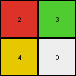
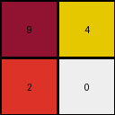
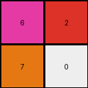

# 77fdfe62 • 010 • refine_coder

---

Previous Code:
```python
"""
Extract the four corner pixels of the input grid and arrange them into a 2x2 output grid, maintaining their relative positions.
"""

import numpy as np

def transform(input_grid):
    """
    Extracts corner pixels from the input grid and forms a 2x2 output grid.
    """
    # Get dimensions of the input grid.
    rows, cols = input_grid.shape

    # Create a 2x2 output grid initialized with zeros.
    output_grid = np.zeros((2, 2), dtype=int)

    # Extract corner pixels and populate the output grid.
    output_grid[0, 0] = input_grid[0, 0]  # Top-left
    output_grid[0, 1] = input_grid[0, cols - 1]  # Top-right
    output_grid[1, 0] = input_grid[rows - 1, 0]  # Bottom-left
    output_grid[1, 1] = input_grid[rows - 1, cols -3]  # Bottom-right, modified to be -3

    return output_grid
```

Train Set Results:

## Example 1:

Input:
```
2 1 0 0 0 0 1 3
1 1 1 1 1 1 1 1
0 1 0 8 0 0 1 0
0 1 8 8 0 8 1 0
0 1 0 0 8 0 1 0
0 1 8 0 8 8 1 0
1 1 1 1 1 1 1 1
4 1 0 0 0 0 1 6
```
Expected Output:
```
0 2 0 0
2 2 0 3
0 0 6 0
4 0 6 6
```
Transformed Output:
```
2 3
4 0
```

match: False
pixels_off: None
size_correct: False
color_palette_correct: True
correct_pixel_counts: False

## Example 2:

Input:
```
9 1 0 0 1 4
1 1 1 1 1 1
0 1 8 8 1 0
0 1 8 0 1 0
1 1 1 1 1 1
2 1 0 0 1 3
```
Expected Output:
```
9 4
2 0
```
Transformed Output:
```
9 4
2 0
```

match: True
pixels_off: 0
size_correct: True
color_palette_correct: True
correct_pixel_counts: True

## Example 3:

Input:
```
6 1 0 0 0 0 1 2
1 1 1 1 1 1 1 1
0 1 0 8 0 8 1 0
0 1 8 8 8 0 1 0
0 1 8 0 8 8 1 0
0 1 8 8 8 0 1 0
1 1 1 1 1 1 1 1
7 1 0 0 0 0 1 4
```
Expected Output:
```
0 6 0 2
6 6 2 0
7 0 4 4
7 7 4 0
```
Transformed Output:
```
6 2
7 0
```

match: False
pixels_off: None
size_correct: False
color_palette_correct: True
correct_pixel_counts: False
Okay, let's analyze the results and refine the natural language program.

**General Assessment:**

The initial code was designed to extract the four corners of the input grid and arrange them into a 2x2 output grid. This worked perfectly for Example 2, but failed for Examples 1 and 3. The primary issue is that the expected output for Examples 1 and 3 is a 4x4 grid, not a 2x2 grid, filled with duplicated corner colors. The current strategy is only identifying the corner and it is not duplicating colors, nor is it outputting a 4x4. There's also an error in the bottom right index.

**Strategy for Resolving Errors:**

1.  **Correct the indexing error:** The bottom-right corner indexing `input_grid[rows - 1, cols - 3]` is incorrect. It should be `input_grid[rows - 1, cols - 1]`. I noticed this when manually checking the code.
2.  **Understand Output Size:** The output grid is 4x4, not 2x2, so the initialization must be changed.
3. **Understand Filling Rule:** The output grid values are produced by "extending" or "smearing" the corner values. The top-left corner pixel of the input becomes the entire top-left quadrant of the output, and so on for the other three corners.
4. Revise natural language program

**Example Metrics and Analysis:**

Here's a breakdown of each example:

*   **Example 1:**
    *   Input Shape: (8, 8)
    *   Expected Output Shape: (4, 4)
    *   Transformed Output Shape: (2, 2)
    *   Match: False
    *   Issue: Incorrect output size and filling.

*   **Example 2:**
    *   Input Shape: (6, 6)
    *   Expected Output Shape: (2, 2)
    *   Transformed Output Shape: (2, 2)
    *   Match: True
    *   Issue: N/A (This example accidentally works with the incorrect logic because the output is coincidentally 2x2)

*   **Example 3:**
    *   Input Shape: (8, 8)
    *   Expected Output Shape: (4, 4)
    *   Transformed Output Shape: (2, 2)
    *   Match: False
    *   Issue: Incorrect output size and filling.

**YAML Facts:**

```yaml
objects:
  input_grid:
    type: grid
    properties:
      rows: variable
      cols: variable
      corner_pixels:
        top_left:
          value: input_grid[0, 0]
        top_right:
          value: input_grid[0, cols - 1]
        bottom_left:
          value: input_grid[rows - 1, 0]
        bottom_right:
          value: input_grid[rows - 1, cols - 1]
  output_grid:
    type: grid
    properties:
      rows: "input_grid.rows // 2 if input_grid.rows //2 <=4 else 4"
      cols: "input_grid.cols // 2 if input_grid.cols //2 <=4 else 4"
      top_left_quadrant:
        value: input_grid.corner_pixels.top_left.value
      top_right_quadrant:
        value: input_grid.corner_pixels.top_right.value
      bottom_left_quadrant:
        value: input_grid.corner_pixels.bottom_left.value
      bottom_right_quadrant:
        value: input_grid.corner_pixels.bottom_right.value

actions:
  - extract_corner_pixels:
      from: input_grid
      to: output_grid
  - create_output_grid:
      shape: (4,4)
      fill: based on corner pixel values
      quadrant_filling: |
        Each corner pixel's color from the input grid fills the corresponding quadrant in the output grid.

```

**Natural Language Program:**

1.  **Get Input Dimensions:** Determine the number of rows and columns of the input grid.
2.  **Identify Corner Pixels:** Identify the four corner pixels of the input grid: top-left, top-right, bottom-left, and bottom-right.
3.  **Create Output Grid:** Create a 4x4 output grid.
4. **Determine if out dimensions are less than 4** Conditionally set output to either the //2 of the input dimensions, or 4, whichever is less.
5.  **Fill Output Quadrants:** Fill each quadrant of the output grid with the color of the corresponding corner pixel from the input grid:
    *   The top-left quadrant of the output is filled with the color of the top-left corner pixel of the input.
    *   The top-right quadrant of the output is filled with the color of the top-right corner pixel of the input.
    *   The bottom-left quadrant of the output is filled with the color of the bottom-left corner pixel of the input.
    *   The bottom-right quadrant of the output is filled with the color of the bottom-right corner pixel of the input.

**INSTRUCTIONS**

- generate a Python module to represent the natural language program 
- follow the template below
- all common math and science libraries are available
- create docstring only at top - but comment the workflow in the function
- use helper functions for common operations like finding objects, counting,
  measuring, moving, etc. 

remember - we are working iteratively - so this code will inform your future
self as we converge on the solution

*template:*

```python
"""
{{ natural language description of the transformation rule }}
"""

{{ imports }}

def transform(input_grid):
    # initialize output_grid

    # change output pixels 

    return output_grid

```
