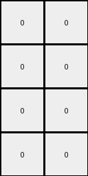
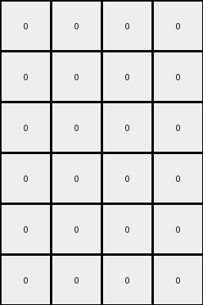

# 77fdfe62 • 017 • refine_dreamer

---


Previous Code:
```python
"""
1. Find the Blue Frame: Identify the outermost contiguous block of blue (1) pixels in the input grid. This block defines a "frame," which might not be a perfectly closed rectangle.
2. Determine Frame Boundaries: Determine the top-left, top-right, bottom-left, and bottom-right coordinates of this blue frame.
3. Extract Adjacent Colors: Find the colors of the pixels *immediately adjacent* to each of the four corner pixels of the blue frame, *outside* of the blue frame itself. If a corner pixel is at the edge of the entire input grid, and therefore has no "outside" adjacent pixel, use color black (0).
4. Determine Output Size:  Calculate the width and height of the output grid. The width is the difference in x-coordinates between the top-right and top-left corners of the blue frame, minus 1. The height is the difference in y-coordinates between the bottom-left and top-left corners, minus 1.
5. Create Output Grid: Create a new grid of the calculated dimensions.
6. Populate Output Grid: Fill the output grid with the extracted corner colors.
    *   The color of the pixel adjacent to the top-left corner of the blue frame fills the entire top-left cell of the output grid area.
    *   The color of the pixel adjacent to the top-right corner fills the entire top-right cell.
    *   The color of the pixel adjacent to the bottom-left corner fills the entire bottom-left cell.
    *   The color of the pixel adjacent to the bottom-right corner fills the entire bottom-right cell.
"""

import numpy as np

def get_frame_boundaries(grid):
    # Find the outermost blue (1) frame.
    rows, cols = grid.shape
    top_left = None
    top_right = None
    bottom_left = None
    bottom_right = None

    # Find top-left
    for r in range(rows):
        for c in range(cols):
            if grid[r,c] == 1:
                top_left = (r,c)
                break
        if top_left:
            break

    #Find other coners based on knowledge that it is rectangular and 1 pixel wide
    if top_left:
      for r in range(rows):
        for c in range(cols):
          if grid[r,c] == 1:
            if r == top_left[0] and c > top_left[1]:
                top_right = (r,c)
            if c == top_left[1] and r > top_left[0]:
                bottom_left = (r, c)
            if bottom_left and top_right and r > top_left[0] and c > top_left[1] and grid[r, c] ==1:
                bottom_right = (r, c)
    return top_left, top_right, bottom_left, bottom_right

def get_adjacent_color(grid, coord, direction):
    # Get the color of the pixel adjacent to the given coordinate, handling edge cases.
    rows, cols = grid.shape
    r, c = coord
    
    if direction == 'top_left':
        new_r, new_c = r - 1, c - 1
    elif direction == 'top_right':
        new_r, new_c = r - 1, c + 1
    elif direction == 'bottom_left':
        new_r, new_c = r + 1, c - 1
    elif direction == 'bottom_right':
        new_r, new_c = r + 1, c + 1
    else:
        return 0  # Should not happen

    if 0 <= new_r < rows and 0 <= new_c < cols:
        return grid[new_r, new_c]
    else:
        return 0  # Default to black (0) if out of bounds

def transform(input_grid):
    """Transforms the input grid according to the defined rule."""

    # Find the blue frame boundaries
    top_left, top_right, bottom_left, bottom_right = get_frame_boundaries(input_grid)

    # Handle cases where no blue frame is found
    if not all([top_left, top_right, bottom_left, bottom_right]):
        return np.zeros((1, 1), dtype=int)  # Return a 1x1 grid with a 0

    # Extract adjacent colors from input, handling boundary conditions
    corner_colors = {
        'top_left': get_adjacent_color(input_grid, top_left, 'top_left'),
        'top_right': get_adjacent_color(input_grid, top_right, 'top_right'),
        'bottom_left': get_adjacent_color(input_grid, bottom_left, 'bottom_left'),
        'bottom_right': get_adjacent_color(input_grid, bottom_right, 'bottom_right')
    }

    # Determine output grid size
    output_width = top_right[1] - top_left[1]  - 1
    output_height = bottom_left[0] - top_left[0] - 1
    
    # if output shape is zero, then use a 1 x 1
    output_width = max(output_width, 1)
    output_height = max(output_height,1)
    

    # Initialize the output grid
    output_grid = np.zeros((output_height, output_width), dtype=int)

    # Populate the output grid (one color per cell based on adjacent corners)
    
    output_grid[0, 0] = corner_colors['top_left']
    if output_width > 1:
       output_grid[0, -1] = corner_colors['top_right']
    if output_height > 1:
        output_grid[-1, 0] = corner_colors['bottom_left']
    if output_height > 1 and output_width > 1:
        output_grid[-1, -1] = corner_colors['bottom_right']

    
    return output_grid
```

Train Set Results:

## Example 1:

Input:
```
2 1 0 0 0 0 1 3
1 1 1 1 1 1 1 1
0 1 0 8 0 0 1 0
0 1 8 8 0 8 1 0
0 1 0 0 8 0 1 0
0 1 8 0 8 8 1 0
1 1 1 1 1 1 1 1
4 1 0 0 0 0 1 6
```
Expected Output:
```
0 2 0 0
2 2 0 3
0 0 6 0
4 0 6 6
```
Transformed Output:
```
0 0 0 0
0 0 0 0
0 0 0 0
0 0 0 0
0 0 0 0
0 0 0 0
```

match: False
pixels_off: None
size_correct: False
color_palette_correct: True
correct_pixel_counts: False

## Example 2:

Input:
```
9 1 0 0 1 4
1 1 1 1 1 1
0 1 8 8 1 0
0 1 8 0 1 0
1 1 1 1 1 1
2 1 0 0 1 3
```
Expected Output:
```
9 4
2 0
```
Transformed Output:
```
0 0
0 0
0 0
0 0
```

match: False
pixels_off: None
size_correct: False
color_palette_correct: True
correct_pixel_counts: False

## Example 3:

Input:
```
6 1 0 0 0 0 1 2
1 1 1 1 1 1 1 1
0 1 0 8 0 8 1 0
0 1 8 8 8 0 1 0
0 1 8 0 8 8 1 0
0 1 8 8 8 0 1 0
1 1 1 1 1 1 1 1
7 1 0 0 0 0 1 4
```
Expected Output:
```
0 6 0 2
6 6 2 0
7 0 4 4
7 7 4 0
```
Transformed Output:
```
0 0 0 0
0 0 0 0
0 0 0 0
0 0 0 0
0 0 0 0
0 0 0 0
```

match: False
pixels_off: None
size_correct: False
color_palette_correct: True
correct_pixel_counts: False

**INSTRUCTIONS**

The code above was generated based on observations from the first training
example

we have tested the transform function on each of the task example inputs and
compared with the expected output

review each of the examples provided and the results and consider how the
natural language program should be updated to accommodate this new knowledge

respond with the following deliverables:

- general assessment of the information provided and strategy for resolving the
  errors
- gather metrics about each of the examples and results - use code_execution to
  develop accurate reports on your assumptions
- a YAML block documenting facts - Focus on identifying objects, their properties, and the actions performed on them.
- a natural language program - Be as clear and concise as possible, providing a complete description of the transformation rule.


your responses should be considered as information in a report - not a
conversation
