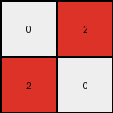
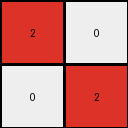
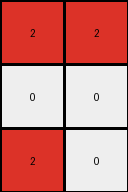
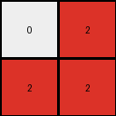
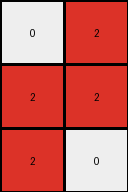

# 794b24be • 005 • refine_dreamer

---

Previous Code:
```python
"""
1. Identify all blue pixels: Find all pixels in the input grid that have a value of 1 (blue).
2. Bounding Box: Determine the smallest rectangle that contains all the blue pixels. This can be defined by the minimum and maximum row and column indices of the blue pixels.
3. Construct the output grid: change the color of the blue pixels from blue to red and move the rectangle formed to the top-left corner of the output grid. The rest of the pixels in output grid are 0.
"""

import numpy as np

def find_blue_pixels(grid):
    # Find the indices of all blue (1) pixels
    return np.where(grid == 1)

def bounding_box(coords):
    # Calculate the bounding box
    min_row, min_col = np.min(coords[0]), np.min(coords[1])
    max_row, max_col = np.max(coords[0]), np.max(coords[1])
    return (min_row, min_col), (max_row, max_col)

def transform(input_grid):
    # Find all blue pixels
    blue_pixels = find_blue_pixels(input_grid)

    # if no blue pixels return all 0 grid.
    if len(blue_pixels[0]) == 0:
      return np.zeros_like(input_grid)

    # Determine the bounding box
    (min_row, min_col), (max_row, max_col) = bounding_box(blue_pixels)

    # Calculate output grid size
    output_height = max_row - min_row + 1
    output_width = max_col - min_col + 1

    # Initialize the output grid
    output_grid = np.zeros((output_height, output_width), dtype=int)
    
    # change to red and move to top-left of the output grid
    for i in range(len(blue_pixels[0])):
        row = blue_pixels[0][i]
        col = blue_pixels[1][i]
        output_grid[row - min_row, col - min_col] = 2


    return output_grid
```

Train Set Results:

## Example 1:

Input:
```
0 0 0
1 0 0
0 0 0
```
Expected Output:
```
2 0 0
0 0 0
0 0 0
```
Transformed Output:
```
2
```

match: False
pixels_off: None
size_correct: False
color_palette_correct: True
correct_pixel_counts: False

## Example 2:

Input:
```
0 1 0
1 0 0
0 0 0
```
Expected Output:
```
2 2 0
0 0 0
0 0 0
```
Transformed Output:
```
0 2
2 0
```

match: False
pixels_off: None
size_correct: False
color_palette_correct: True
correct_pixel_counts: False

## Example 3:

Input:
```
0 0 1
0 0 0
1 0 0
```
Expected Output:
```
2 2 0
0 0 0
0 0 0
```
Transformed Output:
```
0 0 2
0 0 0
2 0 0
```

match: False
pixels_off: 4
size_correct: True
color_palette_correct: True
correct_pixel_counts: True

## Example 4:

Input:
```
0 1 0
0 0 1
0 0 0
```
Expected Output:
```
2 2 0
0 0 0
0 0 0
```
Transformed Output:
```
2 0
0 2
```

match: False
pixels_off: None
size_correct: False
color_palette_correct: True
correct_pixel_counts: False

## Example 5:

Input:
```
0 0 1
0 0 0
0 0 0
```
Expected Output:
```
2 0 0
0 0 0
0 0 0
```
Transformed Output:
```
2
```

match: False
pixels_off: None
size_correct: False
color_palette_correct: True
correct_pixel_counts: False

## Example 6:

Input:
```
1 1 0
0 0 0
1 0 0
```
Expected Output:
```
2 2 2
0 0 0
0 0 0
```
Transformed Output:
```
2 2
0 0
2 0
```

match: False
pixels_off: None
size_correct: False
color_palette_correct: True
correct_pixel_counts: False

## Example 7:

Input:
```
0 1 0
1 1 0
0 0 0
```
Expected Output:
```
2 2 2
0 0 0
0 0 0
```
Transformed Output:
```
0 2
2 2
```

match: False
pixels_off: None
size_correct: False
color_palette_correct: True
correct_pixel_counts: False

## Example 8:

Input:
```
1 1 0
0 0 0
1 0 1
```
Expected Output:
```
2 2 2
0 2 0
0 0 0
```
Transformed Output:
```
2 2 0
0 0 0
2 0 2
```

match: False
pixels_off: 4
size_correct: True
color_palette_correct: True
correct_pixel_counts: True

## Example 9:

Input:
```
0 1 0
1 1 0
1 0 0
```
Expected Output:
```
2 2 2
0 2 0
0 0 0
```
Transformed Output:
```
0 2
2 2
2 0
```

match: False
pixels_off: None
size_correct: False
color_palette_correct: True
correct_pixel_counts: False

## Example 10:

Input:
```
1 0 0
0 0 1
0 1 1
```
Expected Output:
```
2 2 2
0 2 0
0 0 0
```
Transformed Output:
```
2 0 0
0 0 2
0 2 2
```

match: False
pixels_off: 6
size_correct: True
color_palette_correct: True
correct_pixel_counts: True
**INSTRUCTIONS**

The code above was generated based on observations from the first training
example

we have tested the transform function on each of the task example inputs and
compared with the expected output

review each of the examples provided and the results and consider how the
natural language program should be updated to accommodate this new knowledge

respond with the following deliverables:

- general assessment of the information provided and strategy for resolving the
  errors
- gather metrics about each of the examples and results - use code_execution to
  develop accurate reports on your assumptions
- a YAML block documenting facts - Focus on identifying objects, their properties, and the actions performed on them.
- a natural language program - Be as clear and concise as possible, providing a complete description of the transformation rule.


your responses should be considered as information in a report - not a
conversation
