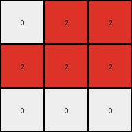

# 794b24be • 017 • refine_dreamer

---


Previous Code:
```python
"""
Iterate through each row of the input grid. Within each row, iterate through the pixels from left to right. If a pixel is blue, change it to red in the output grid. If a pixel is white, check if there is a blue or red pixel to its left in the same row, and that pixel occurs before any other non-white colors. If so, change the white pixel to red in the output grid. All other pixels remain unchanged.
"""

import numpy as np

def transform(input_grid):
    # Initialize output_grid as a copy of the input grid
    output_grid = np.copy(input_grid)
    
    # Get the dimensions of the grid
    rows, cols = output_grid.shape

    # Iterate through each row
    for i in range(rows):
        blue_or_red_found = False  # Flag to track if a blue or red pixel has been found in the current row
        # Iterate through each pixel in the row from left to right
        for j in range(cols):
            if input_grid[i, j] == 1:  # If blue
                output_grid[i, j] = 2  # Change to red
                blue_or_red_found = True
            elif input_grid[i, j] == 0 and blue_or_red_found:  # If white and a blue/red pixel has been found
                output_grid[i, j] = 2  # Change to red
            elif input_grid[i,j] != 0 and input_grid[i,j] != 1:
                blue_or_red_found = False

    return output_grid
```

Train Set Results:

## Example 1:

Input:
```
0 0 0
1 0 0
0 0 0
```
Expected Output:
```
2 0 0
0 0 0
0 0 0
```
Transformed Output:
```
0 0 0
2 2 2
0 0 0
```

match: False
pixels_off: 4
size_correct: True
color_palette_correct: True
correct_pixel_counts: False

## Example 2:

Input:
```
0 1 0
1 0 0
0 0 0
```
Expected Output:
```
2 2 0
0 0 0
0 0 0
```
Transformed Output:
```
0 2 2
2 2 2
0 0 0
```

match: False
pixels_off: 5
size_correct: True
color_palette_correct: True
correct_pixel_counts: False

## Example 3:

Input:
```
0 0 1
0 0 0
1 0 0
```
Expected Output:
```
2 2 0
0 0 0
0 0 0
```
Transformed Output:
```
0 0 2
0 0 0
2 2 2
```

match: False
pixels_off: 6
size_correct: True
color_palette_correct: True
correct_pixel_counts: False

## Example 4:

Input:
```
0 1 0
0 0 1
0 0 0
```
Expected Output:
```
2 2 0
0 0 0
0 0 0
```
Transformed Output:
```
0 2 2
0 0 2
0 0 0
```

match: False
pixels_off: 3
size_correct: True
color_palette_correct: True
correct_pixel_counts: False

## Example 5:

Input:
```
0 0 1
0 0 0
0 0 0
```
Expected Output:
```
2 0 0
0 0 0
0 0 0
```
Transformed Output:
```
0 0 2
0 0 0
0 0 0
```

match: False
pixels_off: 2
size_correct: True
color_palette_correct: True
correct_pixel_counts: True

## Example 6:

Input:
```
1 1 0
0 0 0
1 0 0
```
Expected Output:
```
2 2 2
0 0 0
0 0 0
```
Transformed Output:
```
2 2 2
0 0 0
2 2 2
```

match: False
pixels_off: 3
size_correct: True
color_palette_correct: True
correct_pixel_counts: False

## Example 7:

Input:
```
0 1 0
1 1 0
0 0 0
```
Expected Output:
```
2 2 2
0 0 0
0 0 0
```
Transformed Output:
```
0 2 2
2 2 2
0 0 0
```

match: False
pixels_off: 4
size_correct: True
color_palette_correct: True
correct_pixel_counts: False

## Example 8:

Input:
```
1 1 0
0 0 0
1 0 1
```
Expected Output:
```
2 2 2
0 2 0
0 0 0
```
Transformed Output:
```
2 2 2
0 0 0
2 2 2
```

match: False
pixels_off: 4
size_correct: True
color_palette_correct: True
correct_pixel_counts: False

## Example 9:

Input:
```
0 1 0
1 1 0
1 0 0
```
Expected Output:
```
2 2 2
0 2 0
0 0 0
```
Transformed Output:
```
0 2 2
2 2 2
2 2 2
```

match: False
pixels_off: 6
size_correct: True
color_palette_correct: True
correct_pixel_counts: False

## Example 10:

Input:
```
1 0 0
0 0 1
0 1 1
```
Expected Output:
```
2 2 2
0 2 0
0 0 0
```
Transformed Output:
```
2 2 2
0 0 2
0 2 2
```

match: False
pixels_off: 4
size_correct: True
color_palette_correct: True
correct_pixel_counts: False

**INSTRUCTIONS**

The code above was generated based on observations from the first training
example

we have tested the transform function on each of the task example inputs and
compared with the expected output

review each of the examples provided and the results and consider how the
natural language program should be updated to accommodate this new knowledge

respond with the following deliverables:

- general assessment of the information provided and strategy for resolving the
  errors
- gather metrics about each of the examples and results - use code_execution to
  develop accurate reports on your assumptions
- a YAML block documenting facts - Focus on identifying objects, their properties, and the actions performed on them.
- a natural language program - Be as clear and concise as possible, providing a complete description of the transformation rule.


your responses should be considered as information in a report - not a
conversation
