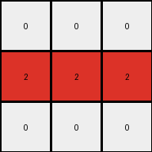
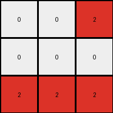
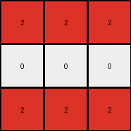
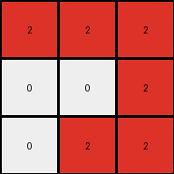

# 794b24be • 018 • refine_coder

---

Previous Code:
```python
"""
Iterate through each row of the input grid. Within each row, iterate through the pixels from left to right. If a pixel is blue, change it to red in the output grid. If a pixel is white, check if there is a blue or red pixel to its left in the same row, and that pixel occurs before any other non-white colors. If so, change the white pixel to red in the output grid. All other pixels remain unchanged.
"""

import numpy as np

def transform(input_grid):
    # Initialize output_grid as a copy of the input grid
    output_grid = np.copy(input_grid)
    
    # Get the dimensions of the grid
    rows, cols = output_grid.shape

    # Iterate through each row
    for i in range(rows):
        blue_or_red_found = False  # Flag to track if a blue or red pixel has been found in the current row
        # Iterate through each pixel in the row from left to right
        for j in range(cols):
            if input_grid[i, j] == 1:  # If blue
                output_grid[i, j] = 2  # Change to red
                blue_or_red_found = True
            elif input_grid[i, j] == 0 and blue_or_red_found:  # If white and a blue/red pixel has been found
                output_grid[i, j] = 2  # Change to red
            elif input_grid[i,j] != 0 and input_grid[i,j] != 1:
                blue_or_red_found = False

    return output_grid
```

Train Set Results:

## Example 1:

Input:
```
0 0 0
1 0 0
0 0 0
```
Expected Output:
```
2 0 0
0 0 0
0 0 0
```
Transformed Output:
```
0 0 0
2 2 2
0 0 0
```

match: False
pixels_off: 4
size_correct: True
color_palette_correct: True
correct_pixel_counts: False

## Example 2:

Input:
```
0 1 0
1 0 0
0 0 0
```
Expected Output:
```
2 2 0
0 0 0
0 0 0
```
Transformed Output:
```
0 2 2
2 2 2
0 0 0
```

match: False
pixels_off: 5
size_correct: True
color_palette_correct: True
correct_pixel_counts: False

## Example 3:

Input:
```
0 0 1
0 0 0
1 0 0
```
Expected Output:
```
2 2 0
0 0 0
0 0 0
```
Transformed Output:
```
0 0 2
0 0 0
2 2 2
```

match: False
pixels_off: 6
size_correct: True
color_palette_correct: True
correct_pixel_counts: False

## Example 4:

Input:
```
0 1 0
0 0 1
0 0 0
```
Expected Output:
```
2 2 0
0 0 0
0 0 0
```
Transformed Output:
```
0 2 2
0 0 2
0 0 0
```

match: False
pixels_off: 3
size_correct: True
color_palette_correct: True
correct_pixel_counts: False

## Example 5:

Input:
```
0 0 1
0 0 0
0 0 0
```
Expected Output:
```
2 0 0
0 0 0
0 0 0
```
Transformed Output:
```
0 0 2
0 0 0
0 0 0
```

match: False
pixels_off: 2
size_correct: True
color_palette_correct: True
correct_pixel_counts: True

## Example 6:

Input:
```
1 1 0
0 0 0
1 0 0
```
Expected Output:
```
2 2 2
0 0 0
0 0 0
```
Transformed Output:
```
2 2 2
0 0 0
2 2 2
```

match: False
pixels_off: 3
size_correct: True
color_palette_correct: True
correct_pixel_counts: False

## Example 7:

Input:
```
0 1 0
1 1 0
0 0 0
```
Expected Output:
```
2 2 2
0 0 0
0 0 0
```
Transformed Output:
```
0 2 2
2 2 2
0 0 0
```

match: False
pixels_off: 4
size_correct: True
color_palette_correct: True
correct_pixel_counts: False

## Example 8:

Input:
```
1 1 0
0 0 0
1 0 1
```
Expected Output:
```
2 2 2
0 2 0
0 0 0
```
Transformed Output:
```
2 2 2
0 0 0
2 2 2
```

match: False
pixels_off: 4
size_correct: True
color_palette_correct: True
correct_pixel_counts: False

## Example 9:

Input:
```
0 1 0
1 1 0
1 0 0
```
Expected Output:
```
2 2 2
0 2 0
0 0 0
```
Transformed Output:
```
0 2 2
2 2 2
2 2 2
```

match: False
pixels_off: 6
size_correct: True
color_palette_correct: True
correct_pixel_counts: False

## Example 10:

Input:
```
1 0 0
0 0 1
0 1 1
```
Expected Output:
```
2 2 2
0 2 0
0 0 0
```
Transformed Output:
```
2 2 2
0 0 2
0 2 2
```

match: False
pixels_off: 4
size_correct: True
color_palette_correct: True
correct_pixel_counts: False
Okay, here's a breakdown of the situation, the results, and a plan to move forward:

**General Assessment:**

The initial natural language program and the resulting Python code are not accurately capturing the transformation rule. The core issue is how the code handles the propagation of the red color. It seems to be incorrectly applying a "fill-to-the-right" logic whenever a blue pixel is encountered, and also incorrectly applies this to the entire grid. It is not restricting the filling effect correctly, based on the provided outputs. We will need to rethink the approach and possibly use recursion.

**Strategy:**

1.  **Re-examine the Examples:** Carefully analyze *all* provided input/output pairs, paying close attention to *where* the red color appears and, crucially, *where it does not*. We're looking for the *limiting factors* of the transformation.
2.  **Focus on a row-wise transformation:** Consider the position of the blue and white colors and the terminating condition.
3.  **Refine the Natural Language Program:** Based on the re-examination, develop a more precise and restrictive natural language program.
4. **YAML facts** Focus on the properties and actions on objects

**Metrics and Observations:**

Here's a summary of observations from the provided examples:

*   **Consistent Size:** All input and output grids have the same dimensions.
*   **Limited Colors:** Only colors 0 (white) and 1 (blue) appear in the input. Only colors 0 (white) and 2 (red) appear in the output.
*   **Blue to Red:** Any blue pixel in the input always becomes a red pixel in the output.
*    **Row-wise transformation** The transformations are localized to each row.
*   **Termination**: a non-white or non-blue character terminates the transformation.

**YAML Facts:**

```yaml
facts:
  - observation: "All input and output grids have the same dimensions."
    type: constraint
    property: dimensions
    values: identical

  - observation: "Input grids contain only white (0) and blue (1) pixels."
    type: constraint
    property: input_colors
    values: [0, 1]

  - observation: "Output grids contain only white (0) and red (2) pixels."
    type: constraint
    property: output_colors
    values: [0, 2]

  - observation: "Blue (1) pixels in the input always become red (2) pixels in the output."
    type: transformation
    input_color: 1
    output_color: 2
    scope: "all pixels where input_color = 1"

  - observation: "White (0) pixels become red (2) in the output *if* they are to the right of a blue (1) pixel within the same row, and there are only white pixels between them"
    type: conditional_transformation
    input_color: 0
    output_color: 2
    condition: "exists blue pixel to the left in the same row, and no non-white pixels are in between."
    scope: row
    
  - observation: "Non-white or Non-blue colors terminate the transformation"
    type: termination_rule
    value: "any color other than white or blue"

  - observation: "Transformation occurs within each row independently."
    type: constraint
    scope: row

```

**Natural Language Program:**

1.  **Initialization:** Create an output grid identical in size to the input grid.
2.  **Row Iteration:** Process each row of the input grid independently.
3.  **Pixel Examination:** Within each row, iterate through the pixels from left to right.
4.  **Blue Pixel Rule:** If a pixel is blue (1), change the corresponding pixel in the output grid to red (2).
5. **White Pixel Rule Check** If a pixel is white, look to see if this a blue pixel that has occurred previously in the same row, and if a non-white/non-blue color has not occurred
6. **White Pixel Change**: If the conditions are met, change to red (2)
7.  **Other Pixels:** All other pixels remain unchanged in the output grid.


**INSTRUCTIONS**

- generate a Python module to represent the natural language program 
- follow the template below
- all common math and science libraries are available
- create docstring only at top - but comment the workflow in the function
- use helper functions for common operations like finding objects, counting,
  measuring, moving, etc. 

remember - we are working iteratively - so this code will inform your future
self as we converge on the solution

*template:*

```python
"""
{{ natural language description of the transformation rule }}
"""

{{ imports }}

def transform(input_grid):
    # initialize output_grid

    # change output pixels 

    return output_grid

```
