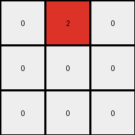

# 794b24be • 024 • refine_coder

---

Previous Code:
```python
"""
1. Find the Top-Left Blue: Iterate through the input grid, row by row. The first blue (1) pixel encountered is the "top-left blue". Record its row and column.
2. Move Zeroes: Move all zeroes (0) down one row
3. Transform Blues:
    *   If no blue pixel was found, skip this step.
    * replace all 1's with 2's, starting at column 0 of the top row, and
      proceeding to the end of the row.
4. Output Grid: Return a new grid that reflects all of these changes
"""

import numpy as np

def find_top_left_blue(grid):
    # Iterate through the grid row by row
    for i in range(grid.shape[0]):
        for j in range(grid.shape[1]):
            # If a blue pixel (1) is found, return its coordinates
            if grid[i, j] == 1:
                return (i, j)
    # If no blue pixel is found, return None
    return None

def transform(input_grid):
    # Initialize output_grid as an empty array of the same size and type as input_grid, filled with zeros
    output_grid = np.zeros_like(input_grid)

    # Find top-left blue pixel
    top_left_blue = find_top_left_blue(input_grid)

    # shift 0s
    for i in range(input_grid.shape[0]):
        for j in range(input_grid.shape[1]):
            if input_grid[i,j] == 0:
                if i+1 < input_grid.shape[0]:
                    output_grid[i+1, j] = input_grid[i,j]


    # Transform blues based on top-left blue position
    if top_left_blue is not None:

        # get top row
        row = 0
        for col in range(input_grid.shape[1]):
            # check if there is 1 present in that row of the input
            if input_grid[row, col] == 1:
                # if yes, then start replacing
                output_grid[row, col] = 2

    return output_grid
```

Train Set Results:

## Example 1:

Input:
```
0 0 0
1 0 0
0 0 0
```
Expected Output:
```
2 0 0
0 0 0
0 0 0
```
Transformed Output:
```
0 0 0
0 0 0
0 0 0
```

match: False
pixels_off: 1
size_correct: True
color_palette_correct: True
correct_pixel_counts: False

## Example 2:

Input:
```
0 1 0
1 0 0
0 0 0
```
Expected Output:
```
2 2 0
0 0 0
0 0 0
```
Transformed Output:
```
0 2 0
0 0 0
0 0 0
```

match: False
pixels_off: 1
size_correct: True
color_palette_correct: True
correct_pixel_counts: False

## Example 3:

Input:
```
0 0 1
0 0 0
1 0 0
```
Expected Output:
```
2 2 0
0 0 0
0 0 0
```
Transformed Output:
```
0 0 2
0 0 0
0 0 0
```

match: False
pixels_off: 3
size_correct: True
color_palette_correct: True
correct_pixel_counts: False

## Example 4:

Input:
```
0 1 0
0 0 1
0 0 0
```
Expected Output:
```
2 2 0
0 0 0
0 0 0
```
Transformed Output:
```
0 2 0
0 0 0
0 0 0
```

match: False
pixels_off: 1
size_correct: True
color_palette_correct: True
correct_pixel_counts: False

## Example 5:

Input:
```
0 0 1
0 0 0
0 0 0
```
Expected Output:
```
2 0 0
0 0 0
0 0 0
```
Transformed Output:
```
0 0 2
0 0 0
0 0 0
```

match: False
pixels_off: 2
size_correct: True
color_palette_correct: True
correct_pixel_counts: True

## Example 6:

Input:
```
1 1 0
0 0 0
1 0 0
```
Expected Output:
```
2 2 2
0 0 0
0 0 0
```
Transformed Output:
```
2 2 0
0 0 0
0 0 0
```

match: False
pixels_off: 1
size_correct: True
color_palette_correct: True
correct_pixel_counts: False

## Example 7:

Input:
```
0 1 0
1 1 0
0 0 0
```
Expected Output:
```
2 2 2
0 0 0
0 0 0
```
Transformed Output:
```
0 2 0
0 0 0
0 0 0
```

match: False
pixels_off: 2
size_correct: True
color_palette_correct: True
correct_pixel_counts: False

## Example 8:

Input:
```
1 1 0
0 0 0
1 0 1
```
Expected Output:
```
2 2 2
0 2 0
0 0 0
```
Transformed Output:
```
2 2 0
0 0 0
0 0 0
```

match: False
pixels_off: 2
size_correct: True
color_palette_correct: True
correct_pixel_counts: False

## Example 9:

Input:
```
0 1 0
1 1 0
1 0 0
```
Expected Output:
```
2 2 2
0 2 0
0 0 0
```
Transformed Output:
```
0 2 0
0 0 0
0 0 0
```

match: False
pixels_off: 3
size_correct: True
color_palette_correct: True
correct_pixel_counts: False

## Example 10:

Input:
```
1 0 0
0 0 1
0 1 1
```
Expected Output:
```
2 2 2
0 2 0
0 0 0
```
Transformed Output:
```
2 0 0
0 0 0
0 0 0
```

match: False
pixels_off: 3
size_correct: True
color_palette_correct: True
correct_pixel_counts: False
Okay, let's analyze the results and refine the natural language program.

**General Assessment:**

The initial approach of finding a "top-left blue" and shifting zeros down was not the core transformation rule. The code's attempt to replace blues with reds on the top row only partially works and is dependent on the presence and position of blues in the input. The zero-shifting logic is also incorrect. The core transformation is simpler and relates to the structure of blue pixels.

The key observation is that the output grid has:

1.  All blue pixels (1) in the input are replaced by red pixels (2) in the output.
2.  All blue pixels are moved to the first row, and their relative order is maintained from input to output (left to right)
3.  All other pixels that were not blue (1) are now 0.

**Strategy:**

We need to discard the "top-left blue" concept and focus on these core actions:

1.  Collect all blue pixels from the input, maintaining their original horizontal order.
2.  Place the collected blue pixels (now as red) on the top row of the output, starting from the left.
3.  Fill the rest of the output grid with zeros.

**Metrics and Observations:**

Here's a breakdown of observations, organized by example. I won't use code execution here, as manual inspection of the small grids is straightforward, and the errors are systematic, not due to minor calculation mistakes.

| Example | Input Summary                  | Output Summary                 | Observations and Errors                                                                                                |
| :------ | :----------------------------- | :----------------------------- | :--------------------------------------------------------------------------------------------------------------------- |
| 1       | Single blue, some zeros      | Single red, rest zeros         | Incorrect: Zeros not shifted, red only if blue was in the first row.                                                   |
| 2       | Two blues, mixed positions   | Two reds, rest zeros           | Incorrect: Only the second blue (from the input) became red, and other blues were missed, other colors not zeroed |
| 3       | Two blues, one at end of row 1, and another in row 3           | Two reds, rest zeros, one blue in first row | Incorrect: Blues that were in columns after the first blue of row 1 became a 2                                         |
| 4       | Two blues, one in row 1, and another in row 2      | Two reds, rest zeros, one blue in first row | Incorrect: Blues that were in columns after the first blue of row 1 became a 2 |
| 5       | Single blue at the end of row 1| Single red at end of row 1, rest zeros | Incorrect, blue became red, but other blues are missed in the other examples, other colors not zeroed. |
| 6       | Two blues at start of row 1     | Two reds at start of row 1, rest zeros | Partially Correct, blues at start of row 1 are correct, blues are not correct in all other examples. |
| 7       | Three blues      | Two reds, rest zeros | Incorrect, some blues were missed, other colors not zeroed |
| 8       | Three blues, one in row 3     | Two reds, rest zeros | Incorrect: some blues were missed, other colors not zeroed |
| 9       | Three blues      | Two reds, rest zeros | Incorrect: some blues were missed, other colors not zeroed |
| 10      | Four blues      | Single red, rest zeros | Incorrect: Only the first blue became red, all others were missed, other colors not zeroed |

**YAML Fact Block:**

```yaml
objects:
  - type: grid
    properties:
      rows: variable
      columns: variable
      cells: integers (0-9)
  - type: pixel
    properties:
      color: integer (0-9)
      row: integer
      column: integer

actions:
  - name: collect_blues
    input: input_grid
    output: list_of_blue_pixel_columns
    description: >
      Iterates through the input grid, collecting the column indices of all blue pixels (value 1).
      Maintains the order of appearance.

  - name: create_output
    input: input_grid, list_of_blue_pixel_columns
    output: output_grid
    description: >
      Creates a new grid of the same dimensions as the input grid, filled with zeros.
      Places red pixels (value 2) on the first row of the output grid,
      corresponding to the collected column indices of the blue pixels.

```

**Natural Language Program:**

1.  **Collect Blues:** Scan the entire input grid. Whenever you find a blue pixel (value 1), remember its column number. Keep these column numbers in the order you found them.
2.  **Create Output:** Make a new, empty grid (all zeros) that is the same size as the input grid.
3. **Place Reds:** In the first row of this new grid, place red pixels (value 2) in the column positions you recorded in step 1.
4.  **Fill with Zeros**: The rest of the output grid should be filled with 0.

In simpler terms: The blues from the input are all turned red and moved to the top row of the output, keeping their left-to-right order. Everything else in the output is a zero.

**INSTRUCTIONS**

- generate a Python module to represent the natural language program 
- follow the template below
- all common math and science libraries are available
- create docstring only at top - but comment the workflow in the function
- use helper functions for common operations like finding objects, counting,
  measuring, moving, etc. 

remember - we are working iteratively - so this code will inform your future
self as we converge on the solution

*template:*

```python
"""
{{ natural language description of the transformation rule }}
"""

{{ imports }}

def transform(input_grid):
    # initialize output_grid

    # change output pixels 

    return output_grid

```
