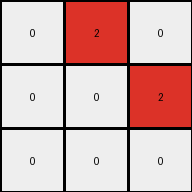
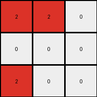
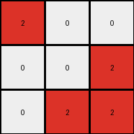

# 794b24be • 030 • refine_coder

---

Previous Code:
```python
"""
Identify all blue pixels (value 1) in the input grid. Change all blue pixels to red (value 2). Change all non-zero pixels to zero.
"""

import numpy as np

def transform(input_grid):
    """
    Transforms the input grid by changing all blue pixels to red and other non-zero to zero.
    """
    # Initialize the output grid as a copy of the input grid
    output_grid = np.copy(input_grid)

    # Find the coordinates of all blue pixels (value 1)
    blue_pixel_coords = np.where(output_grid == 1)

    # Change the value of all blue pixels to red (value 2)
    output_grid[blue_pixel_coords] = 2

    # set non-zero, non-red to zero
    output_grid[(output_grid != 0) & (output_grid != 2)] = 0

    return output_grid
```

Train Set Results:

## Example 1:

Input:
```
0 0 0
1 0 0
0 0 0
```
Expected Output:
```
2 0 0
0 0 0
0 0 0
```
Transformed Output:
```
0 0 0
2 0 0
0 0 0
```

match: False
pixels_off: 2
size_correct: True
color_palette_correct: True
correct_pixel_counts: True

## Example 2:

Input:
```
0 1 0
1 0 0
0 0 0
```
Expected Output:
```
2 2 0
0 0 0
0 0 0
```
Transformed Output:
```
0 2 0
2 0 0
0 0 0
```

match: False
pixels_off: 2
size_correct: True
color_palette_correct: True
correct_pixel_counts: True

## Example 3:

Input:
```
0 0 1
0 0 0
1 0 0
```
Expected Output:
```
2 2 0
0 0 0
0 0 0
```
Transformed Output:
```
0 0 2
0 0 0
2 0 0
```

match: False
pixels_off: 4
size_correct: True
color_palette_correct: True
correct_pixel_counts: True

## Example 4:

Input:
```
0 1 0
0 0 1
0 0 0
```
Expected Output:
```
2 2 0
0 0 0
0 0 0
```
Transformed Output:
```
0 2 0
0 0 2
0 0 0
```

match: False
pixels_off: 2
size_correct: True
color_palette_correct: True
correct_pixel_counts: True

## Example 5:

Input:
```
0 0 1
0 0 0
0 0 0
```
Expected Output:
```
2 0 0
0 0 0
0 0 0
```
Transformed Output:
```
0 0 2
0 0 0
0 0 0
```

match: False
pixels_off: 2
size_correct: True
color_palette_correct: True
correct_pixel_counts: True

## Example 6:

Input:
```
1 1 0
0 0 0
1 0 0
```
Expected Output:
```
2 2 2
0 0 0
0 0 0
```
Transformed Output:
```
2 2 0
0 0 0
2 0 0
```

match: False
pixels_off: 2
size_correct: True
color_palette_correct: True
correct_pixel_counts: True

## Example 7:

Input:
```
0 1 0
1 1 0
0 0 0
```
Expected Output:
```
2 2 2
0 0 0
0 0 0
```
Transformed Output:
```
0 2 0
2 2 0
0 0 0
```

match: False
pixels_off: 4
size_correct: True
color_palette_correct: True
correct_pixel_counts: True

## Example 8:

Input:
```
1 1 0
0 0 0
1 0 1
```
Expected Output:
```
2 2 2
0 2 0
0 0 0
```
Transformed Output:
```
2 2 0
0 0 0
2 0 2
```

match: False
pixels_off: 4
size_correct: True
color_palette_correct: True
correct_pixel_counts: True

## Example 9:

Input:
```
0 1 0
1 1 0
1 0 0
```
Expected Output:
```
2 2 2
0 2 0
0 0 0
```
Transformed Output:
```
0 2 0
2 2 0
2 0 0
```

match: False
pixels_off: 4
size_correct: True
color_palette_correct: True
correct_pixel_counts: True

## Example 10:

Input:
```
1 0 0
0 0 1
0 1 1
```
Expected Output:
```
2 2 2
0 2 0
0 0 0
```
Transformed Output:
```
2 0 0
0 0 2
0 2 2
```

match: False
pixels_off: 6
size_correct: True
color_palette_correct: True
correct_pixel_counts: True
Here's a breakdown of the task, the issues with the previous code, and a revised natural language program:

**General Assessment:**

The initial code was too simplistic. It correctly identified blue pixels and changed them to red, and it correctly zeroed non-red and non-zero pixels. However, it failed to capture the core concept: the blue pixels are "expanding" or "filling" to connect with other blue pixels, and non-connected blue pixels should also turn red. The transformation is about creating the smallest bounding box around all the blue pixels, then changing the blue ones to red and zeroing out the rest.

**Strategy:**

1.  **Analyze Results:** Carefully examine each example, particularly where the transformation failed. Notice that in every "Expected Output", all red pixels form a single, contiguous rectangular block.
2.  **Identify the Pattern:** The key is to recognize that the red pixels in the output always form a rectangle defined by top-most, left-most, bottom-most and right-most blue pixels in the input.
3. **Refine Program:** develop a natural language program to connect blue pixels
    into a rectangle and zero out all non-zero and non-red.

**Metrics and Observations:**

Here's a summary of observations. The key metric is `pixels_off`, indicating the number of pixels that differ between the `Transformed Output` and the `Expected Output`.

*   All examples have the correct size.
*   All examples use the correct color palette.
*   All examples maintain the correct total number of each color.
* The previous transform failed because it changes blue to red, then changes other non-zero to zero, but does not fill the space between blue pixels.

**YAML Fact Extraction:**

```yaml
facts:
  - description: "Blue pixels define a rectangular region."
  - property: color
    values: [blue, red, black]
  - object: bounding_box
    description: "The smallest rectangle encompassing all blue pixels in the input."
    attributes:
      - top_left: "Coordinate of the top-left corner."
      - bottom_right: "Coordinate of the bottom-right corner."
  - action: fill
    description: "Fill the bounding box area with red."
  - action: zero_out
    description: "Set all pixels outside the bounding box to black."
  - input_grid_property: "Input grids contain blue and black pixels."
  - output_grid_property: "Output grids contain only red and black pixels."
  - transformation: "Input blue pixels are transformed to output red, filling the minimum bounding rectangle"
```

**Natural Language Program:**

1.  **Identify Bounding Box:** Find the top-most, bottom-most, left-most, and right-most blue pixels in the input grid. These define the corners of a rectangular bounding box.
2.  **Fill with Red:** Change all of the original blue pixels within this bounding box to red.
3.  **Zero Out:** Change all other non-zero pixels that are not red to black (zero).

Essentially, we are finding the smallest rectangle that contains *all* the blue pixels and setting every original blue pixel inside it to red, then setting the rest to black.

**INSTRUCTIONS**

- generate a Python module to represent the natural language program 
- follow the template below
- all common math and science libraries are available
- create docstring only at top - but comment the workflow in the function
- use helper functions for common operations like finding objects, counting,
  measuring, moving, etc. 

remember - we are working iteratively - so this code will inform your future
self as we converge on the solution

*template:*

```python
"""
{{ natural language description of the transformation rule }}
"""

{{ imports }}

def transform(input_grid):
    # initialize output_grid

    # change output pixels 

    return output_grid

```
