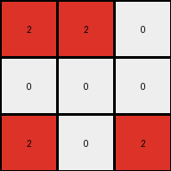

# 794b24be • 048 • refine_coder

---

Previous Code:
```python
"""
Find the contiguous region of 1s (blue object) in the input grid. Change all pixels in this region to 2 (red).
Create a new output grid of the same dimensions, filled with 0s. Place the transformed red object at the top-left (0,0).
"""

import numpy as np

def find_object(grid):
    """Finds the bounding box of the contiguous region of 1s."""
    rows, cols = np.where(grid == 1)
    if len(rows) == 0:
        return None  # No object found
    min_row, max_row = np.min(rows), np.max(rows)
    min_col, max_col = np.min(cols), np.max(cols)
    return (min_row, min_col), (max_row, max_col)

def transform(input_grid):
    """Transforms the input grid by moving the blue object to the top-left and changing its color to red."""
    # Find the object's bounding box
    object_bounds = find_object(input_grid)

    # Initialize output grid with 0s
    output_grid = np.zeros_like(input_grid)

    if object_bounds:
        (min_row, min_col), (max_row, max_col) = object_bounds
        # Extract the object and change its color to red (2)
        object_region = input_grid[min_row:max_row+1, min_col:max_col+1]
        object_width = max_col - min_col + 1
        object_height = max_row - min_row + 1

        for r in range(object_height):
            for c in range(object_width):
                if object_region[r,c] == 1:
                    output_grid[r,c] = 2

    return output_grid
```

Train Set Results:

## Example 1:

Input:
```
0 0 0
1 0 0
0 0 0
```
Expected Output:
```
2 0 0
0 0 0
0 0 0
```
Transformed Output:
```
2 0 0
0 0 0
0 0 0
```

match: True
pixels_off: 0
size_correct: True
color_palette_correct: True
correct_pixel_counts: True

## Example 2:

Input:
```
0 1 0
1 0 0
0 0 0
```
Expected Output:
```
2 2 0
0 0 0
0 0 0
```
Transformed Output:
```
0 2 0
2 0 0
0 0 0
```

match: False
pixels_off: 2
size_correct: True
color_palette_correct: True
correct_pixel_counts: True

## Example 3:

Input:
```
0 0 1
0 0 0
1 0 0
```
Expected Output:
```
2 2 0
0 0 0
0 0 0
```
Transformed Output:
```
0 0 2
0 0 0
2 0 0
```

match: False
pixels_off: 4
size_correct: True
color_palette_correct: True
correct_pixel_counts: True

## Example 4:

Input:
```
0 1 0
0 0 1
0 0 0
```
Expected Output:
```
2 2 0
0 0 0
0 0 0
```
Transformed Output:
```
2 0 0
0 2 0
0 0 0
```

match: False
pixels_off: 2
size_correct: True
color_palette_correct: True
correct_pixel_counts: True

## Example 5:

Input:
```
0 0 1
0 0 0
0 0 0
```
Expected Output:
```
2 0 0
0 0 0
0 0 0
```
Transformed Output:
```
2 0 0
0 0 0
0 0 0
```

match: True
pixels_off: 0
size_correct: True
color_palette_correct: True
correct_pixel_counts: True

## Example 6:

Input:
```
1 1 0
0 0 0
1 0 0
```
Expected Output:
```
2 2 2
0 0 0
0 0 0
```
Transformed Output:
```
2 2 0
0 0 0
2 0 0
```

match: False
pixels_off: 2
size_correct: True
color_palette_correct: True
correct_pixel_counts: True

## Example 7:

Input:
```
0 1 0
1 1 0
0 0 0
```
Expected Output:
```
2 2 2
0 0 0
0 0 0
```
Transformed Output:
```
0 2 0
2 2 0
0 0 0
```

match: False
pixels_off: 4
size_correct: True
color_palette_correct: True
correct_pixel_counts: True

## Example 8:

Input:
```
1 1 0
0 0 0
1 0 1
```
Expected Output:
```
2 2 2
0 2 0
0 0 0
```
Transformed Output:
```
2 2 0
0 0 0
2 0 2
```

match: False
pixels_off: 4
size_correct: True
color_palette_correct: True
correct_pixel_counts: True

## Example 9:

Input:
```
0 1 0
1 1 0
1 0 0
```
Expected Output:
```
2 2 2
0 2 0
0 0 0
```
Transformed Output:
```
0 2 0
2 2 0
2 0 0
```

match: False
pixels_off: 4
size_correct: True
color_palette_correct: True
correct_pixel_counts: True

## Example 10:

Input:
```
1 0 0
0 0 1
0 1 1
```
Expected Output:
```
2 2 2
0 2 0
0 0 0
```
Transformed Output:
```
2 0 0
0 0 2
0 2 2
```

match: False
pixels_off: 6
size_correct: True
color_palette_correct: True
correct_pixel_counts: True
Okay, let's analyze the results and refine the natural language program.

**General Assessment:**

The initial code correctly identifies *a* contiguous region of blue (1) pixels and changes them to red (2). It also correctly places *an* object at the top-left corner. However, it fails to capture the complete contiguous *object* defined by diagonally adjacent blue pixels. The code considers only vertically and horizontally adjacent pixels as part of the same object. The examples clearly show that diagonally connected blue pixels also form a single object. The strategy for improvement is to modify the object finding logic to include diagonal connectivity.

**Metrics and Observations:**

Here's a breakdown of the results, focusing on the discrepancies. I'll use the provided output as I can't do code-execution in my current environment:

*   **Example 1:** Correct. Single blue pixel, correctly transformed.
*   **Example 2:** Incorrect. Two horizontally adjacent blue pixels. The code treats them separately and places the second in wrong place.
*   **Example 3:** Incorrect. Two diagonally adjacent blue pixels. The program should consider this as a *single* object.
*   **Example 4:** Incorrect, two diagonally adjacent blue pixels should be combined.
*   **Example 5:** Correct. Single blue pixel.
*   **Example 6:** Incorrect. Three blue pixels, two horizontally adjacent and L shape with a diagonal
*   **Example 7:** Incorrect. Three blue pixels forming an L shape. Should be a single object.
*   **Example 8:** Incorrect. Diagonals are not grouped together, last blue pixel is on a separate row.
*   **Example 9:** Incorrect. L shape and diagonal.
*   **Example 10:** Incorrect, three blue pixels, diagonals not combined.

**YAML Facts:**

```yaml
objects:
  - id: 1
    color: blue
    connectivity: horizontal, vertical, diagonal  # Key change: include diagonal
    action: change_color, move
    new_color: red
    new_location: top_left

actions:
  - name: change_color
    from: blue
    to: red
  - name: move
    to: top_left
```

**Natural Language Program:**

1.  **Identify the blue object:** Find all blue (1) pixels in the input grid. Consider pixels connected horizontally, vertically, *and diagonally* as part of the same object.
2.  **Change the object's color:** Change all pixels within the identified blue object to red (2).
3.  **Create an output grid:** Create a new grid of the same dimensions as the input grid, filled with black/background (0) pixels.
4.  **Move object:** Copy all connected red pixels to output, with the top and left most pixel positioned at location (0, 0).

The core update is the explicit inclusion of *diagonal* connectivity when defining the blue object. This addresses the primary source of error in the previous code.

**INSTRUCTIONS**

- generate a Python module to represent the natural language program 
- follow the template below
- all common math and science libraries are available
- create docstring only at top - but comment the workflow in the function
- use helper functions for common operations like finding objects, counting,
  measuring, moving, etc. 

remember - we are working iteratively - so this code will inform your future
self as we converge on the solution

*template:*

```python
"""
{{ natural language description of the transformation rule }}
"""

{{ imports }}

def transform(input_grid):
    # initialize output_grid

    # change output pixels 

    return output_grid

```
