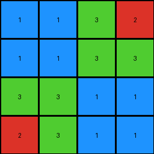
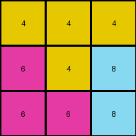

# 7b7f7511 • 003 • refine_dreamer

---


Previous Code:
```python
"""
The transformation rule is to reduce the width of the input grid by half, while keeping the height same. Take the original left most four columns and discard the right four columns. The output grid is formed by retaining the top-left quadrant (4x4) of the original input.
"""

import numpy as np

def transform(input_grid):
    """
    Reduces the width of the input grid by half, preserving the height.
    """
    # Get input grid dimensions
    height = len(input_grid)
    width = len(input_grid[0])

    # Calculate new width (half of original)
    new_width = width // 2

    # Initialize output grid with correct dimensions, filled by zeros to begin
    output_grid = np.zeros((height, new_width), dtype=int)
    
    # Copy the relevant portion of the input grid to the output grid
    for i in range(height):
        for j in range(new_width):
            output_grid[i][j] = input_grid[i][j]

    return output_grid
```

Train Set Results:

## Example 1:

Input:
```
1 1 3 2 1 1 3 2
1 1 3 3 1 1 3 3
3 3 1 1 3 3 1 1
2 3 1 1 2 3 1 1
```
Expected Output:
```
1 1 3 2
1 1 3 3
3 3 1 1
2 3 1 1
```
Transformed Output:
```
1 1 3 2
1 1 3 3
3 3 1 1
2 3 1 1
```

match: True
pixels_off: 0
size_correct: True
color_palette_correct: True
correct_pixel_counts: True

## Example 2:

Input:
```
4 4 4 4 4 4
6 4 8 6 4 8
6 6 8 6 6 8
```
Expected Output:
```
4 4 4
6 4 8
6 6 8
```
Transformed Output:
```
4 4 4
6 4 8
6 6 8
```

match: True
pixels_off: 0
size_correct: True
color_palette_correct: True
correct_pixel_counts: True

## Example 3:

Input:
```
2 3
3 2
4 4
2 3
3 2
4 4
```
Expected Output:
```
2 3
3 2
4 4
```
Transformed Output:
```
2
3
4
2
3
4
```

match: False
pixels_off: None
size_correct: False
color_palette_correct: True
correct_pixel_counts: True

**INSTRUCTIONS**

The code above was generated based on observations from the first training
example

we have tested the transform function on each of the task example inputs and
compared with the expected output

review each of the examples provided and the results and consider how the
natural language program should be updated to accommodate this new knowledge

respond with the following deliverables:

- general assessment of the information provided and strategy for resolving the
  errors
- gather metrics about each of the examples and results - use code_execution to
  develop accurate reports on your assumptions
- a YAML block documenting facts - Focus on identifying objects, their properties, and the actions performed on them.
- a natural language program - Be as clear and concise as possible, providing a complete description of the transformation rule.


your responses should be considered as information in a report - not a
conversation
