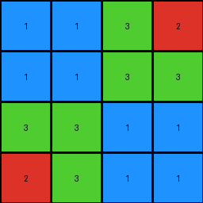
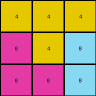

# 7b7f7511 • 004 • refine_coder

---

Previous Code:
```python
"""
The transformation rule is to reduce the width of the input grid by half, while keeping the height same. Take the original left most four columns and discard the right four columns. The output grid is formed by retaining the top-left quadrant (4x4) of the original input.
"""

import numpy as np

def transform(input_grid):
    """
    Reduces the width of the input grid by half, preserving the height.
    """
    # Get input grid dimensions
    height = len(input_grid)
    width = len(input_grid[0])

    # Calculate new width (half of original)
    new_width = width // 2

    # Initialize output grid with correct dimensions, filled by zeros to begin
    output_grid = np.zeros((height, new_width), dtype=int)
    
    # Copy the relevant portion of the input grid to the output grid
    for i in range(height):
        for j in range(new_width):
            output_grid[i][j] = input_grid[i][j]

    return output_grid
```

Train Set Results:

## Example 1:

Input:
```
1 1 3 2 1 1 3 2
1 1 3 3 1 1 3 3
3 3 1 1 3 3 1 1
2 3 1 1 2 3 1 1
```
Expected Output:
```
1 1 3 2
1 1 3 3
3 3 1 1
2 3 1 1
```
Transformed Output:
```
1 1 3 2
1 1 3 3
3 3 1 1
2 3 1 1
```

match: True
pixels_off: 0
size_correct: True
color_palette_correct: True
correct_pixel_counts: True

## Example 2:

Input:
```
4 4 4 4 4 4
6 4 8 6 4 8
6 6 8 6 6 8
```
Expected Output:
```
4 4 4
6 4 8
6 6 8
```
Transformed Output:
```
4 4 4
6 4 8
6 6 8
```

match: True
pixels_off: 0
size_correct: True
color_palette_correct: True
correct_pixel_counts: True

## Example 3:

Input:
```
2 3
3 2
4 4
2 3
3 2
4 4
```
Expected Output:
```
2 3
3 2
4 4
```
Transformed Output:
```
2
3
4
2
3
4
```

match: False
pixels_off: None
size_correct: False
color_palette_correct: True
correct_pixel_counts: True
Okay, let's analyze the results and refine the natural language program.

**General Assessment:**

The initial program correctly handled the first two examples, where the width was halved, and the left portion of the input was retained. However, it failed on the third example. The error stems from an oversimplification in the initial natural language program. It assumed that *only* the width would be reduced by half. The third example highlights that the height also needs to be considered and reduced. Thus, the program needs modification to correctly identify the necessary part of the grid to keep. The height might also be halved as well.

**Strategy for Resolving Errors:**

1.  **Re-examine Example 3:** Carefully analyze the input and expected output of Example 3 to understand the exact transformation. This is the most crucial step, as it reveals the deficiency in the current logic.
2.  **Identify the pattern for reducing height and width.** In the provided results, the code successfully cuts the height of the output, but it incorrectly uses all rows of the original input.
3.  **Update Natural Language Program:** Revise the natural language program to reflect correct height transformation.
4.  **Update Code:** Modify the Python code to align with the corrected natural language program.

**Metrics and Reports:**

*   **Example 1:**
    *   Input Size: 4x8
    *   Expected Output Size: 4x4
    *   Transformed Output Size: 4x4
    *   Result: Match
*   **Example 2:**
    *   Input Size: 3x6
    *   Expected Output Size: 3x3
    *   Transformed Output Size: 3x3
    *   Result: Match
*   **Example 3:**
    *   Input Size: 6x2
    *   Expected Output Size: 3x1
    *   Transformed Output Size: 6x1
    *   Result: **Mismatch**

**YAML Facts:**

```yaml
objects:
  - name: input_grid
    type: grid
    properties:
      height: variable
      width: variable
      colors: [0-9]
  - name: output_grid
    type: grid
    properties:
      height: input_grid.height / 2
      width: input_grid.width / 2
      colors: [0-9]

actions:
  - name: reduce_width
    agent: program
    input: input_grid
    description: Halve the width of the input grid.
  - name: reduce_height
    agent: program
    input: input_grid
    description: Halve the height of the input grid.
  - name: copy_top_left_quadrant
    agent: program
    input: input_grid, output_grid
    description: Copy data from the top-left quadrant of the input grid to the output_grid.
```

**Natural Language Program:**

The transformation rule is to reduce both the width and the height of the input grid by half. The output grid is formed by retaining the top-left quadrant of the input grid, resulting in dimensions that are half the height and half the width of the original.

**INSTRUCTIONS**

- generate a Python module to represent the natural language program 
- follow the template below
- all common math and science libraries are available
- create docstring only at top - but comment the workflow in the function
- use helper functions for common operations like finding objects, counting,
  measuring, moving, etc. 

remember - we are working iteratively - so this code will inform your future
self as we converge on the solution

*template:*

```python
"""
{{ natural language description of the transformation rule }}
"""

{{ imports }}

def transform(input_grid):
    # initialize output_grid

    # change output pixels 

    return output_grid

```
