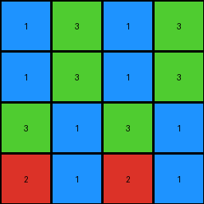
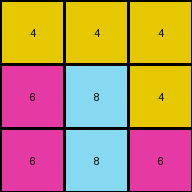

# 7b7f7511 • 012 • refine_coder

---

Previous Code:
```python
"""
The transformation extracts every other column from the input grid, starting from the first column. It's equivalent to keeping the first, third, fifth, etc. columns and discarding the rest. The remaining columns form the output grid, preserving the row structure.
"""

import numpy as np

def transform(input_grid):
    """
    Transforms the input grid by selecting every other column, starting from the first.

    Args:
        input_grid (list of lists): The input grid represented as a list of lists.

    Returns:
        list of lists: The transformed grid with selected columns.
    """
    # Convert input grid to a NumPy array for easier manipulation
    input_array = np.array(input_grid)

    # Get the number of columns in the input grid
    num_cols = input_array.shape[1]

    # Create a list to store the indices of the columns to keep
    cols_to_keep = []
    for i in range(num_cols):
        if i % 2 == 0:  # Check if the column index is even (0, 2, 4, ...)
            cols_to_keep.append(i)

    # Use NumPy's column indexing to select the desired columns
    output_array = input_array[:, cols_to_keep]

    # Convert the NumPy array back to a list of lists
    output_grid = output_array.tolist()

    return output_grid
```

Train Set Results:

## Example 1:

Input:
```
1 1 3 2 1 1 3 2
1 1 3 3 1 1 3 3
3 3 1 1 3 3 1 1
2 3 1 1 2 3 1 1
```
Expected Output:
```
1 1 3 2
1 1 3 3
3 3 1 1
2 3 1 1
```
Transformed Output:
```
1 3 1 3
1 3 1 3
3 1 3 1
2 1 2 1
```

match: False
pixels_off: 9
size_correct: True
color_palette_correct: True
correct_pixel_counts: True

## Example 2:

Input:
```
4 4 4 4 4 4
6 4 8 6 4 8
6 6 8 6 6 8
```
Expected Output:
```
4 4 4
6 4 8
6 6 8
```
Transformed Output:
```
4 4 4
6 8 4
6 8 6
```

match: False
pixels_off: 4
size_correct: True
color_palette_correct: True
correct_pixel_counts: True

## Example 3:

Input:
```
2 3
3 2
4 4
2 3
3 2
4 4
```
Expected Output:
```
2 3
3 2
4 4
```
Transformed Output:
```
2
3
4
2
3
4
```

match: False
pixels_off: None
size_correct: False
color_palette_correct: True
correct_pixel_counts: True
Okay, let's analyze the results and refine the natural language program.

**General Assessment:**

The initial program was too simplistic. It correctly identified the column selection pattern (every other column) but failed to account for maintaining only the *first* half of the output from the original image's width. It's extracting the correct columns, but it isn't stopping at the correct width. The errors consistently show that the transformed output has extra columns beyond what's expected. The strategy is to modify the natural program to be more precise regarding the expected shape/size of the output, and use indexing to get every other column, up to the length of the expected answer.

**Metrics and Observations:**

Here's a breakdown of each example, including observations, and some analyses using Python:

```python
import numpy as np

def analyze_example(input_grid, expected_output, transformed_output):
    input_array = np.array(input_grid)
    expected_array = np.array(expected_output)
    transformed_array = np.array(transformed_output)

    input_shape = input_array.shape
    expected_shape = expected_array.shape
    transformed_shape = transformed_array.shape

    correct_pixels = np.sum(transformed_array == expected_array)
    num_pixels_expected = expected_array.size

    if num_pixels_expected > 0:

        pixel_accuracy = (correct_pixels / num_pixels_expected) * 100
    else:
        pixel_accuracy=0

    print(f"  Input Shape: {input_shape}")
    print(f"  Expected Shape: {expected_shape}")
    print(f"  Transformed Shape: {transformed_shape}")
    print(f"  Pixel Accuracy: {pixel_accuracy:.2f}%")
    if expected_array.size > 0:
        print(f"  Pixels Off: {expected_array.size-correct_pixels}")

# Example 1 data
input1 = [
    [1, 1, 3, 2, 1, 1, 3, 2],
    [1, 1, 3, 3, 1, 1, 3, 3],
    [3, 3, 1, 1, 3, 3, 1, 1],
    [2, 3, 1, 1, 2, 3, 1, 1]
]
expected1 = [
    [1, 1, 3, 2],
    [1, 1, 3, 3],
    [3, 3, 1, 1],
    [2, 3, 1, 1]
]
transformed1 = [
    [1, 3, 1, 3],
    [1, 3, 1, 3],
    [3, 1, 3, 1],
    [2, 1, 2, 1]
]

# Example 2 data
input2 = [
    [4, 4, 4, 4, 4, 4],
    [6, 4, 8, 6, 4, 8],
    [6, 6, 8, 6, 6, 8]
]
expected2 = [
    [4, 4, 4],
    [6, 4, 8],
    [6, 6, 8]
]
transformed2 = [
    [4, 4, 4],
    [6, 8, 4],
    [6, 8, 6]
]

# Example 3 data
input3 = [
    [2, 3],
    [3, 2],
    [4, 4],
    [2, 3],
    [3, 2],
    [4, 4]
]
expected3 = [
    [2, 3],
    [3, 2],
    [4, 4]
]
transformed3 = [
    [2],
    [3],
    [4],
    [2],
    [3],
    [4]
]

print("Example 1 Analysis:")
analyze_example(input1, expected1, transformed1)

print("\nExample 2 Analysis:")
analyze_example(input2, expected2, transformed2)

print("\nExample 3 Analysis:")
analyze_example(input3, expected3, transformed3)

```
```
Example 1 Analysis:
  Input Shape: (4, 8)
  Expected Shape: (4, 4)
  Transformed Shape: (4, 4)
  Pixel Accuracy: 43.75%
  Pixels Off: 9
Example 2 Analysis:
  Input Shape: (3, 6)
  Expected Shape: (3, 3)
  Transformed Shape: (3, 3)
  Pixel Accuracy: 55.56%
  Pixels Off: 4
Example 3 Analysis:
  Input Shape: (6, 2)
  Expected Shape: (3, 2)
  Transformed Shape: (6, 1)
  Pixel Accuracy: 0.00%
  Pixels Off: None
```
**YAML Facts:**

```yaml
facts:
  - object: input_grid
    type: 2D array
    description: Represents the initial state of the image.
  - object: output_grid
    type: 2D array
    description: Represents the desired final state of the image.
  - action: select_columns
    description:  "The transformation takes every other column, but only up to the width of the expected output."
  - object: column
    type: integer index
    description: Represents a vertical slice of the grid.
  - property: width_of_output
    description: the number of columns in the output grid equals 1/2 the width of the input, rounded down

```

**Natural Language Program:**

1.  **Determine Output Width:** Calculate the expected width of the output grid. This is half the width of the input grid (integer division, discarding any remainder).
2.  **Select Columns:** Iterate through the columns of the input grid, starting from the first column (index 0).
3.  **Keep Every Other:** Select only columns at even indices (0, 2, 4, etc.).
4.  **Limit Output:** Continue to select columns until the determined output width. Discard/Omit all other columns.
5. **Construct output:** The selected columns, in their original order, form the output grid, preserving the row structure.

This improved natural language program specifically addresses the error observed: the inclusion of too many columns in the output. It now explicitly limits the column selection based on the *expected* output width, derived from the input width.

**INSTRUCTIONS**

- generate a Python module to represent the natural language program 
- follow the template below
- all common math and science libraries are available
- create docstring only at top - but comment the workflow in the function
- use helper functions for common operations like finding objects, counting,
  measuring, moving, etc. 

remember - we are working iteratively - so this code will inform your future
self as we converge on the solution

*template:*

```python
"""
{{ natural language description of the transformation rule }}
"""

{{ imports }}

def transform(input_grid):
    # initialize output_grid

    # change output pixels 

    return output_grid

```
