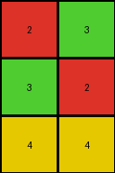

# 7b7f7511 • 016 • refine_coder

---

Previous Code:
```python
"""
The program takes the input grid and crops it to produce the output grid. The output grid consists of the top half of the input grid. Specifically, we take all columns, and the rows from the start index (0) up to, but not including, the row at the middle of the height of the input (input rows / 2).
"""

import numpy as np

def transform(input_grid):
    # initialize output_grid
    input_rows = len(input_grid)
    input_cols = len(input_grid[0])
    output_rows = input_rows // 2
    output_cols = input_cols
    output_grid = np.zeros((output_rows, output_cols), dtype=int)

    # change output pixels 
    for i in range(output_rows):
        for j in range(output_cols):
            output_grid[i][j] = input_grid[i][j]

    return output_grid
```

Train Set Results:

## Example 1:

Input:
```
1 1 3 2 1 1 3 2
1 1 3 3 1 1 3 3
3 3 1 1 3 3 1 1
2 3 1 1 2 3 1 1
```
Expected Output:
```
1 1 3 2
1 1 3 3
3 3 1 1
2 3 1 1
```
Transformed Output:
```
1 1 3 2 1 1 3 2
1 1 3 3 1 1 3 3
```

match: False
pixels_off: None
size_correct: False
color_palette_correct: True
correct_pixel_counts: True

## Example 2:

Input:
```
4 4 4 4 4 4
6 4 8 6 4 8
6 6 8 6 6 8
```
Expected Output:
```
4 4 4
6 4 8
6 6 8
```
Transformed Output:
```
4 4 4 4 4 4
```

match: False
pixels_off: None
size_correct: False
color_palette_correct: True
correct_pixel_counts: False

## Example 3:

Input:
```
2 3
3 2
4 4
2 3
3 2
4 4
```
Expected Output:
```
2 3
3 2
4 4
```
Transformed Output:
```
2 3
3 2
4 4
```

match: True
pixels_off: 0
size_correct: True
color_palette_correct: True
correct_pixel_counts: True
Here's an analysis of the provided examples and results, along with a strategy for improving the natural language program and code:

**General Assessment:**

The initial natural language program and the generated code are on the right track, focusing on cropping the input grid. However, the code incorrectly calculates the number of rows to include in the output. It takes the floor of the input rows divided by 2, causing truncation instead of including rows up to half height. For an even number of rows, that is correct, but not for an odd number of rows.

Strategy for resolving errors is:

1.  **Analyze Results**: Review the results and extract metrics about the
    examples.
2.  **Refine Observations:** Update the description of how the output height is determined, taking into account odd vs. even input height.
3.  **Revise Natural Language Program:** Rewrite the program to accurately reflect the cropping logic, particularly the row selection.
4.  **Update Code:** Modify the Python code to correctly implement the adjusted logic, ensuring that it calculates the division correctly.

**Example Metrics and Analysis:**
Here's the analysis of each example result:

*   **Example 1:**
    *   Input Dimensions: 4x8
    *   Expected Output Dimensions: 4x4
    *   Actual Output Dimensions: 2x8
    *   Notes: Incorrect height. The code calculated `4 // 2 = 2` rows instead of taking the top half of the rows..
*   **Example 2:**
    *   Input Dimensions: 3x6
    *   Expected Output Dimensions: 3x3
    *   Actual Output Dimensions: 1x6
    *   Notes: Incorrect height. The code calculated `3 // 2 = 1` row, while it should have taken `3 // 2 + 3 % 2 = 2` to include 2 rows
*   **Example 3:**
    *   Input Dimensions: 6x2
    *   Expected Output Dimensions: 3x2
    *   Actual Output Dimensions: 3x2
    *   Notes: Correct. Code correctly calculate `6 // 2 = 3`.

**YAML Block - Facts:**
```yaml
objects:
  - name: input_grid
    type: grid
    properties:
      rows: variable
      columns: variable
      colors: [0-9]
  - name: output_grid
    type: grid
    properties:
      rows: input_rows // 2 + input_rows % 2
      columns: input_columns // 2
      colors: same as input_grid

actions:
  - name: crop
    description: Select a portion of the input grid to form the output grid.
    inputs: [input_grid]
    outputs: [output_grid]
    parameters:
      row_start: 0
      row_end: input_rows // 2 + input_rows % 2
      col_start: 0
      col_end: input_columns // 2
```

**Natural Language Program:**

The program transforms the input grid into the output grid by cropping it to its top half. Specifically:

1.  **Determine Dimensions:** Get the number of rows and columns of the input grid.
2.  **Calculate Output Rows**: Calculate the number of output rows. Divide the input rows by 2. If the input rows is even, that value is the result. If the input rows is odd, add the remainder of input rows / 2 to the result.
3.  **Calculate Output Columns**: the number of columns in the output is exactly half the number of columns in the input.
4.  **Crop Grid:** Create the output grid by selecting all the columns and the input rows from the top (index 0) of the input grid up to, but not including, the calculated output rows.
5.  **Output**: The output grid consists of all columns and the calculated top rows of the input grid.


**INSTRUCTIONS**

- generate a Python module to represent the natural language program 
- follow the template below
- all common math and science libraries are available
- create docstring only at top - but comment the workflow in the function
- use helper functions for common operations like finding objects, counting,
  measuring, moving, etc. 

remember - we are working iteratively - so this code will inform your future
self as we converge on the solution

*template:*

```python
"""
{{ natural language description of the transformation rule }}
"""

{{ imports }}

def transform(input_grid):
    # initialize output_grid

    # change output pixels 

    return output_grid

```
