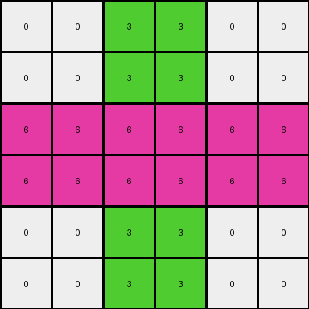

# 7fe24cdd • 005 • refine_dreamer

---


Previous Code:
```python
"""
The transformation rule takes a 3x3 input grid and expands it into a 6x6 output grid. The width and height are doubled. The current hypothesis about the precise pixel mapping within the enlarged grid is incorrect. The precise mapping between input and output pixels is more complex than simple replication. Each pixel from the input grid appears to influence multiple locations, and this must be solved. The current understanding is flawed and needs a new hypothesis based on close comparisons between all given examples.
"""

import numpy as np

def transform(input_grid):
    # Initialize output_grid with double the dimensions of the input_grid.
    input_height, input_width = input_grid.shape
    output_height, output_width = input_height * 2, input_width * 2
    output_grid = np.zeros((output_height, output_width), dtype=int)

    # The following is a placeholder based on the *incorrect* assumption of 2x2 replication.
    # It needs to be replaced with the correct mapping logic once determined.
    for i in range(input_height):
        for j in range(input_width):
            # Get the color of the current pixel.
            color = input_grid[i, j]

            # Placeholder: Incorrectly replicate the pixel to a 2x2 block.
            output_grid[2*i:2*i+2, 2*j:2*j+2] = color
            # Needs to be replaced by the correct mapping logic!

    return output_grid
```

Train Set Results:

## Example 1:

Input:
```
8 5 0
8 5 3
0 3 2
```
Expected Output:
```
8 5 0 0 8 8
8 5 3 3 5 5
0 3 2 2 3 0
0 3 2 2 3 0
5 5 3 3 5 8
8 8 0 0 5 8
```
Transformed Output:
```
8 8 5 5 0 0
8 8 5 5 0 0
8 8 5 5 3 3
8 8 5 5 3 3
0 0 3 3 2 2
0 0 3 3 2 2
```

match: False
pixels_off: 30
size_correct: True
color_palette_correct: True
correct_pixel_counts: True

## Example 2:

Input:
```
3 8 2
3 2 2
8 5 2
```
Expected Output:
```
3 8 2 8 3 3
3 2 2 5 2 8
8 5 2 2 2 2
2 2 2 2 5 8
8 2 5 2 2 3
3 3 8 2 8 3
```
Transformed Output:
```
3 3 8 8 2 2
3 3 8 8 2 2
3 3 2 2 2 2
3 3 2 2 2 2
8 8 5 5 2 2
8 8 5 5 2 2
```

match: False
pixels_off: 23
size_correct: True
color_palette_correct: True
correct_pixel_counts: True

## Example 3:

Input:
```
0 3 0
6 6 6
0 3 0
```
Expected Output:
```
0 3 0 0 6 0
6 6 6 3 6 3
0 3 0 0 6 0
0 6 0 0 3 0
3 6 3 6 6 6
0 6 0 0 3 0
```
Transformed Output:
```
0 0 3 3 0 0
0 0 3 3 0 0
6 6 6 6 6 6
6 6 6 6 6 6
0 0 3 3 0 0
0 0 3 3 0 0
```

match: False
pixels_off: 28
size_correct: True
color_palette_correct: True
correct_pixel_counts: True

**INSTRUCTIONS**

The code above was generated based on observations from the first training
example

we have tested the transform function on each of the task example inputs and
compared with the expected output

review each of the examples provided and the results and consider how the
natural language program should be updated to accommodate this new knowledge

respond with the following deliverables:

- general assessment of the information provided and strategy for resolving the
  errors
- gather metrics about each of the examples and results - use code_execution to
  develop accurate reports on your assumptions
- a YAML block documenting facts - Focus on identifying objects, their properties, and the actions performed on them.
- a natural language program - Be as clear and concise as possible, providing a complete description of the transformation rule.


your responses should be considered as information in a report - not a
conversation
