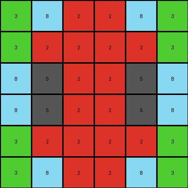
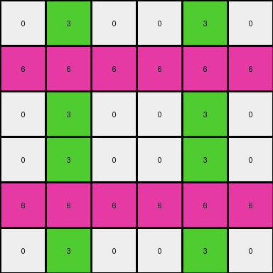

# 7fe24cdd • 009 • refine_dreamer

---


Previous Code:
```python
"""
The input grid is replicated four times to create a 6x6 output grid. Each 3x3 quadrant of the output grid is either a direct copy or a mirrored version of the input grid:

1. Top-Left Quadrant: Exact copy of the input grid.
2. Top-Right Quadrant: Mirrored copy (reflection across the vertical axis) of the input grid.
3. Bottom-Left Quadrant: Mirrored copy (reflection across the horizontal axis) of the input grid.
4. Bottom-Right Quadrant: Double-mirrored copy (reflection across both axes, or 180-degree rotation) of the input grid.
"""

import numpy as np

def transform(input_grid):
    # Initialize the output grid as a 6x6 array filled with zeros.
    output_grid = np.zeros((6, 6), dtype=int)

    # Get the dimensions of the input grid.
    rows, cols = input_grid.shape

    # Fill the top-left quadrant (direct copy).
    output_grid[:rows, :cols] = input_grid

    # Fill the top-right quadrant (horizontal mirror).
    output_grid[:rows, cols:] = np.fliplr(input_grid)

    # Fill the bottom-left quadrant (vertical mirror).
    output_grid[rows:, :cols] = np.flipud(input_grid)

    # Fill the bottom-right quadrant (double mirror/rotation).
    output_grid[rows:, cols:] = np.rot90(input_grid, 2)

    return output_grid
```

Train Set Results:

## Example 1:

Input:
```
8 5 0
8 5 3
0 3 2
```
Expected Output:
```
8 5 0 0 8 8
8 5 3 3 5 5
0 3 2 2 3 0
0 3 2 2 3 0
5 5 3 3 5 8
8 8 0 0 5 8
```
Transformed Output:
```
8 5 0 0 5 8
8 5 3 3 5 8
0 3 2 2 3 0
0 3 2 2 3 0
8 5 3 3 5 8
8 5 0 0 5 8
```

match: False
pixels_off: 4
size_correct: True
color_palette_correct: True
correct_pixel_counts: True

## Example 2:

Input:
```
3 8 2
3 2 2
8 5 2
```
Expected Output:
```
3 8 2 8 3 3
3 2 2 5 2 8
8 5 2 2 2 2
2 2 2 2 5 8
8 2 5 2 2 3
3 3 8 2 8 3
```
Transformed Output:
```
3 8 2 2 8 3
3 2 2 2 2 3
8 5 2 2 5 8
8 5 2 2 5 8
3 2 2 2 2 3
3 8 2 2 8 3
```

match: False
pixels_off: 12
size_correct: True
color_palette_correct: True
correct_pixel_counts: True

## Example 3:

Input:
```
0 3 0
6 6 6
0 3 0
```
Expected Output:
```
0 3 0 0 6 0
6 6 6 3 6 3
0 3 0 0 6 0
0 6 0 0 3 0
3 6 3 6 6 6
0 6 0 0 3 0
```
Transformed Output:
```
0 3 0 0 3 0
6 6 6 6 6 6
0 3 0 0 3 0
0 3 0 0 3 0
6 6 6 6 6 6
0 3 0 0 3 0
```

match: False
pixels_off: 8
size_correct: True
color_palette_correct: True
correct_pixel_counts: True

**INSTRUCTIONS**

The code above was generated based on observations from the first training
example

we have tested the transform function on each of the task example inputs and
compared with the expected output

review each of the examples provided and the results and consider how the
natural language program should be updated to accommodate this new knowledge

respond with the following deliverables:

- general assessment of the information provided and strategy for resolving the
  errors
- gather metrics about each of the examples and results - use code_execution to
  develop accurate reports on your assumptions
- a YAML block documenting facts - Focus on identifying objects, their properties, and the actions performed on them.
- a natural language program - Be as clear and concise as possible, providing a complete description of the transformation rule.


your responses should be considered as information in a report - not a
conversation
