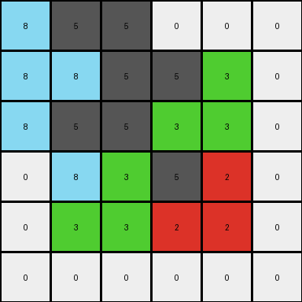
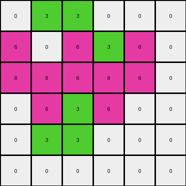

# 7fe24cdd • 015 • refine_dreamer

---


Previous Code:
```python
"""
The transformation rule is a cross-product-like expansion. Each cell in the 3x3 input grid maps to a 2x2 block in the 6x6 output grid, resulting in an expansion.
The expansion interacts with neighboring cells.
"""

import numpy as np

def transform(input_grid):
    input_grid = np.array(input_grid)
    rows, cols = input_grid.shape
    output_grid = np.zeros((2 * rows, 2 * cols), dtype=int)

    for row in range(rows):
        for col in range(cols):
            # Each input cell maps to four output cell locations.
            output_grid[2*row][2*col] = input_grid[row][col]

            # Handle the cell to the right
            if col + 1 < cols:
                output_grid[2*row][2*col + 1] = input_grid[row][col+1]
            else:
                output_grid[2*row][2*col + 1] = 0

            # Handle the cell below.
            if row + 1 < rows:
                output_grid[2*row + 1][2*col] = input_grid[row+1][col]
            else:
                output_grid[2*row + 1][2*col] = 0

            # Handle the cell to the bottom right (mirrored from original cell)
            if row + 1 < rows and col + 1 < cols:
               output_grid[2*row+1][2*col+1] = input_grid[row][col]
            # cases where original cell is on an edge
            elif row + 1 == rows and col+1 < cols:
                output_grid[2*row + 1][2 * col + 1] = 0
            elif col + 1 == rows and row+1 < cols:
                output_grid[2*row + 1][2 * col + 1] = 0
            else:
                output_grid[2*row + 1][2*col+1] = 0


    return output_grid.tolist()
```

Train Set Results:

## Example 1:

Input:
```
8 5 0
8 5 3
0 3 2
```
Expected Output:
```
8 5 0 0 8 8
8 5 3 3 5 5
0 3 2 2 3 0
0 3 2 2 3 0
5 5 3 3 5 8
8 8 0 0 5 8
```
Transformed Output:
```
8 5 5 0 0 0
8 8 5 5 3 0
8 5 5 3 3 0
0 8 3 5 2 0
0 3 3 2 2 0
0 0 0 0 0 0
```

match: False
pixels_off: 25
size_correct: True
color_palette_correct: True
correct_pixel_counts: False

## Example 2:

Input:
```
3 8 2
3 2 2
8 5 2
```
Expected Output:
```
3 8 2 8 3 3
3 2 2 5 2 8
8 5 2 2 2 2
2 2 2 2 5 8
8 2 5 2 2 3
3 3 8 2 8 3
```
Transformed Output:
```
3 8 8 2 2 0
3 3 2 8 2 0
3 2 2 2 2 0
8 3 5 2 2 0
8 5 5 2 2 0
0 0 0 0 0 0
```

match: False
pixels_off: 23
size_correct: True
color_palette_correct: False
correct_pixel_counts: False

## Example 3:

Input:
```
0 3 0
6 6 6
0 3 0
```
Expected Output:
```
0 3 0 0 6 0
6 6 6 3 6 3
0 3 0 0 6 0
0 6 0 0 3 0
3 6 3 6 6 6
0 6 0 0 3 0
```
Transformed Output:
```
0 3 3 0 0 0
6 0 6 3 6 0
6 6 6 6 6 0
0 6 3 6 0 0
0 3 3 0 0 0
0 0 0 0 0 0
```

match: False
pixels_off: 18
size_correct: True
color_palette_correct: True
correct_pixel_counts: False

**INSTRUCTIONS**

The code above was generated based on observations from the first training
example

we have tested the transform function on each of the task example inputs and
compared with the expected output

review each of the examples provided and the results and consider how the
natural language program should be updated to accommodate this new knowledge

respond with the following deliverables:

- general assessment of the information provided and strategy for resolving the
  errors
- gather metrics about each of the examples and results - use code_execution to
  develop accurate reports on your assumptions
- a YAML block documenting facts - Focus on identifying objects, their properties, and the actions performed on them.
- a natural language program - Be as clear and concise as possible, providing a complete description of the transformation rule.


your responses should be considered as information in a report - not a
conversation
