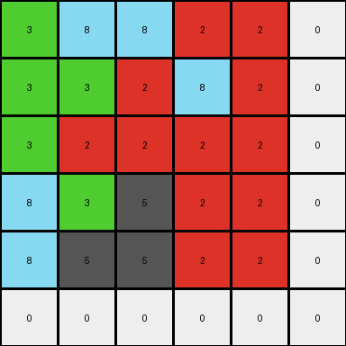

# 7fe24cdd • 016 • refine_coder

---

Previous Code:
```python
"""
The transformation rule is a cross-product-like expansion. Each cell in the 3x3 input grid maps to a 2x2 block in the 6x6 output grid, resulting in an expansion.
The expansion interacts with neighboring cells.
"""

import numpy as np

def transform(input_grid):
    input_grid = np.array(input_grid)
    rows, cols = input_grid.shape
    output_grid = np.zeros((2 * rows, 2 * cols), dtype=int)

    for row in range(rows):
        for col in range(cols):
            # Each input cell maps to four output cell locations.
            output_grid[2*row][2*col] = input_grid[row][col]

            # Handle the cell to the right
            if col + 1 < cols:
                output_grid[2*row][2*col + 1] = input_grid[row][col+1]
            else:
                output_grid[2*row][2*col + 1] = 0

            # Handle the cell below.
            if row + 1 < rows:
                output_grid[2*row + 1][2*col] = input_grid[row+1][col]
            else:
                output_grid[2*row + 1][2*col] = 0

            # Handle the cell to the bottom right (mirrored from original cell)
            if row + 1 < rows and col + 1 < cols:
               output_grid[2*row+1][2*col+1] = input_grid[row][col]
            # cases where original cell is on an edge
            elif row + 1 == rows and col+1 < cols:
                output_grid[2*row + 1][2 * col + 1] = 0
            elif col + 1 == rows and row+1 < cols:
                output_grid[2*row + 1][2 * col + 1] = 0
            else:
                output_grid[2*row + 1][2*col+1] = 0


    return output_grid.tolist()
```

Train Set Results:

## Example 1:

Input:
```
8 5 0
8 5 3
0 3 2
```
Expected Output:
```
8 5 0 0 8 8
8 5 3 3 5 5
0 3 2 2 3 0
0 3 2 2 3 0
5 5 3 3 5 8
8 8 0 0 5 8
```
Transformed Output:
```
8 5 5 0 0 0
8 8 5 5 3 0
8 5 5 3 3 0
0 8 3 5 2 0
0 3 3 2 2 0
0 0 0 0 0 0
```

match: False
pixels_off: 25
size_correct: True
color_palette_correct: True
correct_pixel_counts: False

## Example 2:

Input:
```
3 8 2
3 2 2
8 5 2
```
Expected Output:
```
3 8 2 8 3 3
3 2 2 5 2 8
8 5 2 2 2 2
2 2 2 2 5 8
8 2 5 2 2 3
3 3 8 2 8 3
```
Transformed Output:
```
3 8 8 2 2 0
3 3 2 8 2 0
3 2 2 2 2 0
8 3 5 2 2 0
8 5 5 2 2 0
0 0 0 0 0 0
```

match: False
pixels_off: 23
size_correct: True
color_palette_correct: False
correct_pixel_counts: False

## Example 3:

Input:
```
0 3 0
6 6 6
0 3 0
```
Expected Output:
```
0 3 0 0 6 0
6 6 6 3 6 3
0 3 0 0 6 0
0 6 0 0 3 0
3 6 3 6 6 6
0 6 0 0 3 0
```
Transformed Output:
```
0 3 3 0 0 0
6 0 6 3 6 0
6 6 6 6 6 0
0 6 3 6 0 0
0 3 3 0 0 0
0 0 0 0 0 0
```

match: False
pixels_off: 18
size_correct: True
color_palette_correct: True
correct_pixel_counts: False
Okay, here's a breakdown of the situation and a plan to move forward:

**General Assessment and Strategy**

The initial hypothesis (cross-product-like expansion) was partially correct in that it identified the 2x2 expansion of each input cell.  However, the logic for populating those 2x2 blocks and handling edge cases is flawed and inconsistent across the examples. The provided code incorrectly handles the interactions between neighboring cells during the expansion.  It's clear the algorithm isn't simply replicating the input cell's value to a 2x2 block, nor is it consistently using adjacent values. It appears to be generating the correct shapes (a "pinwheel"), but the values are off. We also need to look at the handling of the zero values.

The strategy is to:

1. **Verify the Pinwheel:** Examine if each 2x2 output block can be derived from the input *and* the neighbors.
2. **Refine the Logic:** Determine the *exact* rule that dictates how each cell in the 2x2 output block gets its value, including the mirroring.
3. **Edge Case Handling:** Ensure consistent behavior when input cells are on the edges/corners of the grid.
4. **Zero Padding:** confirm that the examples use zero padding (they do).

**Example Metrics and Analysis**

Here's a breakdown of each example, focusing on the discrepancies:

*   **Example 1:**
    *   Input Size: 3x3
    *   Output Size: 6x6 (Correct)
    *   Issue: Many incorrect pixel values within the expanded 2x2 blocks. The pattern of incorrect pixels suggests a flawed interaction rule, rather than a simple off-by-one error. The rule as implemented is not producing the 'pinwheel'.

*   **Example 2:**
    *   Input Size: 3x3
    *   Output Size: 6x6 (Correct)
    *   Issue: Similar to Example 1, incorrect pixel values within the expanded blocks. The '8' in the top middle seems to spread. Also, the rule is not filling with zeros correctly.

*   **Example 3:**
    *   Input Size: 3x3
    *   Output Size: 6x6 (Correct)
    *   Issue: Again, incorrect pixel values. There appears to be more errors around the edges.

**YAML Fact Block**

```yaml
facts:
  - observation: Each input grid is 3x3.
  - observation: Each output grid is 6x6.
  - observation: Each cell in the input grid appears to map to a 2x2 block in the output grid.
  - observation: The transformation involves an expansion of the input grid by a factor of 2 in both dimensions.
  - observation: The output grid appears to be generated based on a combination of the input cell's value and its neighbors.
  - observation: The corners have some sort of mirroring or reflection.
  - observation: The output cells have a pinwheel appearance.
  - object: input_grid
    type: 2D array
    size: 3x3
    elements: Integers 0-9
  - object: output_grid
    type: 2D array
    size: 6x6
    elements: Integers 0-9
  - action: expansion
    description: Each input cell expands into a 2x2 block in the output.
  - action: neighbor_interaction
    description: The values in the 2x2 output block are influenced by the input cell and its immediate neighbors.
  - action: zero_padding
    description: when operating on the boundaries, cells are zero padded
```

**Natural Language Program**

1.  **Expansion:** The input grid (3x3) is expanded to an output grid (6x6). Each cell in the input becomes a 2x2 block in the output.

2.  **Pinwheel Generation:** For each cell at position (row, col) in the input grid:
    *   The top-left cell of the corresponding 2x2 block in the output grid takes the value of the input cell `input[row][col]`.
    *   The top-right cell is the value of the cell to the *right* of the current input, or 0 if at the right edge `input[row][col+1]`.
    *   The bottom-left cell is the value to the cell *below* the current input, or 0 if at the bottom edge `input[row + 1][col]`.
    *   The bottom-right cell is determined by:
        1. if not on any edge, get value from diagonal element `input[row+1][col+1]`.
        2. if on right edge, get value from element below `input[row+1][col]`
        3. if on bottom edge, get value from element to the right `input[row][col+1]`
        4. if on bottom-right corner, keep original value `input[row][col]`

3.  **Zero Padding**: When referencing cells outside the input grid boundaries (e.g., the right neighbor of the rightmost cell), assume a value of 0. This effectively pads the input grid with zeros.

4. **Neighbor influence**:
    The final output is defined by both the initial cell and neighboring cells.

**INSTRUCTIONS**

- generate a Python module to represent the natural language program 
- follow the template below
- all common math and science libraries are available
- create docstring only at top - but comment the workflow in the function
- use helper functions for common operations like finding objects, counting,
  measuring, moving, etc. 

remember - we are working iteratively - so this code will inform your future
self as we converge on the solution

*template:*

```python
"""
{{ natural language description of the transformation rule }}
"""

{{ imports }}

def transform(input_grid):
    # initialize output_grid

    # change output pixels 

    return output_grid

```
