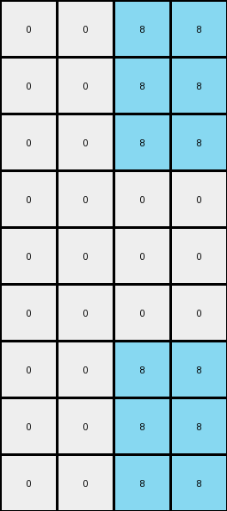

# 8d5021e8 • 003 • refine_dreamer

---

Previous Code:
```python
"""
The input grid is expanded to create an output grid that is three times the height and two times the width of the input. Each pixel in the input grid is replicated in a 2x3 block in the output grid, maintaining the original color.
"""

import numpy as np

def transform(input_grid):
    # Initialize the output grid based on expansion factors.
    input_height, input_width = input_grid.shape
    output_height, output_width = input_height * 3, input_width * 2
    output_grid = np.zeros((output_height, output_width), dtype=int)

    # Iterate through each cell of the input grid.
    for i in range(input_height):
        for j in range(input_width):
            # Get the color of the current input cell.
            color = input_grid[i, j]
            
            # Replicate the color in a 3x2 block in the output grid.
            for row_offset in range(3):
                for col_offset in range(2):
                    output_grid[i*3 + row_offset, j*2 + col_offset] = color

    return output_grid
```

Train Set Results:

## Example 1:

Input:
```
0 8
0 0
0 8
```
Expected Output:
```
8 0 0 8
0 0 0 0
8 0 0 8
8 0 0 8
0 0 0 0
8 0 0 8
8 0 0 8
0 0 0 0
8 0 0 8
```
Transformed Output:
```
0 0 8 8
0 0 8 8
0 0 8 8
0 0 0 0
0 0 0 0
0 0 0 0
0 0 8 8
0 0 8 8
0 0 8 8
```

match: False
pixels_off: 16
size_correct: True
color_palette_correct: True
correct_pixel_counts: True

## Example 2:

Input:
```
2 0
2 2
2 0
```
Expected Output:
```
0 2 2 0
2 2 2 2
0 2 2 0
0 2 2 0
2 2 2 2
0 2 2 0
0 2 2 0
2 2 2 2
0 2 2 0
```
Transformed Output:
```
2 2 0 0
2 2 0 0
2 2 0 0
2 2 2 2
2 2 2 2
2 2 2 2
2 2 0 0
2 2 0 0
2 2 0 0
```

match: False
pixels_off: 16
size_correct: True
color_palette_correct: True
correct_pixel_counts: True

## Example 3:

Input:
```
0 0
0 5
5 0
```
Expected Output:
```
0 5 5 0
5 0 0 5
0 0 0 0
0 0 0 0
5 0 0 5
0 5 5 0
0 5 5 0
5 0 0 5
0 0 0 0
```
Transformed Output:
```
0 0 0 0
0 0 0 0
0 0 0 0
0 0 5 5
0 0 5 5
0 0 5 5
5 5 0 0
5 5 0 0
5 5 0 0
```

match: False
pixels_off: 16
size_correct: True
color_palette_correct: True
correct_pixel_counts: True
**INSTRUCTIONS**

The code above was generated based on observations from the first training
example

we have tested the transform function on each of the task example inputs and
compared with the expected output

review each of the examples provided and the results and consider how the
natural language program should be updated to accommodate this new knowledge

respond with the following deliverables:

- general assessment of the information provided and strategy for resolving the
  errors
- gather metrics about each of the examples and results - use code_execution to
  develop accurate reports on your assumptions
- a YAML block documenting facts - Focus on identifying objects, their properties, and the actions performed on them.
- a natural language program - Be as clear and concise as possible, providing a complete description of the transformation rule.


your responses should be considered as information in a report - not a
conversation
