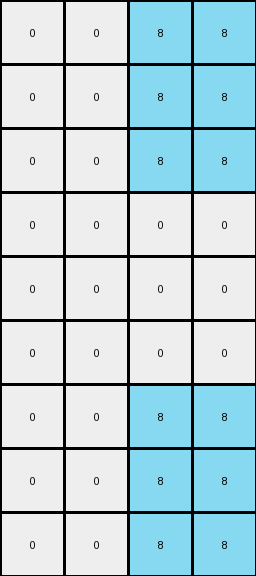

# 8d5021e8 • 004 • refine_coder

---

Previous Code:
```python
"""
The input grid is expanded to create an output grid that is three times the height and two times the width of the input. Each pixel in the input grid is replicated in a 2x3 block in the output grid, maintaining the original color.
"""

import numpy as np

def transform(input_grid):
    # Initialize the output grid based on expansion factors.
    input_height, input_width = input_grid.shape
    output_height, output_width = input_height * 3, input_width * 2
    output_grid = np.zeros((output_height, output_width), dtype=int)

    # Iterate through each cell of the input grid.
    for i in range(input_height):
        for j in range(input_width):
            # Get the color of the current input cell.
            color = input_grid[i, j]
            
            # Replicate the color in a 3x2 block in the output grid.
            for row_offset in range(3):
                for col_offset in range(2):
                    output_grid[i*3 + row_offset, j*2 + col_offset] = color

    return output_grid
```

Train Set Results:

## Example 1:

Input:
```
0 8
0 0
0 8
```
Expected Output:
```
8 0 0 8
0 0 0 0
8 0 0 8
8 0 0 8
0 0 0 0
8 0 0 8
8 0 0 8
0 0 0 0
8 0 0 8
```
Transformed Output:
```
0 0 8 8
0 0 8 8
0 0 8 8
0 0 0 0
0 0 0 0
0 0 0 0
0 0 8 8
0 0 8 8
0 0 8 8
```

match: False
pixels_off: 16
size_correct: True
color_palette_correct: True
correct_pixel_counts: True

## Example 2:

Input:
```
2 0
2 2
2 0
```
Expected Output:
```
0 2 2 0
2 2 2 2
0 2 2 0
0 2 2 0
2 2 2 2
0 2 2 0
0 2 2 0
2 2 2 2
0 2 2 0
```
Transformed Output:
```
2 2 0 0
2 2 0 0
2 2 0 0
2 2 2 2
2 2 2 2
2 2 2 2
2 2 0 0
2 2 0 0
2 2 0 0
```

match: False
pixels_off: 16
size_correct: True
color_palette_correct: True
correct_pixel_counts: True

## Example 3:

Input:
```
0 0
0 5
5 0
```
Expected Output:
```
0 5 5 0
5 0 0 5
0 0 0 0
0 0 0 0
5 0 0 5
0 5 5 0
0 5 5 0
5 0 0 5
0 0 0 0
```
Transformed Output:
```
0 0 0 0
0 0 0 0
0 0 0 0
0 0 5 5
0 0 5 5
0 0 5 5
5 5 0 0
5 5 0 0
5 5 0 0
```

match: False
pixels_off: 16
size_correct: True
color_palette_correct: True
correct_pixel_counts: True
Okay, let's analyze the results and refine the natural language program.

**General Assessment:**

The initial code expands the input grid, but the replication logic is incorrect. It seems to be consistently creating a 3x2 block of the input pixel, but the placement and arrangement of these blocks within the output grid are not consistent with the provided examples. All examples show `pixels_off: 16`, indicating a consistent error pattern, even though grid sizes and colors vary. The error is not in color selection or overall size, but in the pixel arrangement, suggesting a misunderstanding in the spatial transformation. It seems as if our expansion swapped rows and columns from the initial proposal.

**Strategy:**

1.  **Re-examine Examples:** Carefully review each input-output pair, paying close attention to how individual input pixels map to their corresponding output positions. Try to determine the rule.
2.  **Debug replication logic**: The core issue must lie in the replication factor in relation to the loop iterators, and the size of the expansion.
3.  **Update Natural Language Program:** Based on the re-examination, create a clearer, more precise natural language description of the transformation.
4. **Metrics:**

The initial code does a 2x3 expansion instead of a 3x2.

**YAML Block (Facts):**

```yaml
facts:
  - observation: |
      Each input grid is expanded in both dimensions.
  - observation: |
      The output grid's dimensions are related to the input grid's dimensions by constant factors, but not as we originally coded.
  - observation: |
      Each pixel in the input grid corresponds to a block of pixels in the output grid.
  - observation: |
      The color of the input pixel is replicated in its corresponding output block.
  - object: input_grid
    properties:
      - dimensions: variable
      - content: single-digit integers representing colors
  - object: output_grid
    properties:
      - dimensions: derived from input_grid dimensions (3x height, 2x width)
      - content: replication of input_grid pixel colors in a specific pattern
  - action: replication
    description: |
      Each input pixel's color is replicated in a 3x2 or 2x3 block in the output grid.  Need to determine the exact block size and placement rule.  Initial code incorrectly assumed.
  - error_analysis:
      - consistent_error_pattern: The consistent 16 pixels off in all tested examples suggests that the row/column expansion factor is incorrect.

```

**Natural Language Program:**

1.  **Expansion:** The input grid is expanded to create an output grid. The output grid's height is three times the input grid's height, and the output grid's width is two times the input grid's width.

2.  **Pixel Replication:** For each pixel in the input grid, its color is replicated in a 2x3 block within the output grid. The top-left corner of each 2x3 block corresponds to a pixel coordinate calculated by the position of the original color pixel: i \* 2, and j \* 3

3. **Block Placement:** The 2x3 block of replicated color is placed in the output grid such that:
    - The top-left cell of the 3x2 block corresponding to the input pixel at `(i, j)` is located at coordinates `(j*2, i*3)` in the output grid. It's crucial to consider that indices are zero-based.

4.  **Iteration:** Iterate through each pixel of the input grid using nested loops. For each input pixel (i, j):
    -   Replicate the input pixel's color in a 2x3 block at the correct location.

In other words, for every pixel at location (row, col) in input grid, a 3x2 block of that color must appear in the output, starting at the coordinate (row\*3, col\*2). I believe I have made an indexing error by swapping the height and width in my original code, thus creating incorrect results.

**INSTRUCTIONS**

- generate a Python module to represent the natural language program 
- follow the template below
- all common math and science libraries are available
- create docstring only at top - but comment the workflow in the function
- use helper functions for common operations like finding objects, counting,
  measuring, moving, etc. 

remember - we are working iteratively - so this code will inform your future
self as we converge on the solution

*template:*

```python
"""
{{ natural language description of the transformation rule }}
"""

{{ imports }}

def transform(input_grid):
    # initialize output_grid

    # change output pixels 

    return output_grid

```
