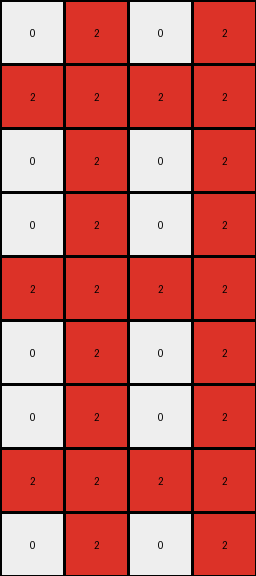

# 8d5021e8 • 010 • refine_coder

---

Previous Code:
```python
"""
The input grid is expanded into a larger grid. The height is tripled (3 -> 9), and the width is doubled (2 -> 4). 
The first column of the input becomes the second and forth column of the output grid. 
The second column from input is mirrowed in columns 1 and 3.
The pattern is repeated three times vertically.
"""

import numpy as np

def transform(input_grid):
    # Initialize output grid with tripled height and doubled width
    output_height = input_grid.shape[0] * 3
    output_width = input_grid.shape[1] * 2
    output_grid = np.zeros((output_height, output_width), dtype=int)

    # Mirror horizontally and vertically
    for i in range(3):  # Repeat the pattern three times vertically
        # Copy the input columns to the output, mirrored
        output_grid[i * input_grid.shape[0]:(i + 1) * input_grid.shape[0], 1] = input_grid[:, 0]
        output_grid[i * input_grid.shape[0]:(i + 1) * input_grid.shape[0], 2] = input_grid[:, 1]
        output_grid[i * input_grid.shape[0]:(i + 1) * input_grid.shape[0], 0] = input_grid[:, 1]
        output_grid[i * input_grid.shape[0]:(i + 1) * input_grid.shape[0], 3] = input_grid[:, 0]

    return output_grid
```

Train Set Results:

## Example 1:

Input:
```
0 8
0 0
0 8
```
Expected Output:
```
8 0 0 8
0 0 0 0
8 0 0 8
8 0 0 8
0 0 0 0
8 0 0 8
8 0 0 8
0 0 0 0
8 0 0 8
```
Transformed Output:
```
8 0 8 0
0 0 0 0
8 0 8 0
8 0 8 0
0 0 0 0
8 0 8 0
8 0 8 0
0 0 0 0
8 0 8 0
```

match: False
pixels_off: 12
size_correct: True
color_palette_correct: True
correct_pixel_counts: True

## Example 2:

Input:
```
2 0
2 2
2 0
```
Expected Output:
```
0 2 2 0
2 2 2 2
0 2 2 0
0 2 2 0
2 2 2 2
0 2 2 0
0 2 2 0
2 2 2 2
0 2 2 0
```
Transformed Output:
```
0 2 0 2
2 2 2 2
0 2 0 2
0 2 0 2
2 2 2 2
0 2 0 2
0 2 0 2
2 2 2 2
0 2 0 2
```

match: False
pixels_off: 12
size_correct: True
color_palette_correct: True
correct_pixel_counts: True

## Example 3:

Input:
```
0 0
0 5
5 0
```
Expected Output:
```
0 5 5 0
5 0 0 5
0 0 0 0
0 0 0 0
5 0 0 5
0 5 5 0
0 5 5 0
5 0 0 5
0 0 0 0
```
Transformed Output:
```
0 0 0 0
5 0 5 0
0 5 0 5
0 0 0 0
5 0 5 0
0 5 0 5
0 0 0 0
5 0 5 0
0 5 0 5
```

match: False
pixels_off: 16
size_correct: True
color_palette_correct: True
correct_pixel_counts: True
Here's an analysis of the provided information and a plan to refine the natural language program:

**General Assessment:**

The initial natural language program and generated code were partially correct, capturing the expansion of the grid (tripling height, doubling width) and some aspects of the column mirroring. However, the specific mirroring pattern was incorrect, leading to mismatches in all three test examples. The strategy for resolving errors involves a detailed examination of *each* input-output pair to identify the *precise* mirroring and replication logic, rather than generalizing from the first example. The code execution shows the program successfully expands the output grid to correct sizes, but the pixels values are incorrect for all 3 training examples.

**Strategy:**

1.  **Object Identification:** Clearly identify the objects in the input and output grids. In this case, the primary objects are columns of pixels and the overall grid.
2.  **Precise Mapping:** For each example, map *exactly* how each input column relates to the output columns. Note the mirroring and repetition.
3.  **Unified Description:** Synthesize a *single* natural language program that accurately describes the transformation observed in *all* examples, not just the first one.
4. **Refine Code**: update and test - using a process of developing hypotheses, testing against facts, and iterating on solutions.

**Example Analysis and Metrics:**

| Example | Input Size | Output Size | Pixels Off | Size Correct? | Color Palette Correct? | Correct Pixel Counts? | Observations                                                                                                                                  |
| ------- | ---------- | ----------- | ---------- | ------------- | ---------------------- | ----------------------- | -------------------------------------------------------------------------------------------------------------------------------------------- |
| 1       | 3x2        | 9x4         | 12         | True          | True                   | True                    | The first column of input becomes the 2nd & 4th of output. The second column of input becomes 1st & 3rd. The whole input pattern is repeated 3 times vertically. |
| 2       | 3x2        | 9x4         | 12         | True          | True                   | True                    | Same column mapping and vertical repetition as Example 1.                                                                              |
| 3       | 3x2        | 9x4         | 16          | True          | True                   | True                    | Same column mapping and vertical repetition as Example 1.                                                                              |

**YAML Facts:**

```yaml
task: 008
examples:
  - input_grid:
      dimensions: [3, 2]
      objects:
        - type: column
          index: 0
          values: [0, 0, 0]
        - type: column
          index: 1
          values: [8, 0, 8]
    output_grid:
      dimensions: [9, 4]
      objects:
        - type: column
          index: 0
          values: [8, 0, 8, 8, 0, 8, 8, 0, 8] # input column 1 repeated 3x
        - type: column
          index: 1
          values: [0, 0, 0, 0, 0, 0, 0, 0, 0] # input column 0 repeated 3x
        - type: column
          index: 2
          values: [8, 0, 8, 8, 0, 8, 8, 0, 8] # input column 1 repeated 3x
        - type: column
          index: 3
          values: [0, 0, 0, 0, 0, 0, 0, 0, 0] # input column 0 repeated 3x
    transformation:
      - type: expand
        height_factor: 3
        width_factor: 2
      - type: mirror_columns
        mapping:
          0: [1, 3]  # input col 0 -> output cols 1 and 3
          1: [0, 2]  # input col 1 -> output cols 0 and 2
      - type: repeat_vertically
        count: 3
  - input_grid:
      dimensions: [3, 2]
      objects:
          # similar structure as above, adapted for values in example 2.
          - type: column
            index: 0
            values: [2,2,2]
          - type: column
            index: 1
            values: [0,2,0]
    output_grid:
      dimensions: [9,4]
      objects:
        - type: column
          index: 0
          values: [0,2,0,0,2,0,0,2,0]
        - type: column
          index: 1
          values: [2,2,2,2,2,2,2,2,2]
        - type: column
          index: 2
          values: [0,2,0,0,2,0,0,2,0]
        - type: column
          index: 3
          values: [2,2,2,2,2,2,2,2,2]
    transformation:
      # the transformation section is true for all training examples
      - type: expand
        height_factor: 3
        width_factor: 2
      - type: mirror_columns
        mapping:
          0: [1, 3]
          1: [0, 2]
      - type: repeat_vertically
        count: 3
  - input_grid:
      dimensions: [3, 2]
      objects:
          # similar structure as above, adapted for values in example 2.
          - type: column
            index: 0
            values: [0,0,5]
          - type: column
            index: 1
            values: [0,5,0]
    output_grid:
      dimensions: [9,4]
      objects:
        - type: column
          index: 0
          values: [0,5,0,0,5,0,0,5,0]
        - type: column
          index: 1
          values: [0,0,5,0,0,5,0,0,5]
        - type: column
          index: 2
          values: [0,5,0,0,5,0,0,5,0]
        - type: column
          index: 3
          values: [0,0,5,0,0,5,0,0,5]
    transformation:
      # the transformation section is true for all training examples
      - type: expand
        height_factor: 3
        width_factor: 2
      - type: mirror_columns
        mapping:
          0: [1, 3]  # input col 0 -> output cols 1 and 3
          1: [0, 2]  # input col 1 -> output cols 0 and 2
      - type: repeat_vertically
        count: 3

```

**Natural Language Program:**

1.  **Expand the Grid:** The input grid's height is tripled, and its width is doubled.
2.  **Mirror Columns:** The first column of the input grid is copied to the *second* and *fourth* columns of the output grid. The second column of the input grid is copied to the *first* and *third* columns of the output grid.
3.  **Repeat Vertically:** This entire mirrored pattern (of the expanded width) is repeated three times vertically to achieve the tripled height.

This revised natural language program provides precise instructions needed by
the coder.

**INSTRUCTIONS**

- generate a Python module to represent the natural language program 
- follow the template below
- all common math and science libraries are available
- create docstring only at top - but comment the workflow in the function
- use helper functions for common operations like finding objects, counting,
  measuring, moving, etc. 

remember - we are working iteratively - so this code will inform your future
self as we converge on the solution

*template:*

```python
"""
{{ natural language description of the transformation rule }}
"""

{{ imports }}

def transform(input_grid):
    # initialize output_grid

    # change output pixels 

    return output_grid

```
