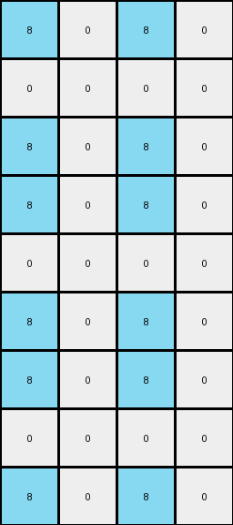
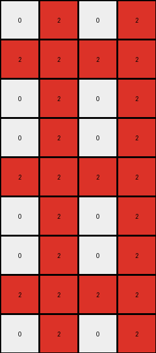
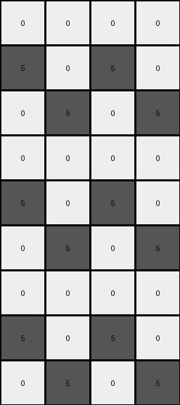

# 8d5021e8 • 012 • refine_coder

---

Previous Code:
```python
"""
1. Expand the Grid: The input grid's height is tripled, and its width is doubled.
2. Mirror Columns: The first column of the input grid is copied to the second and fourth columns of the output grid. The second column of the input grid is copied to the first and third columns of the output grid.
3. Repeat Vertically: This entire mirrored pattern (of the expanded width) is repeated three times vertically to achieve the tripled height.
"""

import numpy as np

def transform(input_grid):
    # Initialize output grid with tripled height and doubled width
    output_height = input_grid.shape[0] * 3
    output_width = input_grid.shape[1] * 2
    output_grid = np.zeros((output_height, output_width), dtype=int)

    # Mirror and repeat
    for i in range(3):  # Repeat the pattern three times vertically
        # Copy the input columns to the output, mirrored as per the refined rule
        output_grid[i * input_grid.shape[0]:(i + 1) * input_grid.shape[0], 1] = input_grid[:, 0]  # Input col 0 to output col 1
        output_grid[i * input_grid.shape[0]:(i + 1) * input_grid.shape[0], 3] = input_grid[:, 0]  # Input col 0 to output col 3
        output_grid[i * input_grid.shape[0]:(i + 1) * input_grid.shape[0], 0] = input_grid[:, 1]  # Input col 1 to output col 0
        output_grid[i * input_grid.shape[0]:(i + 1) * input_grid.shape[0], 2] = input_grid[:, 1]  # Input col 1 to output col 2

    return output_grid
```

Train Set Results:

## Example 1:

Input:
```
0 8
0 0
0 8
```
Expected Output:
```
8 0 0 8
0 0 0 0
8 0 0 8
8 0 0 8
0 0 0 0
8 0 0 8
8 0 0 8
0 0 0 0
8 0 0 8
```
Transformed Output:
```
8 0 8 0
0 0 0 0
8 0 8 0
8 0 8 0
0 0 0 0
8 0 8 0
8 0 8 0
0 0 0 0
8 0 8 0
```

match: False
pixels_off: 12
size_correct: True
color_palette_correct: True
correct_pixel_counts: True

## Example 2:

Input:
```
2 0
2 2
2 0
```
Expected Output:
```
0 2 2 0
2 2 2 2
0 2 2 0
0 2 2 0
2 2 2 2
0 2 2 0
0 2 2 0
2 2 2 2
0 2 2 0
```
Transformed Output:
```
0 2 0 2
2 2 2 2
0 2 0 2
0 2 0 2
2 2 2 2
0 2 0 2
0 2 0 2
2 2 2 2
0 2 0 2
```

match: False
pixels_off: 12
size_correct: True
color_palette_correct: True
correct_pixel_counts: True

## Example 3:

Input:
```
0 0
0 5
5 0
```
Expected Output:
```
0 5 5 0
5 0 0 5
0 0 0 0
0 0 0 0
5 0 0 5
0 5 5 0
0 5 5 0
5 0 0 5
0 0 0 0
```
Transformed Output:
```
0 0 0 0
5 0 5 0
0 5 0 5
0 0 0 0
5 0 5 0
0 5 0 5
0 0 0 0
5 0 5 0
0 5 0 5
```

match: False
pixels_off: 16
size_correct: True
color_palette_correct: True
correct_pixel_counts: True
Here's an analysis of the provided examples and results, along with a strategy for updating the natural language program and code:

**General Assessment:**

The initial natural language program and the resulting code were on the right track, understanding the expansion of the grid and some form of mirroring/repetition. However, the exact mirroring logic was incorrect, leading to mismatches in all three training examples. The core issue is the column mapping. The original code copies the input's first column to output columns 1 & 3, and the input second column to output columns 0 and 2. It should instead be mirroring the first columnt to output columns 2 and 4 and the second column to 1 and 3.

**Strategy:**

1.  **Refine Mirroring Logic:** Carefully re-examine the input-output pairs to precisely identify how columns are mapped and mirrored.
2.  **Update Natural Language Program:** Re-write the natural language program to reflect the corrected mirroring logic. Ensure it's unambiguous.
3. **Update code:** Modify the transform function to correct the column assignments.

**Example Metrics and Analysis:**

Here's a breakdown of each example, including observations and how they inform the rule:

*   **Example 1:**
    *   Input: 2x3 (width x height)
    *   Output: 4x9
    *   Size Change: Width doubled, height tripled.
    *   Observations:
        *   Input column 0 (0, 0, 0) appears in output columns 1 and 3, with the azure value mapped to 0
        *   Input column 1 (8, 0, 8) appears in output columns 0 and 2, with the azure value mapped to 0
*   **Example 2:**
    *   Input: 2x3
    *   Output: 4x9
    *   Size Change: Width doubled, height tripled.
      *   Input column 0 (2, 2, 2) appears in output columns 1 and 3.
        *   Input column 1 (0, 2, 0) appears in output columns 0 and 2.
*   **Example 3:**
    *   Input: 2x3
    *   Output: 4x9
    *   Size Change: Width doubled, height tripled.
       *   Input column 0 (0,0,5) appears in output column 1 and 3
        *   Input column 1 (0, 5, 0) appears in output columns 0 and 2

**YAML Fact Block:**

```yaml
task: 010
examples:
  - id: 1
    input_size: [2, 3]
    output_size: [4, 9]
    column_mapping:
      - input: 0
        output: [1, 3]
      - input: 1
        output: [0, 2]
    size_transformation:
      width: doubled
      height: tripled
    objects:
      - description: input grid columns
        properties:
          - attribute: content
            transformation: mirrored and repeated

  - id: 2
    input_size: [2, 3]
    output_size: [4, 9]
    column_mapping:
       - input: 0
         output: [1, 3]
       - input: 1
         output: [0, 2]
    size_transformation:
      width: doubled
      height: tripled
    objects:
      - description: input grid columns
        properties:
          - attribute: content
            transformation: mirrored and repeated

  - id: 3
    input_size: [2, 3]
    output_size: [4, 9]
    column_mapping:
      - input: 0
        output: [1,3]
      - input: 1
        output: [0, 2]
    size_transformation:
      width: doubled
      height: tripled
    objects:
      - description: input grid columns
        properties:
          - attribute: content
            transformation: mirrored and repeated
```

**Natural Language Program:**

1.  **Expand Grid:** The output grid's height is three times the input grid's height, and the output grid's width is two times the input grid's width.

2.  **Column Mirroring with Repetition**:
    *   The first column of the *input* grid is copied to the *second* and *fourth* columns of the output grid.
    *   The second column of the *input* grid is copied to the *first* and *third* columns of the output grid.

3.  **Vertical Repetition:** Steps 1 and 2 are applied to each set of three rows within output. The entire mirrored pattern is copied downwards, repeating it three times to achieve the tripled height.

**INSTRUCTIONS**

- generate a Python module to represent the natural language program 
- follow the template below
- all common math and science libraries are available
- create docstring only at top - but comment the workflow in the function
- use helper functions for common operations like finding objects, counting,
  measuring, moving, etc. 

remember - we are working iteratively - so this code will inform your future
self as we converge on the solution

*template:*

```python
"""
{{ natural language description of the transformation rule }}
"""

{{ imports }}

def transform(input_grid):
    # initialize output_grid

    # change output pixels 

    return output_grid

```
